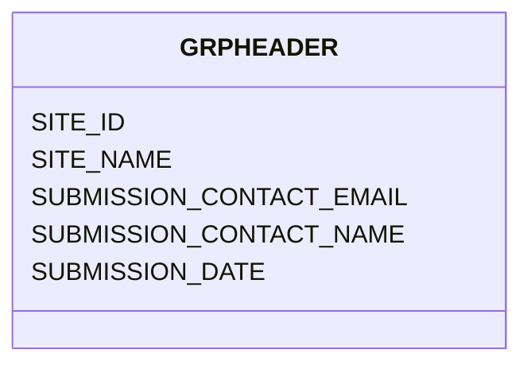

# Class: GRPHEADER


URI: [TEMP:GRPHEADER](https://example.org/TEMP/GRPHEADER)





<!-- no inheritance hierarchy -->


## Slots

| Name | Cardinality and Range | Description | Inheritance |
| ---  | --- | --- | --- |
| [SITE_ID](SITE_ID.md) | 0..1 <br/> [xsd:string](xsd:string) | Six character site identifier | direct |
| [SITE_NAME](SITE_NAME.md) | 0..1 <br/> [xsd:string](xsd:string) | Site name | direct |
| [SUBMISSION_CONTACT_NAME](SUBMISSION_CONTACT_NAME.md) | 0..1 <br/> [xsd:string](xsd:string) | Name of person who submitted this template | direct |
| [SUBMISSION_CONTACT_EMAIL](SUBMISSION_CONTACT_EMAIL.md) | 0..1 <br/> [xsd:string](xsd:string) | E-mail address of the person who submitted this template | direct |
| [SUBMISSION_DATE](SUBMISSION_DATE.md) | 0..1 <br/> [xsd:float](xsd:float) | Date this submission was last edited/modified | direct |


## Identifier and Mapping Information


### Schema Source


* from schema: TEMP


## Mappings

| Mapping Type | Mapped Value |
| ---  | ---  |
| self | TEMP:GRPHEADER |
| native | TEMP:GRPHEADER |


## LinkML Source

<!-- TODO: investigate https://stackoverflow.com/questions/37606292/how-to-create-tabbed-code-blocks-in-mkdocs-or-sphinx -->

### Direct

<details>
```yaml
name: GRP_HEADER
from_schema: TEMP
rank: 1000
slots:
- SITE_ID
- SITE_NAME
- SUBMISSION_CONTACT_NAME
- SUBMISSION_CONTACT_EMAIL
- SUBMISSION_DATE
slot_usage:
  SITE_ID:
    name: SITE_ID
    description: Six character site identifier. MANDATORY if site is already registered
    comments:
    - The code is assigned by the network and communicated to the PI when the site
      is first registered. Use only the assigned code once it has been assigned. If
      you do not yet have a site_id contact your regional network to get one assigned.
    identifier: true
    domain_of:
    - GRP_HEADER
    - GRP_HEADER
  SITE_NAME:
    name: SITE_NAME
    description: Site name
    comments:
    - The name should be related to the location where the site is installed and not
      the name of the vegetation type (e.g. "Central Park New York" is ok, "forest"
      is not).
    domain_of:
    - GRP_HEADER
    - GRP_HEADER
    required: true
  SUBMISSION_CONTACT_EMAIL:
    name: SUBMISSION_CONTACT_EMAIL
    description: E-mail address of the person who submitted this template
    comments:
    - This person is the one that we will contact to get help solving issues related
      to the data import process for this data submission.
    domain_of:
    - GRP_HEADER
    - GRP_HEADER
    required: true
  SUBMISSION_CONTACT_NAME:
    name: SUBMISSION_CONTACT_NAME
    description: Name of person who submitted this template
    comments:
    - This person is the one that we will contact to get help solving issues related
      to the data import process for this data submission.
    domain_of:
    - GRP_HEADER
    - GRP_HEADER
    required: true
  SUBMISSION_DATE:
    name: SUBMISSION_DATE
    description: Date this submission was last edited/modified
    comments:
    - If you change this template's contents, this date should be the date of the
      last change.
    domain_of:
    - GRP_HEADER
    - GRP_HEADER
    required: true

```
</details>

### Induced

<details>
```yaml
name: GRP_HEADER
from_schema: TEMP
rank: 1000
slot_usage:
  SITE_ID:
    name: SITE_ID
    description: Six character site identifier. MANDATORY if site is already registered
    comments:
    - The code is assigned by the network and communicated to the PI when the site
      is first registered. Use only the assigned code once it has been assigned. If
      you do not yet have a site_id contact your regional network to get one assigned.
    identifier: true
    domain_of:
    - GRP_HEADER
    - GRP_HEADER
  SITE_NAME:
    name: SITE_NAME
    description: Site name
    comments:
    - The name should be related to the location where the site is installed and not
      the name of the vegetation type (e.g. "Central Park New York" is ok, "forest"
      is not).
    domain_of:
    - GRP_HEADER
    - GRP_HEADER
    required: true
  SUBMISSION_CONTACT_EMAIL:
    name: SUBMISSION_CONTACT_EMAIL
    description: E-mail address of the person who submitted this template
    comments:
    - This person is the one that we will contact to get help solving issues related
      to the data import process for this data submission.
    domain_of:
    - GRP_HEADER
    - GRP_HEADER
    required: true
  SUBMISSION_CONTACT_NAME:
    name: SUBMISSION_CONTACT_NAME
    description: Name of person who submitted this template
    comments:
    - This person is the one that we will contact to get help solving issues related
      to the data import process for this data submission.
    domain_of:
    - GRP_HEADER
    - GRP_HEADER
    required: true
  SUBMISSION_DATE:
    name: SUBMISSION_DATE
    description: Date this submission was last edited/modified
    comments:
    - If you change this template's contents, this date should be the date of the
      last change.
    domain_of:
    - GRP_HEADER
    - GRP_HEADER
    required: true
attributes:
  SITE_ID:
    name: SITE_ID
    description: Six character site identifier. MANDATORY if site is already registered
    comments:
    - The code is assigned by the network and communicated to the PI when the site
      is first registered. Use only the assigned code once it has been assigned. If
      you do not yet have a site_id contact your regional network to get one assigned.
    from_schema: TEMP
    rank: 1000
    identifier: true
    alias: SITE_ID
    owner: GRP_HEADER
    domain_of:
    - GRP_HEADER
    range: string
  SITE_NAME:
    name: SITE_NAME
    description: Site name
    comments:
    - The name should be related to the location where the site is installed and not
      the name of the vegetation type (e.g. "Central Park New York" is ok, "forest"
      is not).
    from_schema: TEMP
    rank: 1000
    alias: SITE_NAME
    owner: GRP_HEADER
    domain_of:
    - GRP_HEADER
    range: string
    required: true
  SUBMISSION_CONTACT_NAME:
    name: SUBMISSION_CONTACT_NAME
    description: Name of person who submitted this template
    comments:
    - This person is the one that we will contact to get help solving issues related
      to the data import process for this data submission.
    from_schema: TEMP
    rank: 1000
    alias: SUBMISSION_CONTACT_NAME
    owner: GRP_HEADER
    domain_of:
    - GRP_HEADER
    range: string
    required: true
  SUBMISSION_CONTACT_EMAIL:
    name: SUBMISSION_CONTACT_EMAIL
    description: E-mail address of the person who submitted this template
    comments:
    - This person is the one that we will contact to get help solving issues related
      to the data import process for this data submission.
    from_schema: TEMP
    rank: 1000
    alias: SUBMISSION_CONTACT_EMAIL
    owner: GRP_HEADER
    domain_of:
    - GRP_HEADER
    range: string
    required: true
  SUBMISSION_DATE:
    name: SUBMISSION_DATE
    description: Date this submission was last edited/modified
    comments:
    - If you change this template's contents, this date should be the date of the
      last change.
    from_schema: TEMP
    rank: 1000
    alias: SUBMISSION_DATE
    owner: GRP_HEADER
    domain_of:
    - GRP_HEADER
    range: float
    required: true
    unit:
      symbol: YYYYMMDD

```
</details>