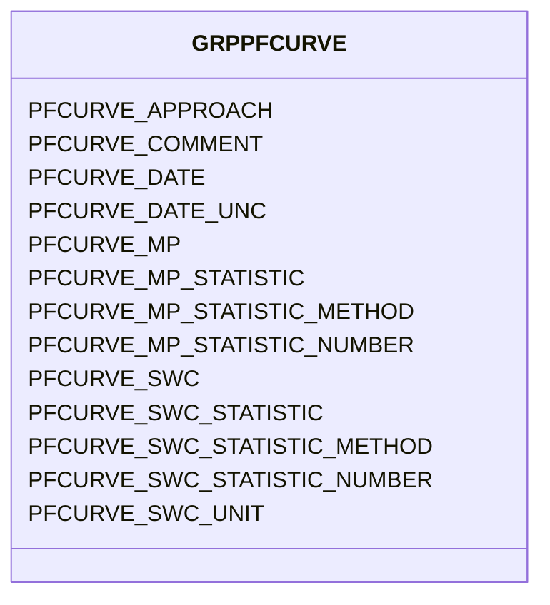

# Class: GRPPFCURVE


URI: [TEMP:GRPPFCURVE](https://example.org/TEMP/GRPPFCURVE)





<!-- no inheritance hierarchy -->


## Slots

| Name | Cardinality and Range | Description | Inheritance |
| ---  | --- | --- | --- |
| [PFCURVE_MP](PFCURVE_MP.md) | 0..1 <br/> [xsd:float](xsd:float) | Water retention (pF) curve matric potential | direct |
| [PFCURVE_MP_STATISTIC](PFCURVE_MP_STATISTIC.md) | 0..1 <br/> [STATISTIC](STATISTIC.md) | Water retention (pF) curve matric potential statistic | direct |
| [PFCURVE_MP_STATISTIC_METHOD](PFCURVE_MP_STATISTIC_METHOD.md) | 0..1 <br/> [STATISTICMETHOD](STATISTICMETHOD.md) | Water retention (pF) curve matric potential statistic method | direct |
| [PFCURVE_MP_STATISTIC_NUMBER](PFCURVE_MP_STATISTIC_NUMBER.md) | 0..1 <br/> [xsd:integer](xsd:integer) | Number of observations used to determine water retention (pF) curve matric po... | direct |
| [PFCURVE_SWC](PFCURVE_SWC.md) | 0..1 <br/> [xsd:float](xsd:float) | Water retention (pF) curve soil water content (SWC) | direct |
| [PFCURVE_SWC_STATISTIC](PFCURVE_SWC_STATISTIC.md) | 0..1 <br/> [STATISTIC](STATISTIC.md) | Water retention (pF) curve soil water content (SWC) statistic | direct |
| [PFCURVE_SWC_STATISTIC_METHOD](PFCURVE_SWC_STATISTIC_METHOD.md) | 0..1 <br/> [STATISTICMETHOD](STATISTICMETHOD.md) | Water retention (pF) curve soil water content (SWC) statistic method | direct |
| [PFCURVE_SWC_STATISTIC_NUMBER](PFCURVE_SWC_STATISTIC_NUMBER.md) | 0..1 <br/> [xsd:integer](xsd:integer) | Number of observations used to determine water retention (pF) curve soil wate... | direct |
| [PFCURVE_SWC_UNIT](PFCURVE_SWC_UNIT.md) | 0..1 <br/> [UNITSWC](UNITSWC.md) | Measurement unit of Water retention (pF) curve soil water content (SWC) | direct |
| [PFCURVE_APPROACH](PFCURVE_APPROACH.md) | 0..1 <br/> [xsd:string](xsd:string) | Water retention (pF) curve measurement approach | direct |
| [PFCURVE_DATE](PFCURVE_DATE.md) | 0..1 <br/> [xsd:float](xsd:float) | Water retention (pF) curve measurement date | direct |
| [PFCURVE_DATE_UNC](PFCURVE_DATE_UNC.md) | 0..1 <br/> [xsd:float](xsd:float) | Uncertainty in the Water retention (pF) curve measurement date | direct |
| [PFCURVE_COMMENT](PFCURVE_COMMENT.md) | 0..1 <br/> [xsd:string](xsd:string) | Water retention (pF) curve comments | direct |


## Identifier and Mapping Information


### Schema Source


* from schema: TEMP


## Mappings

| Mapping Type | Mapped Value |
| ---  | ---  |
| self | TEMP:GRPPFCURVE |
| native | TEMP:GRPPFCURVE |


## LinkML Source

<!-- TODO: investigate https://stackoverflow.com/questions/37606292/how-to-create-tabbed-code-blocks-in-mkdocs-or-sphinx -->

### Direct

<details>
```yaml
name: GRP_PFCURVE
from_schema: TEMP
rank: 1000
slots:
- PFCURVE_MP
- PFCURVE_MP_STATISTIC
- PFCURVE_MP_STATISTIC_METHOD
- PFCURVE_MP_STATISTIC_NUMBER
- PFCURVE_SWC
- PFCURVE_SWC_STATISTIC
- PFCURVE_SWC_STATISTIC_METHOD
- PFCURVE_SWC_STATISTIC_NUMBER
- PFCURVE_SWC_UNIT
- PFCURVE_APPROACH
- PFCURVE_DATE
- PFCURVE_DATE_UNC
- PFCURVE_COMMENT
slot_usage:
  PFCURVE_APPROACH:
    name: PFCURVE_APPROACH
    description: Water retention (pF) curve measurement approach
    comments:
    - Report Water retention (pF) curve SWC units (gravimetric or volumetric) as part
      of Approach for the Water retention (pF) curve measurement.
    multivalued: true
    domain_of:
    - GRP_PFCURVE
    - GRP_PFCURVE
  PFCURVE_COMMENT:
    name: PFCURVE_COMMENT
    description: Water retention (pF) curve comments
    multivalued: true
    domain_of:
    - GRP_PFCURVE
    - GRP_PFCURVE
  PFCURVE_DATE:
    name: PFCURVE_DATE
    description: Water retention (pF) curve measurement date
    comments:
    - Please report the date at the precision known. Allowed reporting precisions
      are YYYY, YYYYMM, YYYYMMDD, and YYYYMMDDHHMM.
    multivalued: true
    domain_of:
    - GRP_PFCURVE
    - GRP_PFCURVE
    required: true
  PFCURVE_DATE_UNC:
    name: PFCURVE_DATE_UNC
    description: Uncertainty in the Water retention (pF) curve measurement date
    multivalued: true
    domain_of:
    - GRP_PFCURVE
    - GRP_PFCURVE
  PFCURVE_MP:
    name: PFCURVE_MP
    description: Water retention (pF) curve matric potential
    comments:
    - This measure is intended to be taken in conjunction with PFCURVE_SWC so that
      a water retention (pF) can be generated. (pF is the negative log of matric potential.)
    multivalued: true
    identifier: true
    domain_of:
    - GRP_PFCURVE
    - GRP_PFCURVE
  PFCURVE_MP_STATISTIC:
    name: PFCURVE_MP_STATISTIC
    description: Water retention (pF) curve matric potential statistic
    comments:
    - The statistic for the measurement reported. Use predefined list (e.g., mean,
      min / max, standard deviation, etc).
    multivalued: true
    domain_of:
    - GRP_PFCURVE
    - GRP_PFCURVE
    required: true
  PFCURVE_MP_STATISTIC_METHOD:
    name: PFCURVE_MP_STATISTIC_METHOD
    description: Water retention (pF) curve matric potential statistic method
    comments:
    - Method used to generate the reported statistic (e.g., aggregate of individuals,
      aggregate of sample aggregates) from observations representing the same time
      period. Use predefined list. The aggregation method is not meant to describe
      temporal aggregations for example in calculations of higher frequency observations
      (e.g., sub-minute) to lower frequency observations (e.g., hourly) at a single
      location.
    multivalued: true
    domain_of:
    - GRP_PFCURVE
    - GRP_PFCURVE
  PFCURVE_MP_STATISTIC_NUMBER:
    name: PFCURVE_MP_STATISTIC_NUMBER
    description: Number of observations used to determine water retention (pF) curve
      matric potential statistic
    comments:
    - Number of observations (samples / replicates) used to calculate the STATISTIC
      for the reported measurement.
    multivalued: true
    domain_of:
    - GRP_PFCURVE
    - GRP_PFCURVE
  PFCURVE_SWC:
    name: PFCURVE_SWC
    description: Water retention (pF) curve soil water content (SWC)
    comments:
    - This measure is intended to be taken in conjunction with PFCURVE_MP so that
      a water retention (pF) can be generated. (pF is the negative log of matric potential.)
      Report units (gravimetric or volumetric) in Approach.
    multivalued: true
    domain_of:
    - GRP_PFCURVE
    - GRP_PFCURVE
    required: true
  PFCURVE_SWC_STATISTIC:
    name: PFCURVE_SWC_STATISTIC
    description: Water retention (pF) curve soil water content (SWC) statistic
    comments:
    - The statistic for the measurement reported. Use predefined list (e.g., mean,
      min / max, standard deviation, etc).
    multivalued: true
    domain_of:
    - GRP_PFCURVE
    - GRP_PFCURVE
    required: true
  PFCURVE_SWC_STATISTIC_METHOD:
    name: PFCURVE_SWC_STATISTIC_METHOD
    description: Water retention (pF) curve soil water content (SWC) statistic method
    comments:
    - Method used to generate the reported statistic (e.g., aggregate of individuals,
      aggregate of sample aggregates) from observations representing the same time
      period. Use predefined list. The aggregation method is not meant to describe
      temporal aggregations for example in calculations of higher frequency observations
      (e.g., sub-minute) to lower frequency observations (e.g., hourly) at a single
      location.
    multivalued: true
    domain_of:
    - GRP_PFCURVE
    - GRP_PFCURVE
  PFCURVE_SWC_STATISTIC_NUMBER:
    name: PFCURVE_SWC_STATISTIC_NUMBER
    description: Number of observations used to determine water retention (pF) curve
      soil water content (SWC) statistic
    comments:
    - Number of observations (samples / replicates) used to calculate the STATISTIC
      for the reported measurement.
    multivalued: true
    domain_of:
    - GRP_PFCURVE
    - GRP_PFCURVE
  PFCURVE_SWC_UNIT:
    name: PFCURVE_SWC_UNIT
    description: Measurement unit of Water retention (pF) curve soil water content
      (SWC)
    comments:
    - Use the predefined list to specify gravimetric (mass water / mass dry soil)
      or volumetric (volume water / volume soil) water content.
    multivalued: true
    domain_of:
    - GRP_PFCURVE
    - GRP_PFCURVE
    required: true

```
</details>

### Induced

<details>
```yaml
name: GRP_PFCURVE
from_schema: TEMP
rank: 1000
slot_usage:
  PFCURVE_APPROACH:
    name: PFCURVE_APPROACH
    description: Water retention (pF) curve measurement approach
    comments:
    - Report Water retention (pF) curve SWC units (gravimetric or volumetric) as part
      of Approach for the Water retention (pF) curve measurement.
    multivalued: true
    domain_of:
    - GRP_PFCURVE
    - GRP_PFCURVE
  PFCURVE_COMMENT:
    name: PFCURVE_COMMENT
    description: Water retention (pF) curve comments
    multivalued: true
    domain_of:
    - GRP_PFCURVE
    - GRP_PFCURVE
  PFCURVE_DATE:
    name: PFCURVE_DATE
    description: Water retention (pF) curve measurement date
    comments:
    - Please report the date at the precision known. Allowed reporting precisions
      are YYYY, YYYYMM, YYYYMMDD, and YYYYMMDDHHMM.
    multivalued: true
    domain_of:
    - GRP_PFCURVE
    - GRP_PFCURVE
    required: true
  PFCURVE_DATE_UNC:
    name: PFCURVE_DATE_UNC
    description: Uncertainty in the Water retention (pF) curve measurement date
    multivalued: true
    domain_of:
    - GRP_PFCURVE
    - GRP_PFCURVE
  PFCURVE_MP:
    name: PFCURVE_MP
    description: Water retention (pF) curve matric potential
    comments:
    - This measure is intended to be taken in conjunction with PFCURVE_SWC so that
      a water retention (pF) can be generated. (pF is the negative log of matric potential.)
    multivalued: true
    identifier: true
    domain_of:
    - GRP_PFCURVE
    - GRP_PFCURVE
  PFCURVE_MP_STATISTIC:
    name: PFCURVE_MP_STATISTIC
    description: Water retention (pF) curve matric potential statistic
    comments:
    - The statistic for the measurement reported. Use predefined list (e.g., mean,
      min / max, standard deviation, etc).
    multivalued: true
    domain_of:
    - GRP_PFCURVE
    - GRP_PFCURVE
    required: true
  PFCURVE_MP_STATISTIC_METHOD:
    name: PFCURVE_MP_STATISTIC_METHOD
    description: Water retention (pF) curve matric potential statistic method
    comments:
    - Method used to generate the reported statistic (e.g., aggregate of individuals,
      aggregate of sample aggregates) from observations representing the same time
      period. Use predefined list. The aggregation method is not meant to describe
      temporal aggregations for example in calculations of higher frequency observations
      (e.g., sub-minute) to lower frequency observations (e.g., hourly) at a single
      location.
    multivalued: true
    domain_of:
    - GRP_PFCURVE
    - GRP_PFCURVE
  PFCURVE_MP_STATISTIC_NUMBER:
    name: PFCURVE_MP_STATISTIC_NUMBER
    description: Number of observations used to determine water retention (pF) curve
      matric potential statistic
    comments:
    - Number of observations (samples / replicates) used to calculate the STATISTIC
      for the reported measurement.
    multivalued: true
    domain_of:
    - GRP_PFCURVE
    - GRP_PFCURVE
  PFCURVE_SWC:
    name: PFCURVE_SWC
    description: Water retention (pF) curve soil water content (SWC)
    comments:
    - This measure is intended to be taken in conjunction with PFCURVE_MP so that
      a water retention (pF) can be generated. (pF is the negative log of matric potential.)
      Report units (gravimetric or volumetric) in Approach.
    multivalued: true
    domain_of:
    - GRP_PFCURVE
    - GRP_PFCURVE
    required: true
  PFCURVE_SWC_STATISTIC:
    name: PFCURVE_SWC_STATISTIC
    description: Water retention (pF) curve soil water content (SWC) statistic
    comments:
    - The statistic for the measurement reported. Use predefined list (e.g., mean,
      min / max, standard deviation, etc).
    multivalued: true
    domain_of:
    - GRP_PFCURVE
    - GRP_PFCURVE
    required: true
  PFCURVE_SWC_STATISTIC_METHOD:
    name: PFCURVE_SWC_STATISTIC_METHOD
    description: Water retention (pF) curve soil water content (SWC) statistic method
    comments:
    - Method used to generate the reported statistic (e.g., aggregate of individuals,
      aggregate of sample aggregates) from observations representing the same time
      period. Use predefined list. The aggregation method is not meant to describe
      temporal aggregations for example in calculations of higher frequency observations
      (e.g., sub-minute) to lower frequency observations (e.g., hourly) at a single
      location.
    multivalued: true
    domain_of:
    - GRP_PFCURVE
    - GRP_PFCURVE
  PFCURVE_SWC_STATISTIC_NUMBER:
    name: PFCURVE_SWC_STATISTIC_NUMBER
    description: Number of observations used to determine water retention (pF) curve
      soil water content (SWC) statistic
    comments:
    - Number of observations (samples / replicates) used to calculate the STATISTIC
      for the reported measurement.
    multivalued: true
    domain_of:
    - GRP_PFCURVE
    - GRP_PFCURVE
  PFCURVE_SWC_UNIT:
    name: PFCURVE_SWC_UNIT
    description: Measurement unit of Water retention (pF) curve soil water content
      (SWC)
    comments:
    - Use the predefined list to specify gravimetric (mass water / mass dry soil)
      or volumetric (volume water / volume soil) water content.
    multivalued: true
    domain_of:
    - GRP_PFCURVE
    - GRP_PFCURVE
    required: true
attributes:
  PFCURVE_MP:
    name: PFCURVE_MP
    description: Water retention (pF) curve matric potential
    comments:
    - This measure is intended to be taken in conjunction with PFCURVE_SWC so that
      a water retention (pF) can be generated. (pF is the negative log of matric potential.)
    from_schema: TEMP
    rank: 1000
    multivalued: true
    identifier: true
    alias: PFCURVE_MP
    owner: GRP_PFCURVE
    domain_of:
    - GRP_PFCURVE
    - GRP_PFCURVE
    range: float
    unit:
      symbol: kPa
  PFCURVE_MP_STATISTIC:
    name: PFCURVE_MP_STATISTIC
    description: Water retention (pF) curve matric potential statistic
    comments:
    - The statistic for the measurement reported. Use predefined list (e.g., mean,
      min / max, standard deviation, etc).
    from_schema: TEMP
    rank: 1000
    multivalued: true
    alias: PFCURVE_MP_STATISTIC
    owner: GRP_PFCURVE
    domain_of:
    - GRP_PFCURVE
    - GRP_PFCURVE
    range: STATISTIC
    required: true
  PFCURVE_MP_STATISTIC_METHOD:
    name: PFCURVE_MP_STATISTIC_METHOD
    description: Water retention (pF) curve matric potential statistic method
    comments:
    - Method used to generate the reported statistic (e.g., aggregate of individuals,
      aggregate of sample aggregates) from observations representing the same time
      period. Use predefined list. The aggregation method is not meant to describe
      temporal aggregations for example in calculations of higher frequency observations
      (e.g., sub-minute) to lower frequency observations (e.g., hourly) at a single
      location.
    from_schema: TEMP
    rank: 1000
    multivalued: true
    alias: PFCURVE_MP_STATISTIC_METHOD
    owner: GRP_PFCURVE
    domain_of:
    - GRP_PFCURVE
    - GRP_PFCURVE
    range: STATISTIC_METHOD
  PFCURVE_MP_STATISTIC_NUMBER:
    name: PFCURVE_MP_STATISTIC_NUMBER
    description: Number of observations used to determine water retention (pF) curve
      matric potential statistic
    comments:
    - Number of observations (samples / replicates) used to calculate the STATISTIC
      for the reported measurement.
    from_schema: TEMP
    rank: 1000
    multivalued: true
    alias: PFCURVE_MP_STATISTIC_NUMBER
    owner: GRP_PFCURVE
    domain_of:
    - GRP_PFCURVE
    - GRP_PFCURVE
    range: integer
  PFCURVE_SWC:
    name: PFCURVE_SWC
    description: Water retention (pF) curve soil water content (SWC)
    comments:
    - This measure is intended to be taken in conjunction with PFCURVE_MP so that
      a water retention (pF) can be generated. (pF is the negative log of matric potential.)
      Report units (gravimetric or volumetric) in Approach.
    from_schema: TEMP
    rank: 1000
    multivalued: true
    alias: PFCURVE_SWC
    owner: GRP_PFCURVE
    domain_of:
    - GRP_PFCURVE
    - GRP_PFCURVE
    range: float
    required: true
    unit:
      symbol: '%'
  PFCURVE_SWC_STATISTIC:
    name: PFCURVE_SWC_STATISTIC
    description: Water retention (pF) curve soil water content (SWC) statistic
    comments:
    - The statistic for the measurement reported. Use predefined list (e.g., mean,
      min / max, standard deviation, etc).
    from_schema: TEMP
    rank: 1000
    multivalued: true
    alias: PFCURVE_SWC_STATISTIC
    owner: GRP_PFCURVE
    domain_of:
    - GRP_PFCURVE
    - GRP_PFCURVE
    range: STATISTIC
    required: true
  PFCURVE_SWC_STATISTIC_METHOD:
    name: PFCURVE_SWC_STATISTIC_METHOD
    description: Water retention (pF) curve soil water content (SWC) statistic method
    comments:
    - Method used to generate the reported statistic (e.g., aggregate of individuals,
      aggregate of sample aggregates) from observations representing the same time
      period. Use predefined list. The aggregation method is not meant to describe
      temporal aggregations for example in calculations of higher frequency observations
      (e.g., sub-minute) to lower frequency observations (e.g., hourly) at a single
      location.
    from_schema: TEMP
    rank: 1000
    multivalued: true
    alias: PFCURVE_SWC_STATISTIC_METHOD
    owner: GRP_PFCURVE
    domain_of:
    - GRP_PFCURVE
    - GRP_PFCURVE
    range: STATISTIC_METHOD
  PFCURVE_SWC_STATISTIC_NUMBER:
    name: PFCURVE_SWC_STATISTIC_NUMBER
    description: Number of observations used to determine water retention (pF) curve
      soil water content (SWC) statistic
    comments:
    - Number of observations (samples / replicates) used to calculate the STATISTIC
      for the reported measurement.
    from_schema: TEMP
    rank: 1000
    multivalued: true
    alias: PFCURVE_SWC_STATISTIC_NUMBER
    owner: GRP_PFCURVE
    domain_of:
    - GRP_PFCURVE
    - GRP_PFCURVE
    range: integer
  PFCURVE_SWC_UNIT:
    name: PFCURVE_SWC_UNIT
    description: Measurement unit of Water retention (pF) curve soil water content
      (SWC)
    comments:
    - Use the predefined list to specify gravimetric (mass water / mass dry soil)
      or volumetric (volume water / volume soil) water content.
    from_schema: TEMP
    rank: 1000
    multivalued: true
    alias: PFCURVE_SWC_UNIT
    owner: GRP_PFCURVE
    domain_of:
    - GRP_PFCURVE
    - GRP_PFCURVE
    range: UNIT_SWC
    required: true
  PFCURVE_APPROACH:
    name: PFCURVE_APPROACH
    description: Water retention (pF) curve measurement approach
    comments:
    - Report Water retention (pF) curve SWC units (gravimetric or volumetric) as part
      of Approach for the Water retention (pF) curve measurement.
    from_schema: TEMP
    rank: 1000
    multivalued: true
    alias: PFCURVE_APPROACH
    owner: GRP_PFCURVE
    domain_of:
    - GRP_PFCURVE
    - GRP_PFCURVE
    range: string
  PFCURVE_DATE:
    name: PFCURVE_DATE
    description: Water retention (pF) curve measurement date
    comments:
    - Please report the date at the precision known. Allowed reporting precisions
      are YYYY, YYYYMM, YYYYMMDD, and YYYYMMDDHHMM.
    from_schema: TEMP
    rank: 1000
    multivalued: true
    alias: PFCURVE_DATE
    owner: GRP_PFCURVE
    domain_of:
    - GRP_PFCURVE
    - GRP_PFCURVE
    range: float
    required: true
    unit:
      symbol: YYYYMMDDHHMM
  PFCURVE_DATE_UNC:
    name: PFCURVE_DATE_UNC
    description: Uncertainty in the Water retention (pF) curve measurement date
    from_schema: TEMP
    rank: 1000
    multivalued: true
    alias: PFCURVE_DATE_UNC
    owner: GRP_PFCURVE
    domain_of:
    - GRP_PFCURVE
    - GRP_PFCURVE
    range: float
    unit:
      symbol: days
  PFCURVE_COMMENT:
    name: PFCURVE_COMMENT
    description: Water retention (pF) curve comments
    from_schema: TEMP
    rank: 1000
    multivalued: true
    alias: PFCURVE_COMMENT
    owner: GRP_PFCURVE
    domain_of:
    - GRP_PFCURVE
    - GRP_PFCURVE
    range: string

```
</details>