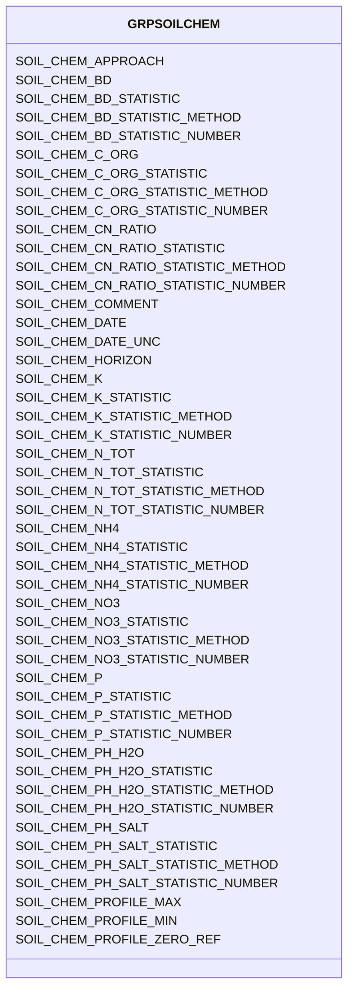

# Class: GRPSOILCHEM


URI: [TEMP:GRPSOILCHEM](https://example.org/TEMP/GRPSOILCHEM)





<!-- no inheritance hierarchy -->


## Slots

| Name | Cardinality and Range | Description | Inheritance |
| ---  | --- | --- | --- |
| [SOIL_CHEM_C_ORG](SOIL_CHEM_C_ORG.md) | 0..1 <br/> [xsd:float](xsd:float) | Soil organic carbon concentration | direct |
| [SOIL_CHEM_C_ORG_STATISTIC](SOIL_CHEM_C_ORG_STATISTIC.md) | 0..1 <br/> [STATISTIC](STATISTIC.md) | Soil organic carbon concentration statistic | direct |
| [SOIL_CHEM_C_ORG_STATISTIC_METHOD](SOIL_CHEM_C_ORG_STATISTIC_METHOD.md) | 0..1 <br/> [STATISTICMETHOD](STATISTICMETHOD.md) | Soil organic carbon concentration statistic method | direct |
| [SOIL_CHEM_C_ORG_STATISTIC_NUMBER](SOIL_CHEM_C_ORG_STATISTIC_NUMBER.md) | 0..1 <br/> [xsd:integer](xsd:integer) | Number of observations used to determine soil organic carbon concentration st... | direct |
| [SOIL_CHEM_N_TOT](SOIL_CHEM_N_TOT.md) | 0..1 <br/> [xsd:float](xsd:float) | Soil total nitrogen concentration | direct |
| [SOIL_CHEM_N_TOT_STATISTIC](SOIL_CHEM_N_TOT_STATISTIC.md) | 0..1 <br/> [STATISTIC](STATISTIC.md) | Soil total nitrogen concentration statistic | direct |
| [SOIL_CHEM_N_TOT_STATISTIC_METHOD](SOIL_CHEM_N_TOT_STATISTIC_METHOD.md) | 0..1 <br/> [STATISTICMETHOD](STATISTICMETHOD.md) | Soil total nitrogen concentration statistic method | direct |
| [SOIL_CHEM_N_TOT_STATISTIC_NUMBER](SOIL_CHEM_N_TOT_STATISTIC_NUMBER.md) | 0..1 <br/> [xsd:integer](xsd:integer) | Number of observations used to determine soil total nitrogen concentration st... | direct |
| [SOIL_CHEM_NH4](SOIL_CHEM_NH4.md) | 0..1 <br/> [xsd:float](xsd:float) | Soil ammonium concentration | direct |
| [SOIL_CHEM_NH4_STATISTIC](SOIL_CHEM_NH4_STATISTIC.md) | 0..1 <br/> [STATISTIC](STATISTIC.md) | Soil ammonium concentration statistic | direct |
| [SOIL_CHEM_NH4_STATISTIC_METHOD](SOIL_CHEM_NH4_STATISTIC_METHOD.md) | 0..1 <br/> [STATISTICMETHOD](STATISTICMETHOD.md) | Soil ammonium concentration statistic method | direct |
| [SOIL_CHEM_NH4_STATISTIC_NUMBER](SOIL_CHEM_NH4_STATISTIC_NUMBER.md) | 0..1 <br/> [xsd:integer](xsd:integer) | Number of observations used to determine soil ammonium concentration statisti... | direct |
| [SOIL_CHEM_NO3](SOIL_CHEM_NO3.md) | 0..1 <br/> [xsd:float](xsd:float) | Soil nitrate concentration | direct |
| [SOIL_CHEM_NO3_STATISTIC](SOIL_CHEM_NO3_STATISTIC.md) | 0..1 <br/> [STATISTIC](STATISTIC.md) | Soil nitrate concentration statistic | direct |
| [SOIL_CHEM_NO3_STATISTIC_METHOD](SOIL_CHEM_NO3_STATISTIC_METHOD.md) | 0..1 <br/> [STATISTICMETHOD](STATISTICMETHOD.md) | Soil nitrate concentration statistic method | direct |
| [SOIL_CHEM_NO3_STATISTIC_NUMBER](SOIL_CHEM_NO3_STATISTIC_NUMBER.md) | 0..1 <br/> [xsd:integer](xsd:integer) | Number of observations used to determine soil nitrate concentration statistic | direct |
| [SOIL_CHEM_K](SOIL_CHEM_K.md) | 0..1 <br/> [xsd:float](xsd:float) | Soil potassium concentration | direct |
| [SOIL_CHEM_K_STATISTIC](SOIL_CHEM_K_STATISTIC.md) | 0..1 <br/> [STATISTIC](STATISTIC.md) | Soil potassium concentration statistic | direct |
| [SOIL_CHEM_K_STATISTIC_METHOD](SOIL_CHEM_K_STATISTIC_METHOD.md) | 0..1 <br/> [STATISTICMETHOD](STATISTICMETHOD.md) | Soil potassium concentration statistic method | direct |
| [SOIL_CHEM_K_STATISTIC_NUMBER](SOIL_CHEM_K_STATISTIC_NUMBER.md) | 0..1 <br/> [xsd:integer](xsd:integer) | Number of observations used to determine soil potassium concentration statist... | direct |
| [SOIL_CHEM_P](SOIL_CHEM_P.md) | 0..1 <br/> [xsd:float](xsd:float) | Soil phosphorus concentration | direct |
| [SOIL_CHEM_P_STATISTIC](SOIL_CHEM_P_STATISTIC.md) | 0..1 <br/> [STATISTIC](STATISTIC.md) | Soil phosphorus concentration statistic | direct |
| [SOIL_CHEM_P_STATISTIC_METHOD](SOIL_CHEM_P_STATISTIC_METHOD.md) | 0..1 <br/> [STATISTICMETHOD](STATISTICMETHOD.md) | Soil phosphorus concentration statistic method | direct |
| [SOIL_CHEM_P_STATISTIC_NUMBER](SOIL_CHEM_P_STATISTIC_NUMBER.md) | 0..1 <br/> [xsd:integer](xsd:integer) | Number of observations used to determine soil phosphorus concentration statis... | direct |
| [SOIL_CHEM_CN_RATIO](SOIL_CHEM_CN_RATIO.md) | 0..1 <br/> [xsd:float](xsd:float) | Soil C/N ratio | direct |
| [SOIL_CHEM_CN_RATIO_STATISTIC](SOIL_CHEM_CN_RATIO_STATISTIC.md) | 0..1 <br/> [STATISTIC](STATISTIC.md) | Soil C/N ratio statistic | direct |
| [SOIL_CHEM_CN_RATIO_STATISTIC_METHOD](SOIL_CHEM_CN_RATIO_STATISTIC_METHOD.md) | 0..1 <br/> [STATISTICMETHOD](STATISTICMETHOD.md) | Soil C/N ratio statistic method | direct |
| [SOIL_CHEM_CN_RATIO_STATISTIC_NUMBER](SOIL_CHEM_CN_RATIO_STATISTIC_NUMBER.md) | 0..1 <br/> [xsd:integer](xsd:integer) | Number of observations used to determine soil C/N ratio statistic | direct |
| [SOIL_CHEM_PH_SALT](SOIL_CHEM_PH_SALT.md) | 0..1 <br/> [xsd:float](xsd:float) | Soil pH by CaCl2 or other salt | direct |
| [SOIL_CHEM_PH_SALT_STATISTIC](SOIL_CHEM_PH_SALT_STATISTIC.md) | 0..1 <br/> [STATISTIC](STATISTIC.md) | Soil pH by CaCl2 or other salt statistic | direct |
| [SOIL_CHEM_PH_SALT_STATISTIC_METHOD](SOIL_CHEM_PH_SALT_STATISTIC_METHOD.md) | 0..1 <br/> [STATISTICMETHOD](STATISTICMETHOD.md) | Soil pH by CaCl2 or other salt statistic method | direct |
| [SOIL_CHEM_PH_SALT_STATISTIC_NUMBER](SOIL_CHEM_PH_SALT_STATISTIC_NUMBER.md) | 0..1 <br/> [xsd:integer](xsd:integer) | Number of observations used to determine soil pH by CaCl2 or other salt stati... | direct |
| [SOIL_CHEM_PH_H2O](SOIL_CHEM_PH_H2O.md) | 0..1 <br/> [xsd:float](xsd:float) | Soil pH by H2O | direct |
| [SOIL_CHEM_PH_H2O_STATISTIC](SOIL_CHEM_PH_H2O_STATISTIC.md) | 0..1 <br/> [STATISTIC](STATISTIC.md) | Soil pH by H2O statistic | direct |
| [SOIL_CHEM_PH_H2O_STATISTIC_METHOD](SOIL_CHEM_PH_H2O_STATISTIC_METHOD.md) | 0..1 <br/> [STATISTICMETHOD](STATISTICMETHOD.md) | Soil pH by H2O statistic method | direct |
| [SOIL_CHEM_PH_H2O_STATISTIC_NUMBER](SOIL_CHEM_PH_H2O_STATISTIC_NUMBER.md) | 0..1 <br/> [xsd:integer](xsd:integer) | Number of observations used to determine soil pH by H2O statistic | direct |
| [SOIL_CHEM_BD](SOIL_CHEM_BD.md) | 0..1 <br/> [xsd:float](xsd:float) | Soil bulk density | direct |
| [SOIL_CHEM_BD_STATISTIC](SOIL_CHEM_BD_STATISTIC.md) | 0..1 <br/> [STATISTIC](STATISTIC.md) | Soil bulk density statistic | direct |
| [SOIL_CHEM_BD_STATISTIC_METHOD](SOIL_CHEM_BD_STATISTIC_METHOD.md) | 0..1 <br/> [STATISTICMETHOD](STATISTICMETHOD.md) | Soil bulk density statistic method | direct |
| [SOIL_CHEM_BD_STATISTIC_NUMBER](SOIL_CHEM_BD_STATISTIC_NUMBER.md) | 0..1 <br/> [xsd:integer](xsd:integer) | Number of observations used to determine soil bulk density statistic | direct |
| [SOIL_CHEM_PROFILE_ZERO_REF](SOIL_CHEM_PROFILE_ZERO_REF.md) | 0..1 <br/> [PROFILEZEROREF](PROFILEZEROREF.md) | Soil chemistry profile zero reference | direct |
| [SOIL_CHEM_PROFILE_MIN](SOIL_CHEM_PROFILE_MIN.md) | 0..1 <br/> [xsd:float](xsd:float) | Soil chemistry profile minimum depth | direct |
| [SOIL_CHEM_PROFILE_MAX](SOIL_CHEM_PROFILE_MAX.md) | 0..1 <br/> [xsd:float](xsd:float) | Soil chemistry profile maximum depth | direct |
| [SOIL_CHEM_HORIZON](SOIL_CHEM_HORIZON.md) | 0..1 <br/> [xsd:string](xsd:string) | Soil chemistry profile horizon | direct |
| [SOIL_CHEM_APPROACH](SOIL_CHEM_APPROACH.md) | 0..1 <br/> [xsd:string](xsd:string) | Soil chemistry measurement approach | direct |
| [SOIL_CHEM_DATE](SOIL_CHEM_DATE.md) | 0..1 <br/> [xsd:float](xsd:float) | Soil chemistry measurement sampling date | direct |
| [SOIL_CHEM_DATE_UNC](SOIL_CHEM_DATE_UNC.md) | 0..1 <br/> [xsd:float](xsd:float) | Uncertainty in the Soil chemistry measurement sampling date | direct |
| [SOIL_CHEM_COMMENT](SOIL_CHEM_COMMENT.md) | 0..1 <br/> [xsd:string](xsd:string) | Soil chemistry comments | direct |


## Identifier and Mapping Information


### Schema Source


* from schema: TEMP


## Mappings

| Mapping Type | Mapped Value |
| ---  | ---  |
| self | TEMP:GRPSOILCHEM |
| native | TEMP:GRPSOILCHEM |


## LinkML Source

<!-- TODO: investigate https://stackoverflow.com/questions/37606292/how-to-create-tabbed-code-blocks-in-mkdocs-or-sphinx -->

### Direct

<details>
```yaml
name: GRP_SOIL_CHEM
from_schema: TEMP
rank: 1000
slots:
- SOIL_CHEM_C_ORG
- SOIL_CHEM_C_ORG_STATISTIC
- SOIL_CHEM_C_ORG_STATISTIC_METHOD
- SOIL_CHEM_C_ORG_STATISTIC_NUMBER
- SOIL_CHEM_N_TOT
- SOIL_CHEM_N_TOT_STATISTIC
- SOIL_CHEM_N_TOT_STATISTIC_METHOD
- SOIL_CHEM_N_TOT_STATISTIC_NUMBER
- SOIL_CHEM_NH4
- SOIL_CHEM_NH4_STATISTIC
- SOIL_CHEM_NH4_STATISTIC_METHOD
- SOIL_CHEM_NH4_STATISTIC_NUMBER
- SOIL_CHEM_NO3
- SOIL_CHEM_NO3_STATISTIC
- SOIL_CHEM_NO3_STATISTIC_METHOD
- SOIL_CHEM_NO3_STATISTIC_NUMBER
- SOIL_CHEM_K
- SOIL_CHEM_K_STATISTIC
- SOIL_CHEM_K_STATISTIC_METHOD
- SOIL_CHEM_K_STATISTIC_NUMBER
- SOIL_CHEM_P
- SOIL_CHEM_P_STATISTIC
- SOIL_CHEM_P_STATISTIC_METHOD
- SOIL_CHEM_P_STATISTIC_NUMBER
- SOIL_CHEM_CN_RATIO
- SOIL_CHEM_CN_RATIO_STATISTIC
- SOIL_CHEM_CN_RATIO_STATISTIC_METHOD
- SOIL_CHEM_CN_RATIO_STATISTIC_NUMBER
- SOIL_CHEM_PH_SALT
- SOIL_CHEM_PH_SALT_STATISTIC
- SOIL_CHEM_PH_SALT_STATISTIC_METHOD
- SOIL_CHEM_PH_SALT_STATISTIC_NUMBER
- SOIL_CHEM_PH_H2O
- SOIL_CHEM_PH_H2O_STATISTIC
- SOIL_CHEM_PH_H2O_STATISTIC_METHOD
- SOIL_CHEM_PH_H2O_STATISTIC_NUMBER
- SOIL_CHEM_BD
- SOIL_CHEM_BD_STATISTIC
- SOIL_CHEM_BD_STATISTIC_METHOD
- SOIL_CHEM_BD_STATISTIC_NUMBER
- SOIL_CHEM_PROFILE_ZERO_REF
- SOIL_CHEM_PROFILE_MIN
- SOIL_CHEM_PROFILE_MAX
- SOIL_CHEM_HORIZON
- SOIL_CHEM_APPROACH
- SOIL_CHEM_DATE
- SOIL_CHEM_DATE_UNC
- SOIL_CHEM_COMMENT
slot_usage:
  SOIL_CHEM_APPROACH:
    name: SOIL_CHEM_APPROACH
    description: Soil chemistry measurement approach
    comments:
    - Approach describes both sampling and processing methodologies. Please provide
      details that will improve intepretation of measurement/assessment, facilitate
      comparison with similar measures made with different approaches, and/or allow
      for quality checking.
    multivalued: true
    domain_of:
    - GRP_SOIL_CHEM
    - GRP_SOIL_CHEM
  SOIL_CHEM_BD:
    name: SOIL_CHEM_BD
    description: Soil bulk density
    multivalued: true
    identifier: true
    domain_of:
    - GRP_SOIL_CHEM
    - GRP_SOIL_CHEM
  SOIL_CHEM_BD_STATISTIC:
    name: SOIL_CHEM_BD_STATISTIC
    description: Soil bulk density statistic
    comments:
    - The statistic for the measurement reported. Use predefined list (e.g., mean,
      min / max, standard deviation, etc).
    multivalued: true
    domain_of:
    - GRP_SOIL_CHEM
    - GRP_SOIL_CHEM
    required: true
  SOIL_CHEM_BD_STATISTIC_METHOD:
    name: SOIL_CHEM_BD_STATISTIC_METHOD
    description: Soil bulk density statistic method
    comments:
    - Method used to generate the reported statistic (e.g., aggregate of individuals,
      aggregate of sample aggregates) from observations representing the same time
      period. Use predefined list. The aggregation method is not meant to describe
      temporal aggregations for example in calculations of higher frequency observations
      (e.g., sub-minute) to lower frequency observations (e.g., hourly) at a single
      location.
    multivalued: true
    domain_of:
    - GRP_SOIL_CHEM
    - GRP_SOIL_CHEM
  SOIL_CHEM_BD_STATISTIC_NUMBER:
    name: SOIL_CHEM_BD_STATISTIC_NUMBER
    description: Number of observations used to determine soil bulk density statistic
    comments:
    - Number of observations (samples / replicates) used to calculate the STATISTIC
      for the reported measurement.
    multivalued: true
    domain_of:
    - GRP_SOIL_CHEM
    - GRP_SOIL_CHEM
  SOIL_CHEM_CN_RATIO:
    name: SOIL_CHEM_CN_RATIO
    description: Soil C/N ratio
    comments:
    - Soil carbon to nitrogen ratio.
    multivalued: true
    identifier: true
    domain_of:
    - GRP_SOIL_CHEM
    - GRP_SOIL_CHEM
  SOIL_CHEM_CN_RATIO_STATISTIC:
    name: SOIL_CHEM_CN_RATIO_STATISTIC
    description: Soil C/N ratio statistic
    comments:
    - The statistic for the measurement reported. Use predefined list (e.g., mean,
      min / max, standard deviation, etc).
    multivalued: true
    domain_of:
    - GRP_SOIL_CHEM
    - GRP_SOIL_CHEM
    required: true
  SOIL_CHEM_CN_RATIO_STATISTIC_METHOD:
    name: SOIL_CHEM_CN_RATIO_STATISTIC_METHOD
    description: Soil C/N ratio statistic method
    comments:
    - Method used to generate the reported statistic (e.g., aggregate of individuals,
      aggregate of sample aggregates) from observations representing the same time
      period. Use predefined list. The aggregation method is not meant to describe
      temporal aggregations for example in calculations of higher frequency observations
      (e.g., sub-minute) to lower frequency observations (e.g., hourly) at a single
      location.
    multivalued: true
    domain_of:
    - GRP_SOIL_CHEM
    - GRP_SOIL_CHEM
  SOIL_CHEM_CN_RATIO_STATISTIC_NUMBER:
    name: SOIL_CHEM_CN_RATIO_STATISTIC_NUMBER
    description: Number of observations used to determine soil C/N ratio statistic
    comments:
    - Number of observations (samples / replicates) used to calculate the STATISTIC
      for the reported measurement.
    multivalued: true
    domain_of:
    - GRP_SOIL_CHEM
    - GRP_SOIL_CHEM
  SOIL_CHEM_COMMENT:
    name: SOIL_CHEM_COMMENT
    description: Soil chemistry comments
    multivalued: true
    domain_of:
    - GRP_SOIL_CHEM
    - GRP_SOIL_CHEM
  SOIL_CHEM_C_ORG:
    name: SOIL_CHEM_C_ORG
    description: Soil organic carbon concentration
    multivalued: true
    identifier: true
    domain_of:
    - GRP_SOIL_CHEM
    - GRP_SOIL_CHEM
  SOIL_CHEM_C_ORG_STATISTIC:
    name: SOIL_CHEM_C_ORG_STATISTIC
    description: Soil organic carbon concentration statistic
    comments:
    - The statistic for the measurement reported. Use predefined list (e.g., mean,
      min / max, standard deviation, etc).
    multivalued: true
    domain_of:
    - GRP_SOIL_CHEM
    - GRP_SOIL_CHEM
    required: true
  SOIL_CHEM_C_ORG_STATISTIC_METHOD:
    name: SOIL_CHEM_C_ORG_STATISTIC_METHOD
    description: Soil organic carbon concentration statistic method
    comments:
    - Method used to generate the reported statistic (e.g., aggregate of individuals,
      aggregate of sample aggregates) from observations representing the same time
      period. Use predefined list. The aggregation method is not meant to describe
      temporal aggregations for example in calculations of higher frequency observations
      (e.g., sub-minute) to lower frequency observations (e.g., hourly) at a single
      location.
    multivalued: true
    domain_of:
    - GRP_SOIL_CHEM
    - GRP_SOIL_CHEM
  SOIL_CHEM_C_ORG_STATISTIC_NUMBER:
    name: SOIL_CHEM_C_ORG_STATISTIC_NUMBER
    description: Number of observations used to determine soil organic carbon concentration
      statistic
    comments:
    - Number of observations (samples / replicates) used to calculate the STATISTIC
      for the reported measurement.
    multivalued: true
    domain_of:
    - GRP_SOIL_CHEM
    - GRP_SOIL_CHEM
  SOIL_CHEM_DATE:
    name: SOIL_CHEM_DATE
    description: Soil chemistry measurement sampling date
    comments:
    - Please report the date at the precision known. Allowed reporting precisions
      are YYYY, YYYYMM, YYYYMMDD, and YYYYMMDDHHMM.
    multivalued: true
    domain_of:
    - GRP_SOIL_CHEM
    - GRP_SOIL_CHEM
    required: true
  SOIL_CHEM_DATE_UNC:
    name: SOIL_CHEM_DATE_UNC
    description: Uncertainty in the Soil chemistry measurement sampling date
    multivalued: true
    domain_of:
    - GRP_SOIL_CHEM
    - GRP_SOIL_CHEM
  SOIL_CHEM_HORIZON:
    name: SOIL_CHEM_HORIZON
    description: Soil chemistry profile horizon
    comments:
    - Use soil horizon scheme best suited for your soil. Examples include O, Oa, B,
      Bt, C.
    multivalued: true
    domain_of:
    - GRP_SOIL_CHEM
    - GRP_SOIL_CHEM
  SOIL_CHEM_K:
    name: SOIL_CHEM_K
    description: Soil potassium concentration
    multivalued: true
    identifier: true
    domain_of:
    - GRP_SOIL_CHEM
    - GRP_SOIL_CHEM
  SOIL_CHEM_K_STATISTIC:
    name: SOIL_CHEM_K_STATISTIC
    description: Soil potassium concentration statistic
    comments:
    - The statistic for the measurement reported. Use predefined list (e.g., mean,
      min / max, standard deviation, etc).
    multivalued: true
    domain_of:
    - GRP_SOIL_CHEM
    - GRP_SOIL_CHEM
    required: true
  SOIL_CHEM_K_STATISTIC_METHOD:
    name: SOIL_CHEM_K_STATISTIC_METHOD
    description: Soil potassium concentration statistic method
    comments:
    - Method used to generate the reported statistic (e.g., aggregate of individuals,
      aggregate of sample aggregates) from observations representing the same time
      period. Use predefined list. The aggregation method is not meant to describe
      temporal aggregations for example in calculations of higher frequency observations
      (e.g., sub-minute) to lower frequency observations (e.g., hourly) at a single
      location.
    multivalued: true
    domain_of:
    - GRP_SOIL_CHEM
    - GRP_SOIL_CHEM
  SOIL_CHEM_K_STATISTIC_NUMBER:
    name: SOIL_CHEM_K_STATISTIC_NUMBER
    description: Number of observations used to determine soil potassium concentration
      statistic
    comments:
    - Number of observations (samples / replicates) used to calculate the STATISTIC
      for the reported measurement.
    multivalued: true
    domain_of:
    - GRP_SOIL_CHEM
    - GRP_SOIL_CHEM
  SOIL_CHEM_NH4:
    name: SOIL_CHEM_NH4
    description: Soil ammonium concentration
    multivalued: true
    identifier: true
    domain_of:
    - GRP_SOIL_CHEM
    - GRP_SOIL_CHEM
  SOIL_CHEM_NH4_STATISTIC:
    name: SOIL_CHEM_NH4_STATISTIC
    description: Soil ammonium concentration statistic
    comments:
    - The statistic for the measurement reported. Use predefined list (e.g., mean,
      min / max, standard deviation, etc).
    multivalued: true
    domain_of:
    - GRP_SOIL_CHEM
    - GRP_SOIL_CHEM
    required: true
  SOIL_CHEM_NH4_STATISTIC_METHOD:
    name: SOIL_CHEM_NH4_STATISTIC_METHOD
    description: Soil ammonium concentration statistic method
    comments:
    - Method used to generate the reported statistic (e.g., aggregate of individuals,
      aggregate of sample aggregates) from observations representing the same time
      period. Use predefined list. The aggregation method is not meant to describe
      temporal aggregations for example in calculations of higher frequency observations
      (e.g., sub-minute) to lower frequency observations (e.g., hourly) at a single
      location.
    multivalued: true
    domain_of:
    - GRP_SOIL_CHEM
    - GRP_SOIL_CHEM
  SOIL_CHEM_NH4_STATISTIC_NUMBER:
    name: SOIL_CHEM_NH4_STATISTIC_NUMBER
    description: Number of observations used to determine soil ammonium concentration
      statistic
    comments:
    - Number of observations (samples / replicates) used to calculate the STATISTIC
      for the reported measurement.
    multivalued: true
    domain_of:
    - GRP_SOIL_CHEM
    - GRP_SOIL_CHEM
  SOIL_CHEM_NO3:
    name: SOIL_CHEM_NO3
    description: Soil nitrate concentration
    multivalued: true
    identifier: true
    domain_of:
    - GRP_SOIL_CHEM
    - GRP_SOIL_CHEM
  SOIL_CHEM_NO3_STATISTIC:
    name: SOIL_CHEM_NO3_STATISTIC
    description: Soil nitrate concentration statistic
    comments:
    - The statistic for the measurement reported. Use predefined list (e.g., mean,
      min / max, standard deviation, etc).
    multivalued: true
    domain_of:
    - GRP_SOIL_CHEM
    - GRP_SOIL_CHEM
    required: true
  SOIL_CHEM_NO3_STATISTIC_METHOD:
    name: SOIL_CHEM_NO3_STATISTIC_METHOD
    description: Soil nitrate concentration statistic method
    comments:
    - Method used to generate the reported statistic (e.g., aggregate of individuals,
      aggregate of sample aggregates) from observations representing the same time
      period. Use predefined list. The aggregation method is not meant to describe
      temporal aggregations for example in calculations of higher frequency observations
      (e.g., sub-minute) to lower frequency observations (e.g., hourly) at a single
      location.
    multivalued: true
    domain_of:
    - GRP_SOIL_CHEM
    - GRP_SOIL_CHEM
  SOIL_CHEM_NO3_STATISTIC_NUMBER:
    name: SOIL_CHEM_NO3_STATISTIC_NUMBER
    description: Number of observations used to determine soil nitrate concentration
      statistic
    comments:
    - Number of observations (samples / replicates) used to calculate the STATISTIC
      for the reported measurement.
    multivalued: true
    domain_of:
    - GRP_SOIL_CHEM
    - GRP_SOIL_CHEM
  SOIL_CHEM_N_TOT:
    name: SOIL_CHEM_N_TOT
    description: Soil total nitrogen concentration
    multivalued: true
    identifier: true
    domain_of:
    - GRP_SOIL_CHEM
    - GRP_SOIL_CHEM
  SOIL_CHEM_N_TOT_STATISTIC:
    name: SOIL_CHEM_N_TOT_STATISTIC
    description: Soil total nitrogen concentration statistic
    comments:
    - The statistic for the measurement reported. Use predefined list (e.g., mean,
      min / max, standard deviation, etc).
    multivalued: true
    domain_of:
    - GRP_SOIL_CHEM
    - GRP_SOIL_CHEM
    required: true
  SOIL_CHEM_N_TOT_STATISTIC_METHOD:
    name: SOIL_CHEM_N_TOT_STATISTIC_METHOD
    description: Soil total nitrogen concentration statistic method
    comments:
    - Method used to generate the reported statistic (e.g., aggregate of individuals,
      aggregate of sample aggregates) from observations representing the same time
      period. Use predefined list. The aggregation method is not meant to describe
      temporal aggregations for example in calculations of higher frequency observations
      (e.g., sub-minute) to lower frequency observations (e.g., hourly) at a single
      location.
    multivalued: true
    domain_of:
    - GRP_SOIL_CHEM
    - GRP_SOIL_CHEM
  SOIL_CHEM_N_TOT_STATISTIC_NUMBER:
    name: SOIL_CHEM_N_TOT_STATISTIC_NUMBER
    description: Number of observations used to determine soil total nitrogen concentration
      statistic
    comments:
    - Number of observations (samples / replicates) used to calculate the STATISTIC
      for the reported measurement.
    multivalued: true
    domain_of:
    - GRP_SOIL_CHEM
    - GRP_SOIL_CHEM
  SOIL_CHEM_P:
    name: SOIL_CHEM_P
    description: Soil phosphorus concentration
    multivalued: true
    identifier: true
    domain_of:
    - GRP_SOIL_CHEM
    - GRP_SOIL_CHEM
  SOIL_CHEM_PH_H2O:
    name: SOIL_CHEM_PH_H2O
    description: Soil pH by H2O
    comments:
    - Soil pH determined in water.
    multivalued: true
    identifier: true
    domain_of:
    - GRP_SOIL_CHEM
    - GRP_SOIL_CHEM
  SOIL_CHEM_PH_H2O_STATISTIC:
    name: SOIL_CHEM_PH_H2O_STATISTIC
    description: Soil pH by H2O statistic
    comments:
    - The statistic for the measurement reported. Use predefined list (e.g., mean,
      min / max, standard deviation, etc).
    multivalued: true
    domain_of:
    - GRP_SOIL_CHEM
    - GRP_SOIL_CHEM
    required: true
  SOIL_CHEM_PH_H2O_STATISTIC_METHOD:
    name: SOIL_CHEM_PH_H2O_STATISTIC_METHOD
    description: Soil pH by H2O statistic method
    comments:
    - Method used to generate the reported statistic (e.g., aggregate of individuals,
      aggregate of sample aggregates) from observations representing the same time
      period. Use predefined list. The aggregation method is not meant to describe
      temporal aggregations for example in calculations of higher frequency observations
      (e.g., sub-minute) to lower frequency observations (e.g., hourly) at a single
      location.
    multivalued: true
    domain_of:
    - GRP_SOIL_CHEM
    - GRP_SOIL_CHEM
  SOIL_CHEM_PH_H2O_STATISTIC_NUMBER:
    name: SOIL_CHEM_PH_H2O_STATISTIC_NUMBER
    description: Number of observations used to determine soil pH by H2O statistic
    comments:
    - Number of observations (samples / replicates) used to calculate the STATISTIC
      for the reported measurement.
    multivalued: true
    domain_of:
    - GRP_SOIL_CHEM
    - GRP_SOIL_CHEM
  SOIL_CHEM_PH_SALT:
    name: SOIL_CHEM_PH_SALT
    description: Soil pH by CaCl2 or other salt
    comments:
    - If pH is determined with a salt other than CaCl2, specify the salt used in Approach.
    multivalued: true
    identifier: true
    domain_of:
    - GRP_SOIL_CHEM
    - GRP_SOIL_CHEM
  SOIL_CHEM_PH_SALT_STATISTIC:
    name: SOIL_CHEM_PH_SALT_STATISTIC
    description: Soil pH by CaCl2 or other salt statistic
    comments:
    - The statistic for the measurement reported. Use predefined list (e.g., mean,
      min / max, standard deviation, etc).
    multivalued: true
    domain_of:
    - GRP_SOIL_CHEM
    - GRP_SOIL_CHEM
    required: true
  SOIL_CHEM_PH_SALT_STATISTIC_METHOD:
    name: SOIL_CHEM_PH_SALT_STATISTIC_METHOD
    description: Soil pH by CaCl2 or other salt statistic method
    comments:
    - Method used to generate the reported statistic (e.g., aggregate of individuals,
      aggregate of sample aggregates) from observations representing the same time
      period. Use predefined list. The aggregation method is not meant to describe
      temporal aggregations for example in calculations of higher frequency observations
      (e.g., sub-minute) to lower frequency observations (e.g., hourly) at a single
      location.
    multivalued: true
    domain_of:
    - GRP_SOIL_CHEM
    - GRP_SOIL_CHEM
  SOIL_CHEM_PH_SALT_STATISTIC_NUMBER:
    name: SOIL_CHEM_PH_SALT_STATISTIC_NUMBER
    description: Number of observations used to determine soil pH by CaCl2 or other
      salt statistic
    comments:
    - Number of observations (samples / replicates) used to calculate the STATISTIC
      for the reported measurement.
    multivalued: true
    domain_of:
    - GRP_SOIL_CHEM
    - GRP_SOIL_CHEM
  SOIL_CHEM_PROFILE_MAX:
    name: SOIL_CHEM_PROFILE_MAX
    description: Soil chemistry profile maximum depth
    comments:
    - Profile maximum depth is the vertical distance from profile zero reference to
      the bottom of soil layer being measured.
    multivalued: true
    domain_of:
    - GRP_SOIL_CHEM
    - GRP_SOIL_CHEM
  SOIL_CHEM_PROFILE_MIN:
    name: SOIL_CHEM_PROFILE_MIN
    description: Soil chemistry profile minimum depth
    comments:
    - Profile minimum depth is the vertical distance from profile zero reference to
      the top of soil layer being measured.
    multivalued: true
    domain_of:
    - GRP_SOIL_CHEM
    - GRP_SOIL_CHEM
  SOIL_CHEM_PROFILE_ZERO_REF:
    name: SOIL_CHEM_PROFILE_ZERO_REF
    description: Soil chemistry profile zero reference
    comments:
    - Profile Zero Reference is the horizontal plane from which the soil profile minimum
      and maximum depths are measured. For example, top of mineral soil or top of
      litter layer. Use predefined list.
    multivalued: true
    domain_of:
    - GRP_SOIL_CHEM
    - GRP_SOIL_CHEM
  SOIL_CHEM_P_STATISTIC:
    name: SOIL_CHEM_P_STATISTIC
    description: Soil phosphorus concentration statistic
    comments:
    - The statistic for the measurement reported. Use predefined list (e.g., mean,
      min / max, standard deviation, etc).
    multivalued: true
    domain_of:
    - GRP_SOIL_CHEM
    - GRP_SOIL_CHEM
    required: true
  SOIL_CHEM_P_STATISTIC_METHOD:
    name: SOIL_CHEM_P_STATISTIC_METHOD
    description: Soil phosphorus concentration statistic method
    comments:
    - Method used to generate the reported statistic (e.g., aggregate of individuals,
      aggregate of sample aggregates) from observations representing the same time
      period. Use predefined list. The aggregation method is not meant to describe
      temporal aggregations for example in calculations of higher frequency observations
      (e.g., sub-minute) to lower frequency observations (e.g., hourly) at a single
      location.
    multivalued: true
    domain_of:
    - GRP_SOIL_CHEM
    - GRP_SOIL_CHEM
  SOIL_CHEM_P_STATISTIC_NUMBER:
    name: SOIL_CHEM_P_STATISTIC_NUMBER
    description: Number of observations used to determine soil phosphorus concentration
      statistic
    comments:
    - Number of observations (samples / replicates) used to calculate the STATISTIC
      for the reported measurement.
    multivalued: true
    domain_of:
    - GRP_SOIL_CHEM
    - GRP_SOIL_CHEM

```
</details>

### Induced

<details>
```yaml
name: GRP_SOIL_CHEM
from_schema: TEMP
rank: 1000
slot_usage:
  SOIL_CHEM_APPROACH:
    name: SOIL_CHEM_APPROACH
    description: Soil chemistry measurement approach
    comments:
    - Approach describes both sampling and processing methodologies. Please provide
      details that will improve intepretation of measurement/assessment, facilitate
      comparison with similar measures made with different approaches, and/or allow
      for quality checking.
    multivalued: true
    domain_of:
    - GRP_SOIL_CHEM
    - GRP_SOIL_CHEM
  SOIL_CHEM_BD:
    name: SOIL_CHEM_BD
    description: Soil bulk density
    multivalued: true
    identifier: true
    domain_of:
    - GRP_SOIL_CHEM
    - GRP_SOIL_CHEM
  SOIL_CHEM_BD_STATISTIC:
    name: SOIL_CHEM_BD_STATISTIC
    description: Soil bulk density statistic
    comments:
    - The statistic for the measurement reported. Use predefined list (e.g., mean,
      min / max, standard deviation, etc).
    multivalued: true
    domain_of:
    - GRP_SOIL_CHEM
    - GRP_SOIL_CHEM
    required: true
  SOIL_CHEM_BD_STATISTIC_METHOD:
    name: SOIL_CHEM_BD_STATISTIC_METHOD
    description: Soil bulk density statistic method
    comments:
    - Method used to generate the reported statistic (e.g., aggregate of individuals,
      aggregate of sample aggregates) from observations representing the same time
      period. Use predefined list. The aggregation method is not meant to describe
      temporal aggregations for example in calculations of higher frequency observations
      (e.g., sub-minute) to lower frequency observations (e.g., hourly) at a single
      location.
    multivalued: true
    domain_of:
    - GRP_SOIL_CHEM
    - GRP_SOIL_CHEM
  SOIL_CHEM_BD_STATISTIC_NUMBER:
    name: SOIL_CHEM_BD_STATISTIC_NUMBER
    description: Number of observations used to determine soil bulk density statistic
    comments:
    - Number of observations (samples / replicates) used to calculate the STATISTIC
      for the reported measurement.
    multivalued: true
    domain_of:
    - GRP_SOIL_CHEM
    - GRP_SOIL_CHEM
  SOIL_CHEM_CN_RATIO:
    name: SOIL_CHEM_CN_RATIO
    description: Soil C/N ratio
    comments:
    - Soil carbon to nitrogen ratio.
    multivalued: true
    identifier: true
    domain_of:
    - GRP_SOIL_CHEM
    - GRP_SOIL_CHEM
  SOIL_CHEM_CN_RATIO_STATISTIC:
    name: SOIL_CHEM_CN_RATIO_STATISTIC
    description: Soil C/N ratio statistic
    comments:
    - The statistic for the measurement reported. Use predefined list (e.g., mean,
      min / max, standard deviation, etc).
    multivalued: true
    domain_of:
    - GRP_SOIL_CHEM
    - GRP_SOIL_CHEM
    required: true
  SOIL_CHEM_CN_RATIO_STATISTIC_METHOD:
    name: SOIL_CHEM_CN_RATIO_STATISTIC_METHOD
    description: Soil C/N ratio statistic method
    comments:
    - Method used to generate the reported statistic (e.g., aggregate of individuals,
      aggregate of sample aggregates) from observations representing the same time
      period. Use predefined list. The aggregation method is not meant to describe
      temporal aggregations for example in calculations of higher frequency observations
      (e.g., sub-minute) to lower frequency observations (e.g., hourly) at a single
      location.
    multivalued: true
    domain_of:
    - GRP_SOIL_CHEM
    - GRP_SOIL_CHEM
  SOIL_CHEM_CN_RATIO_STATISTIC_NUMBER:
    name: SOIL_CHEM_CN_RATIO_STATISTIC_NUMBER
    description: Number of observations used to determine soil C/N ratio statistic
    comments:
    - Number of observations (samples / replicates) used to calculate the STATISTIC
      for the reported measurement.
    multivalued: true
    domain_of:
    - GRP_SOIL_CHEM
    - GRP_SOIL_CHEM
  SOIL_CHEM_COMMENT:
    name: SOIL_CHEM_COMMENT
    description: Soil chemistry comments
    multivalued: true
    domain_of:
    - GRP_SOIL_CHEM
    - GRP_SOIL_CHEM
  SOIL_CHEM_C_ORG:
    name: SOIL_CHEM_C_ORG
    description: Soil organic carbon concentration
    multivalued: true
    identifier: true
    domain_of:
    - GRP_SOIL_CHEM
    - GRP_SOIL_CHEM
  SOIL_CHEM_C_ORG_STATISTIC:
    name: SOIL_CHEM_C_ORG_STATISTIC
    description: Soil organic carbon concentration statistic
    comments:
    - The statistic for the measurement reported. Use predefined list (e.g., mean,
      min / max, standard deviation, etc).
    multivalued: true
    domain_of:
    - GRP_SOIL_CHEM
    - GRP_SOIL_CHEM
    required: true
  SOIL_CHEM_C_ORG_STATISTIC_METHOD:
    name: SOIL_CHEM_C_ORG_STATISTIC_METHOD
    description: Soil organic carbon concentration statistic method
    comments:
    - Method used to generate the reported statistic (e.g., aggregate of individuals,
      aggregate of sample aggregates) from observations representing the same time
      period. Use predefined list. The aggregation method is not meant to describe
      temporal aggregations for example in calculations of higher frequency observations
      (e.g., sub-minute) to lower frequency observations (e.g., hourly) at a single
      location.
    multivalued: true
    domain_of:
    - GRP_SOIL_CHEM
    - GRP_SOIL_CHEM
  SOIL_CHEM_C_ORG_STATISTIC_NUMBER:
    name: SOIL_CHEM_C_ORG_STATISTIC_NUMBER
    description: Number of observations used to determine soil organic carbon concentration
      statistic
    comments:
    - Number of observations (samples / replicates) used to calculate the STATISTIC
      for the reported measurement.
    multivalued: true
    domain_of:
    - GRP_SOIL_CHEM
    - GRP_SOIL_CHEM
  SOIL_CHEM_DATE:
    name: SOIL_CHEM_DATE
    description: Soil chemistry measurement sampling date
    comments:
    - Please report the date at the precision known. Allowed reporting precisions
      are YYYY, YYYYMM, YYYYMMDD, and YYYYMMDDHHMM.
    multivalued: true
    domain_of:
    - GRP_SOIL_CHEM
    - GRP_SOIL_CHEM
    required: true
  SOIL_CHEM_DATE_UNC:
    name: SOIL_CHEM_DATE_UNC
    description: Uncertainty in the Soil chemistry measurement sampling date
    multivalued: true
    domain_of:
    - GRP_SOIL_CHEM
    - GRP_SOIL_CHEM
  SOIL_CHEM_HORIZON:
    name: SOIL_CHEM_HORIZON
    description: Soil chemistry profile horizon
    comments:
    - Use soil horizon scheme best suited for your soil. Examples include O, Oa, B,
      Bt, C.
    multivalued: true
    domain_of:
    - GRP_SOIL_CHEM
    - GRP_SOIL_CHEM
  SOIL_CHEM_K:
    name: SOIL_CHEM_K
    description: Soil potassium concentration
    multivalued: true
    identifier: true
    domain_of:
    - GRP_SOIL_CHEM
    - GRP_SOIL_CHEM
  SOIL_CHEM_K_STATISTIC:
    name: SOIL_CHEM_K_STATISTIC
    description: Soil potassium concentration statistic
    comments:
    - The statistic for the measurement reported. Use predefined list (e.g., mean,
      min / max, standard deviation, etc).
    multivalued: true
    domain_of:
    - GRP_SOIL_CHEM
    - GRP_SOIL_CHEM
    required: true
  SOIL_CHEM_K_STATISTIC_METHOD:
    name: SOIL_CHEM_K_STATISTIC_METHOD
    description: Soil potassium concentration statistic method
    comments:
    - Method used to generate the reported statistic (e.g., aggregate of individuals,
      aggregate of sample aggregates) from observations representing the same time
      period. Use predefined list. The aggregation method is not meant to describe
      temporal aggregations for example in calculations of higher frequency observations
      (e.g., sub-minute) to lower frequency observations (e.g., hourly) at a single
      location.
    multivalued: true
    domain_of:
    - GRP_SOIL_CHEM
    - GRP_SOIL_CHEM
  SOIL_CHEM_K_STATISTIC_NUMBER:
    name: SOIL_CHEM_K_STATISTIC_NUMBER
    description: Number of observations used to determine soil potassium concentration
      statistic
    comments:
    - Number of observations (samples / replicates) used to calculate the STATISTIC
      for the reported measurement.
    multivalued: true
    domain_of:
    - GRP_SOIL_CHEM
    - GRP_SOIL_CHEM
  SOIL_CHEM_NH4:
    name: SOIL_CHEM_NH4
    description: Soil ammonium concentration
    multivalued: true
    identifier: true
    domain_of:
    - GRP_SOIL_CHEM
    - GRP_SOIL_CHEM
  SOIL_CHEM_NH4_STATISTIC:
    name: SOIL_CHEM_NH4_STATISTIC
    description: Soil ammonium concentration statistic
    comments:
    - The statistic for the measurement reported. Use predefined list (e.g., mean,
      min / max, standard deviation, etc).
    multivalued: true
    domain_of:
    - GRP_SOIL_CHEM
    - GRP_SOIL_CHEM
    required: true
  SOIL_CHEM_NH4_STATISTIC_METHOD:
    name: SOIL_CHEM_NH4_STATISTIC_METHOD
    description: Soil ammonium concentration statistic method
    comments:
    - Method used to generate the reported statistic (e.g., aggregate of individuals,
      aggregate of sample aggregates) from observations representing the same time
      period. Use predefined list. The aggregation method is not meant to describe
      temporal aggregations for example in calculations of higher frequency observations
      (e.g., sub-minute) to lower frequency observations (e.g., hourly) at a single
      location.
    multivalued: true
    domain_of:
    - GRP_SOIL_CHEM
    - GRP_SOIL_CHEM
  SOIL_CHEM_NH4_STATISTIC_NUMBER:
    name: SOIL_CHEM_NH4_STATISTIC_NUMBER
    description: Number of observations used to determine soil ammonium concentration
      statistic
    comments:
    - Number of observations (samples / replicates) used to calculate the STATISTIC
      for the reported measurement.
    multivalued: true
    domain_of:
    - GRP_SOIL_CHEM
    - GRP_SOIL_CHEM
  SOIL_CHEM_NO3:
    name: SOIL_CHEM_NO3
    description: Soil nitrate concentration
    multivalued: true
    identifier: true
    domain_of:
    - GRP_SOIL_CHEM
    - GRP_SOIL_CHEM
  SOIL_CHEM_NO3_STATISTIC:
    name: SOIL_CHEM_NO3_STATISTIC
    description: Soil nitrate concentration statistic
    comments:
    - The statistic for the measurement reported. Use predefined list (e.g., mean,
      min / max, standard deviation, etc).
    multivalued: true
    domain_of:
    - GRP_SOIL_CHEM
    - GRP_SOIL_CHEM
    required: true
  SOIL_CHEM_NO3_STATISTIC_METHOD:
    name: SOIL_CHEM_NO3_STATISTIC_METHOD
    description: Soil nitrate concentration statistic method
    comments:
    - Method used to generate the reported statistic (e.g., aggregate of individuals,
      aggregate of sample aggregates) from observations representing the same time
      period. Use predefined list. The aggregation method is not meant to describe
      temporal aggregations for example in calculations of higher frequency observations
      (e.g., sub-minute) to lower frequency observations (e.g., hourly) at a single
      location.
    multivalued: true
    domain_of:
    - GRP_SOIL_CHEM
    - GRP_SOIL_CHEM
  SOIL_CHEM_NO3_STATISTIC_NUMBER:
    name: SOIL_CHEM_NO3_STATISTIC_NUMBER
    description: Number of observations used to determine soil nitrate concentration
      statistic
    comments:
    - Number of observations (samples / replicates) used to calculate the STATISTIC
      for the reported measurement.
    multivalued: true
    domain_of:
    - GRP_SOIL_CHEM
    - GRP_SOIL_CHEM
  SOIL_CHEM_N_TOT:
    name: SOIL_CHEM_N_TOT
    description: Soil total nitrogen concentration
    multivalued: true
    identifier: true
    domain_of:
    - GRP_SOIL_CHEM
    - GRP_SOIL_CHEM
  SOIL_CHEM_N_TOT_STATISTIC:
    name: SOIL_CHEM_N_TOT_STATISTIC
    description: Soil total nitrogen concentration statistic
    comments:
    - The statistic for the measurement reported. Use predefined list (e.g., mean,
      min / max, standard deviation, etc).
    multivalued: true
    domain_of:
    - GRP_SOIL_CHEM
    - GRP_SOIL_CHEM
    required: true
  SOIL_CHEM_N_TOT_STATISTIC_METHOD:
    name: SOIL_CHEM_N_TOT_STATISTIC_METHOD
    description: Soil total nitrogen concentration statistic method
    comments:
    - Method used to generate the reported statistic (e.g., aggregate of individuals,
      aggregate of sample aggregates) from observations representing the same time
      period. Use predefined list. The aggregation method is not meant to describe
      temporal aggregations for example in calculations of higher frequency observations
      (e.g., sub-minute) to lower frequency observations (e.g., hourly) at a single
      location.
    multivalued: true
    domain_of:
    - GRP_SOIL_CHEM
    - GRP_SOIL_CHEM
  SOIL_CHEM_N_TOT_STATISTIC_NUMBER:
    name: SOIL_CHEM_N_TOT_STATISTIC_NUMBER
    description: Number of observations used to determine soil total nitrogen concentration
      statistic
    comments:
    - Number of observations (samples / replicates) used to calculate the STATISTIC
      for the reported measurement.
    multivalued: true
    domain_of:
    - GRP_SOIL_CHEM
    - GRP_SOIL_CHEM
  SOIL_CHEM_P:
    name: SOIL_CHEM_P
    description: Soil phosphorus concentration
    multivalued: true
    identifier: true
    domain_of:
    - GRP_SOIL_CHEM
    - GRP_SOIL_CHEM
  SOIL_CHEM_PH_H2O:
    name: SOIL_CHEM_PH_H2O
    description: Soil pH by H2O
    comments:
    - Soil pH determined in water.
    multivalued: true
    identifier: true
    domain_of:
    - GRP_SOIL_CHEM
    - GRP_SOIL_CHEM
  SOIL_CHEM_PH_H2O_STATISTIC:
    name: SOIL_CHEM_PH_H2O_STATISTIC
    description: Soil pH by H2O statistic
    comments:
    - The statistic for the measurement reported. Use predefined list (e.g., mean,
      min / max, standard deviation, etc).
    multivalued: true
    domain_of:
    - GRP_SOIL_CHEM
    - GRP_SOIL_CHEM
    required: true
  SOIL_CHEM_PH_H2O_STATISTIC_METHOD:
    name: SOIL_CHEM_PH_H2O_STATISTIC_METHOD
    description: Soil pH by H2O statistic method
    comments:
    - Method used to generate the reported statistic (e.g., aggregate of individuals,
      aggregate of sample aggregates) from observations representing the same time
      period. Use predefined list. The aggregation method is not meant to describe
      temporal aggregations for example in calculations of higher frequency observations
      (e.g., sub-minute) to lower frequency observations (e.g., hourly) at a single
      location.
    multivalued: true
    domain_of:
    - GRP_SOIL_CHEM
    - GRP_SOIL_CHEM
  SOIL_CHEM_PH_H2O_STATISTIC_NUMBER:
    name: SOIL_CHEM_PH_H2O_STATISTIC_NUMBER
    description: Number of observations used to determine soil pH by H2O statistic
    comments:
    - Number of observations (samples / replicates) used to calculate the STATISTIC
      for the reported measurement.
    multivalued: true
    domain_of:
    - GRP_SOIL_CHEM
    - GRP_SOIL_CHEM
  SOIL_CHEM_PH_SALT:
    name: SOIL_CHEM_PH_SALT
    description: Soil pH by CaCl2 or other salt
    comments:
    - If pH is determined with a salt other than CaCl2, specify the salt used in Approach.
    multivalued: true
    identifier: true
    domain_of:
    - GRP_SOIL_CHEM
    - GRP_SOIL_CHEM
  SOIL_CHEM_PH_SALT_STATISTIC:
    name: SOIL_CHEM_PH_SALT_STATISTIC
    description: Soil pH by CaCl2 or other salt statistic
    comments:
    - The statistic for the measurement reported. Use predefined list (e.g., mean,
      min / max, standard deviation, etc).
    multivalued: true
    domain_of:
    - GRP_SOIL_CHEM
    - GRP_SOIL_CHEM
    required: true
  SOIL_CHEM_PH_SALT_STATISTIC_METHOD:
    name: SOIL_CHEM_PH_SALT_STATISTIC_METHOD
    description: Soil pH by CaCl2 or other salt statistic method
    comments:
    - Method used to generate the reported statistic (e.g., aggregate of individuals,
      aggregate of sample aggregates) from observations representing the same time
      period. Use predefined list. The aggregation method is not meant to describe
      temporal aggregations for example in calculations of higher frequency observations
      (e.g., sub-minute) to lower frequency observations (e.g., hourly) at a single
      location.
    multivalued: true
    domain_of:
    - GRP_SOIL_CHEM
    - GRP_SOIL_CHEM
  SOIL_CHEM_PH_SALT_STATISTIC_NUMBER:
    name: SOIL_CHEM_PH_SALT_STATISTIC_NUMBER
    description: Number of observations used to determine soil pH by CaCl2 or other
      salt statistic
    comments:
    - Number of observations (samples / replicates) used to calculate the STATISTIC
      for the reported measurement.
    multivalued: true
    domain_of:
    - GRP_SOIL_CHEM
    - GRP_SOIL_CHEM
  SOIL_CHEM_PROFILE_MAX:
    name: SOIL_CHEM_PROFILE_MAX
    description: Soil chemistry profile maximum depth
    comments:
    - Profile maximum depth is the vertical distance from profile zero reference to
      the bottom of soil layer being measured.
    multivalued: true
    domain_of:
    - GRP_SOIL_CHEM
    - GRP_SOIL_CHEM
  SOIL_CHEM_PROFILE_MIN:
    name: SOIL_CHEM_PROFILE_MIN
    description: Soil chemistry profile minimum depth
    comments:
    - Profile minimum depth is the vertical distance from profile zero reference to
      the top of soil layer being measured.
    multivalued: true
    domain_of:
    - GRP_SOIL_CHEM
    - GRP_SOIL_CHEM
  SOIL_CHEM_PROFILE_ZERO_REF:
    name: SOIL_CHEM_PROFILE_ZERO_REF
    description: Soil chemistry profile zero reference
    comments:
    - Profile Zero Reference is the horizontal plane from which the soil profile minimum
      and maximum depths are measured. For example, top of mineral soil or top of
      litter layer. Use predefined list.
    multivalued: true
    domain_of:
    - GRP_SOIL_CHEM
    - GRP_SOIL_CHEM
  SOIL_CHEM_P_STATISTIC:
    name: SOIL_CHEM_P_STATISTIC
    description: Soil phosphorus concentration statistic
    comments:
    - The statistic for the measurement reported. Use predefined list (e.g., mean,
      min / max, standard deviation, etc).
    multivalued: true
    domain_of:
    - GRP_SOIL_CHEM
    - GRP_SOIL_CHEM
    required: true
  SOIL_CHEM_P_STATISTIC_METHOD:
    name: SOIL_CHEM_P_STATISTIC_METHOD
    description: Soil phosphorus concentration statistic method
    comments:
    - Method used to generate the reported statistic (e.g., aggregate of individuals,
      aggregate of sample aggregates) from observations representing the same time
      period. Use predefined list. The aggregation method is not meant to describe
      temporal aggregations for example in calculations of higher frequency observations
      (e.g., sub-minute) to lower frequency observations (e.g., hourly) at a single
      location.
    multivalued: true
    domain_of:
    - GRP_SOIL_CHEM
    - GRP_SOIL_CHEM
  SOIL_CHEM_P_STATISTIC_NUMBER:
    name: SOIL_CHEM_P_STATISTIC_NUMBER
    description: Number of observations used to determine soil phosphorus concentration
      statistic
    comments:
    - Number of observations (samples / replicates) used to calculate the STATISTIC
      for the reported measurement.
    multivalued: true
    domain_of:
    - GRP_SOIL_CHEM
    - GRP_SOIL_CHEM
attributes:
  SOIL_CHEM_C_ORG:
    name: SOIL_CHEM_C_ORG
    description: Soil organic carbon concentration
    from_schema: TEMP
    rank: 1000
    multivalued: true
    identifier: true
    alias: SOIL_CHEM_C_ORG
    owner: GRP_SOIL_CHEM
    domain_of:
    - GRP_SOIL_CHEM
    - GRP_SOIL_CHEM
    range: float
    unit:
      symbol: g C kg soil-1
  SOIL_CHEM_C_ORG_STATISTIC:
    name: SOIL_CHEM_C_ORG_STATISTIC
    description: Soil organic carbon concentration statistic
    comments:
    - The statistic for the measurement reported. Use predefined list (e.g., mean,
      min / max, standard deviation, etc).
    from_schema: TEMP
    rank: 1000
    multivalued: true
    alias: SOIL_CHEM_C_ORG_STATISTIC
    owner: GRP_SOIL_CHEM
    domain_of:
    - GRP_SOIL_CHEM
    - GRP_SOIL_CHEM
    range: STATISTIC
    required: true
  SOIL_CHEM_C_ORG_STATISTIC_METHOD:
    name: SOIL_CHEM_C_ORG_STATISTIC_METHOD
    description: Soil organic carbon concentration statistic method
    comments:
    - Method used to generate the reported statistic (e.g., aggregate of individuals,
      aggregate of sample aggregates) from observations representing the same time
      period. Use predefined list. The aggregation method is not meant to describe
      temporal aggregations for example in calculations of higher frequency observations
      (e.g., sub-minute) to lower frequency observations (e.g., hourly) at a single
      location.
    from_schema: TEMP
    rank: 1000
    multivalued: true
    alias: SOIL_CHEM_C_ORG_STATISTIC_METHOD
    owner: GRP_SOIL_CHEM
    domain_of:
    - GRP_SOIL_CHEM
    - GRP_SOIL_CHEM
    range: STATISTIC_METHOD
  SOIL_CHEM_C_ORG_STATISTIC_NUMBER:
    name: SOIL_CHEM_C_ORG_STATISTIC_NUMBER
    description: Number of observations used to determine soil organic carbon concentration
      statistic
    comments:
    - Number of observations (samples / replicates) used to calculate the STATISTIC
      for the reported measurement.
    from_schema: TEMP
    rank: 1000
    multivalued: true
    alias: SOIL_CHEM_C_ORG_STATISTIC_NUMBER
    owner: GRP_SOIL_CHEM
    domain_of:
    - GRP_SOIL_CHEM
    - GRP_SOIL_CHEM
    range: integer
  SOIL_CHEM_N_TOT:
    name: SOIL_CHEM_N_TOT
    description: Soil total nitrogen concentration
    from_schema: TEMP
    rank: 1000
    multivalued: true
    identifier: true
    alias: SOIL_CHEM_N_TOT
    owner: GRP_SOIL_CHEM
    domain_of:
    - GRP_SOIL_CHEM
    - GRP_SOIL_CHEM
    range: float
    unit:
      symbol: g N kg soil-1
  SOIL_CHEM_N_TOT_STATISTIC:
    name: SOIL_CHEM_N_TOT_STATISTIC
    description: Soil total nitrogen concentration statistic
    comments:
    - The statistic for the measurement reported. Use predefined list (e.g., mean,
      min / max, standard deviation, etc).
    from_schema: TEMP
    rank: 1000
    multivalued: true
    alias: SOIL_CHEM_N_TOT_STATISTIC
    owner: GRP_SOIL_CHEM
    domain_of:
    - GRP_SOIL_CHEM
    - GRP_SOIL_CHEM
    range: STATISTIC
    required: true
  SOIL_CHEM_N_TOT_STATISTIC_METHOD:
    name: SOIL_CHEM_N_TOT_STATISTIC_METHOD
    description: Soil total nitrogen concentration statistic method
    comments:
    - Method used to generate the reported statistic (e.g., aggregate of individuals,
      aggregate of sample aggregates) from observations representing the same time
      period. Use predefined list. The aggregation method is not meant to describe
      temporal aggregations for example in calculations of higher frequency observations
      (e.g., sub-minute) to lower frequency observations (e.g., hourly) at a single
      location.
    from_schema: TEMP
    rank: 1000
    multivalued: true
    alias: SOIL_CHEM_N_TOT_STATISTIC_METHOD
    owner: GRP_SOIL_CHEM
    domain_of:
    - GRP_SOIL_CHEM
    - GRP_SOIL_CHEM
    range: STATISTIC_METHOD
  SOIL_CHEM_N_TOT_STATISTIC_NUMBER:
    name: SOIL_CHEM_N_TOT_STATISTIC_NUMBER
    description: Number of observations used to determine soil total nitrogen concentration
      statistic
    comments:
    - Number of observations (samples / replicates) used to calculate the STATISTIC
      for the reported measurement.
    from_schema: TEMP
    rank: 1000
    multivalued: true
    alias: SOIL_CHEM_N_TOT_STATISTIC_NUMBER
    owner: GRP_SOIL_CHEM
    domain_of:
    - GRP_SOIL_CHEM
    - GRP_SOIL_CHEM
    range: integer
  SOIL_CHEM_NH4:
    name: SOIL_CHEM_NH4
    description: Soil ammonium concentration
    from_schema: TEMP
    rank: 1000
    multivalued: true
    identifier: true
    alias: SOIL_CHEM_NH4
    owner: GRP_SOIL_CHEM
    domain_of:
    - GRP_SOIL_CHEM
    - GRP_SOIL_CHEM
    range: float
    unit:
      symbol: g NH4 kg soil-1
  SOIL_CHEM_NH4_STATISTIC:
    name: SOIL_CHEM_NH4_STATISTIC
    description: Soil ammonium concentration statistic
    comments:
    - The statistic for the measurement reported. Use predefined list (e.g., mean,
      min / max, standard deviation, etc).
    from_schema: TEMP
    rank: 1000
    multivalued: true
    alias: SOIL_CHEM_NH4_STATISTIC
    owner: GRP_SOIL_CHEM
    domain_of:
    - GRP_SOIL_CHEM
    - GRP_SOIL_CHEM
    range: STATISTIC
    required: true
  SOIL_CHEM_NH4_STATISTIC_METHOD:
    name: SOIL_CHEM_NH4_STATISTIC_METHOD
    description: Soil ammonium concentration statistic method
    comments:
    - Method used to generate the reported statistic (e.g., aggregate of individuals,
      aggregate of sample aggregates) from observations representing the same time
      period. Use predefined list. The aggregation method is not meant to describe
      temporal aggregations for example in calculations of higher frequency observations
      (e.g., sub-minute) to lower frequency observations (e.g., hourly) at a single
      location.
    from_schema: TEMP
    rank: 1000
    multivalued: true
    alias: SOIL_CHEM_NH4_STATISTIC_METHOD
    owner: GRP_SOIL_CHEM
    domain_of:
    - GRP_SOIL_CHEM
    - GRP_SOIL_CHEM
    range: STATISTIC_METHOD
  SOIL_CHEM_NH4_STATISTIC_NUMBER:
    name: SOIL_CHEM_NH4_STATISTIC_NUMBER
    description: Number of observations used to determine soil ammonium concentration
      statistic
    comments:
    - Number of observations (samples / replicates) used to calculate the STATISTIC
      for the reported measurement.
    from_schema: TEMP
    rank: 1000
    multivalued: true
    alias: SOIL_CHEM_NH4_STATISTIC_NUMBER
    owner: GRP_SOIL_CHEM
    domain_of:
    - GRP_SOIL_CHEM
    - GRP_SOIL_CHEM
    range: integer
  SOIL_CHEM_NO3:
    name: SOIL_CHEM_NO3
    description: Soil nitrate concentration
    from_schema: TEMP
    rank: 1000
    multivalued: true
    identifier: true
    alias: SOIL_CHEM_NO3
    owner: GRP_SOIL_CHEM
    domain_of:
    - GRP_SOIL_CHEM
    - GRP_SOIL_CHEM
    range: float
    unit:
      symbol: g NO3 kg soil-1
  SOIL_CHEM_NO3_STATISTIC:
    name: SOIL_CHEM_NO3_STATISTIC
    description: Soil nitrate concentration statistic
    comments:
    - The statistic for the measurement reported. Use predefined list (e.g., mean,
      min / max, standard deviation, etc).
    from_schema: TEMP
    rank: 1000
    multivalued: true
    alias: SOIL_CHEM_NO3_STATISTIC
    owner: GRP_SOIL_CHEM
    domain_of:
    - GRP_SOIL_CHEM
    - GRP_SOIL_CHEM
    range: STATISTIC
    required: true
  SOIL_CHEM_NO3_STATISTIC_METHOD:
    name: SOIL_CHEM_NO3_STATISTIC_METHOD
    description: Soil nitrate concentration statistic method
    comments:
    - Method used to generate the reported statistic (e.g., aggregate of individuals,
      aggregate of sample aggregates) from observations representing the same time
      period. Use predefined list. The aggregation method is not meant to describe
      temporal aggregations for example in calculations of higher frequency observations
      (e.g., sub-minute) to lower frequency observations (e.g., hourly) at a single
      location.
    from_schema: TEMP
    rank: 1000
    multivalued: true
    alias: SOIL_CHEM_NO3_STATISTIC_METHOD
    owner: GRP_SOIL_CHEM
    domain_of:
    - GRP_SOIL_CHEM
    - GRP_SOIL_CHEM
    range: STATISTIC_METHOD
  SOIL_CHEM_NO3_STATISTIC_NUMBER:
    name: SOIL_CHEM_NO3_STATISTIC_NUMBER
    description: Number of observations used to determine soil nitrate concentration
      statistic
    comments:
    - Number of observations (samples / replicates) used to calculate the STATISTIC
      for the reported measurement.
    from_schema: TEMP
    rank: 1000
    multivalued: true
    alias: SOIL_CHEM_NO3_STATISTIC_NUMBER
    owner: GRP_SOIL_CHEM
    domain_of:
    - GRP_SOIL_CHEM
    - GRP_SOIL_CHEM
    range: integer
  SOIL_CHEM_K:
    name: SOIL_CHEM_K
    description: Soil potassium concentration
    from_schema: TEMP
    rank: 1000
    multivalued: true
    identifier: true
    alias: SOIL_CHEM_K
    owner: GRP_SOIL_CHEM
    domain_of:
    - GRP_SOIL_CHEM
    - GRP_SOIL_CHEM
    range: float
    unit:
      symbol: g K kg soil-1
  SOIL_CHEM_K_STATISTIC:
    name: SOIL_CHEM_K_STATISTIC
    description: Soil potassium concentration statistic
    comments:
    - The statistic for the measurement reported. Use predefined list (e.g., mean,
      min / max, standard deviation, etc).
    from_schema: TEMP
    rank: 1000
    multivalued: true
    alias: SOIL_CHEM_K_STATISTIC
    owner: GRP_SOIL_CHEM
    domain_of:
    - GRP_SOIL_CHEM
    - GRP_SOIL_CHEM
    range: STATISTIC
    required: true
  SOIL_CHEM_K_STATISTIC_METHOD:
    name: SOIL_CHEM_K_STATISTIC_METHOD
    description: Soil potassium concentration statistic method
    comments:
    - Method used to generate the reported statistic (e.g., aggregate of individuals,
      aggregate of sample aggregates) from observations representing the same time
      period. Use predefined list. The aggregation method is not meant to describe
      temporal aggregations for example in calculations of higher frequency observations
      (e.g., sub-minute) to lower frequency observations (e.g., hourly) at a single
      location.
    from_schema: TEMP
    rank: 1000
    multivalued: true
    alias: SOIL_CHEM_K_STATISTIC_METHOD
    owner: GRP_SOIL_CHEM
    domain_of:
    - GRP_SOIL_CHEM
    - GRP_SOIL_CHEM
    range: STATISTIC_METHOD
  SOIL_CHEM_K_STATISTIC_NUMBER:
    name: SOIL_CHEM_K_STATISTIC_NUMBER
    description: Number of observations used to determine soil potassium concentration
      statistic
    comments:
    - Number of observations (samples / replicates) used to calculate the STATISTIC
      for the reported measurement.
    from_schema: TEMP
    rank: 1000
    multivalued: true
    alias: SOIL_CHEM_K_STATISTIC_NUMBER
    owner: GRP_SOIL_CHEM
    domain_of:
    - GRP_SOIL_CHEM
    - GRP_SOIL_CHEM
    range: integer
  SOIL_CHEM_P:
    name: SOIL_CHEM_P
    description: Soil phosphorus concentration
    from_schema: TEMP
    rank: 1000
    multivalued: true
    identifier: true
    alias: SOIL_CHEM_P
    owner: GRP_SOIL_CHEM
    domain_of:
    - GRP_SOIL_CHEM
    - GRP_SOIL_CHEM
    range: float
    unit:
      symbol: g P kg soil-1
  SOIL_CHEM_P_STATISTIC:
    name: SOIL_CHEM_P_STATISTIC
    description: Soil phosphorus concentration statistic
    comments:
    - The statistic for the measurement reported. Use predefined list (e.g., mean,
      min / max, standard deviation, etc).
    from_schema: TEMP
    rank: 1000
    multivalued: true
    alias: SOIL_CHEM_P_STATISTIC
    owner: GRP_SOIL_CHEM
    domain_of:
    - GRP_SOIL_CHEM
    - GRP_SOIL_CHEM
    range: STATISTIC
    required: true
  SOIL_CHEM_P_STATISTIC_METHOD:
    name: SOIL_CHEM_P_STATISTIC_METHOD
    description: Soil phosphorus concentration statistic method
    comments:
    - Method used to generate the reported statistic (e.g., aggregate of individuals,
      aggregate of sample aggregates) from observations representing the same time
      period. Use predefined list. The aggregation method is not meant to describe
      temporal aggregations for example in calculations of higher frequency observations
      (e.g., sub-minute) to lower frequency observations (e.g., hourly) at a single
      location.
    from_schema: TEMP
    rank: 1000
    multivalued: true
    alias: SOIL_CHEM_P_STATISTIC_METHOD
    owner: GRP_SOIL_CHEM
    domain_of:
    - GRP_SOIL_CHEM
    - GRP_SOIL_CHEM
    range: STATISTIC_METHOD
  SOIL_CHEM_P_STATISTIC_NUMBER:
    name: SOIL_CHEM_P_STATISTIC_NUMBER
    description: Number of observations used to determine soil phosphorus concentration
      statistic
    comments:
    - Number of observations (samples / replicates) used to calculate the STATISTIC
      for the reported measurement.
    from_schema: TEMP
    rank: 1000
    multivalued: true
    alias: SOIL_CHEM_P_STATISTIC_NUMBER
    owner: GRP_SOIL_CHEM
    domain_of:
    - GRP_SOIL_CHEM
    - GRP_SOIL_CHEM
    range: integer
  SOIL_CHEM_CN_RATIO:
    name: SOIL_CHEM_CN_RATIO
    description: Soil C/N ratio
    comments:
    - Soil carbon to nitrogen ratio.
    from_schema: TEMP
    rank: 1000
    multivalued: true
    identifier: true
    alias: SOIL_CHEM_CN_RATIO
    owner: GRP_SOIL_CHEM
    domain_of:
    - GRP_SOIL_CHEM
    - GRP_SOIL_CHEM
    range: float
    unit:
      symbol: '% by mass'
  SOIL_CHEM_CN_RATIO_STATISTIC:
    name: SOIL_CHEM_CN_RATIO_STATISTIC
    description: Soil C/N ratio statistic
    comments:
    - The statistic for the measurement reported. Use predefined list (e.g., mean,
      min / max, standard deviation, etc).
    from_schema: TEMP
    rank: 1000
    multivalued: true
    alias: SOIL_CHEM_CN_RATIO_STATISTIC
    owner: GRP_SOIL_CHEM
    domain_of:
    - GRP_SOIL_CHEM
    - GRP_SOIL_CHEM
    range: STATISTIC
    required: true
  SOIL_CHEM_CN_RATIO_STATISTIC_METHOD:
    name: SOIL_CHEM_CN_RATIO_STATISTIC_METHOD
    description: Soil C/N ratio statistic method
    comments:
    - Method used to generate the reported statistic (e.g., aggregate of individuals,
      aggregate of sample aggregates) from observations representing the same time
      period. Use predefined list. The aggregation method is not meant to describe
      temporal aggregations for example in calculations of higher frequency observations
      (e.g., sub-minute) to lower frequency observations (e.g., hourly) at a single
      location.
    from_schema: TEMP
    rank: 1000
    multivalued: true
    alias: SOIL_CHEM_CN_RATIO_STATISTIC_METHOD
    owner: GRP_SOIL_CHEM
    domain_of:
    - GRP_SOIL_CHEM
    - GRP_SOIL_CHEM
    range: STATISTIC_METHOD
  SOIL_CHEM_CN_RATIO_STATISTIC_NUMBER:
    name: SOIL_CHEM_CN_RATIO_STATISTIC_NUMBER
    description: Number of observations used to determine soil C/N ratio statistic
    comments:
    - Number of observations (samples / replicates) used to calculate the STATISTIC
      for the reported measurement.
    from_schema: TEMP
    rank: 1000
    multivalued: true
    alias: SOIL_CHEM_CN_RATIO_STATISTIC_NUMBER
    owner: GRP_SOIL_CHEM
    domain_of:
    - GRP_SOIL_CHEM
    - GRP_SOIL_CHEM
    range: integer
  SOIL_CHEM_PH_SALT:
    name: SOIL_CHEM_PH_SALT
    description: Soil pH by CaCl2 or other salt
    comments:
    - If pH is determined with a salt other than CaCl2, specify the salt used in Approach.
    from_schema: TEMP
    rank: 1000
    multivalued: true
    identifier: true
    alias: SOIL_CHEM_PH_SALT
    owner: GRP_SOIL_CHEM
    domain_of:
    - GRP_SOIL_CHEM
    - GRP_SOIL_CHEM
    range: float
    unit:
      symbol: decimal number
  SOIL_CHEM_PH_SALT_STATISTIC:
    name: SOIL_CHEM_PH_SALT_STATISTIC
    description: Soil pH by CaCl2 or other salt statistic
    comments:
    - The statistic for the measurement reported. Use predefined list (e.g., mean,
      min / max, standard deviation, etc).
    from_schema: TEMP
    rank: 1000
    multivalued: true
    alias: SOIL_CHEM_PH_SALT_STATISTIC
    owner: GRP_SOIL_CHEM
    domain_of:
    - GRP_SOIL_CHEM
    - GRP_SOIL_CHEM
    range: STATISTIC
    required: true
  SOIL_CHEM_PH_SALT_STATISTIC_METHOD:
    name: SOIL_CHEM_PH_SALT_STATISTIC_METHOD
    description: Soil pH by CaCl2 or other salt statistic method
    comments:
    - Method used to generate the reported statistic (e.g., aggregate of individuals,
      aggregate of sample aggregates) from observations representing the same time
      period. Use predefined list. The aggregation method is not meant to describe
      temporal aggregations for example in calculations of higher frequency observations
      (e.g., sub-minute) to lower frequency observations (e.g., hourly) at a single
      location.
    from_schema: TEMP
    rank: 1000
    multivalued: true
    alias: SOIL_CHEM_PH_SALT_STATISTIC_METHOD
    owner: GRP_SOIL_CHEM
    domain_of:
    - GRP_SOIL_CHEM
    - GRP_SOIL_CHEM
    range: STATISTIC_METHOD
  SOIL_CHEM_PH_SALT_STATISTIC_NUMBER:
    name: SOIL_CHEM_PH_SALT_STATISTIC_NUMBER
    description: Number of observations used to determine soil pH by CaCl2 or other
      salt statistic
    comments:
    - Number of observations (samples / replicates) used to calculate the STATISTIC
      for the reported measurement.
    from_schema: TEMP
    rank: 1000
    multivalued: true
    alias: SOIL_CHEM_PH_SALT_STATISTIC_NUMBER
    owner: GRP_SOIL_CHEM
    domain_of:
    - GRP_SOIL_CHEM
    - GRP_SOIL_CHEM
    range: integer
  SOIL_CHEM_PH_H2O:
    name: SOIL_CHEM_PH_H2O
    description: Soil pH by H2O
    comments:
    - Soil pH determined in water.
    from_schema: TEMP
    rank: 1000
    multivalued: true
    identifier: true
    alias: SOIL_CHEM_PH_H2O
    owner: GRP_SOIL_CHEM
    domain_of:
    - GRP_SOIL_CHEM
    - GRP_SOIL_CHEM
    range: float
    unit:
      symbol: decimal number
  SOIL_CHEM_PH_H2O_STATISTIC:
    name: SOIL_CHEM_PH_H2O_STATISTIC
    description: Soil pH by H2O statistic
    comments:
    - The statistic for the measurement reported. Use predefined list (e.g., mean,
      min / max, standard deviation, etc).
    from_schema: TEMP
    rank: 1000
    multivalued: true
    alias: SOIL_CHEM_PH_H2O_STATISTIC
    owner: GRP_SOIL_CHEM
    domain_of:
    - GRP_SOIL_CHEM
    - GRP_SOIL_CHEM
    range: STATISTIC
    required: true
  SOIL_CHEM_PH_H2O_STATISTIC_METHOD:
    name: SOIL_CHEM_PH_H2O_STATISTIC_METHOD
    description: Soil pH by H2O statistic method
    comments:
    - Method used to generate the reported statistic (e.g., aggregate of individuals,
      aggregate of sample aggregates) from observations representing the same time
      period. Use predefined list. The aggregation method is not meant to describe
      temporal aggregations for example in calculations of higher frequency observations
      (e.g., sub-minute) to lower frequency observations (e.g., hourly) at a single
      location.
    from_schema: TEMP
    rank: 1000
    multivalued: true
    alias: SOIL_CHEM_PH_H2O_STATISTIC_METHOD
    owner: GRP_SOIL_CHEM
    domain_of:
    - GRP_SOIL_CHEM
    - GRP_SOIL_CHEM
    range: STATISTIC_METHOD
  SOIL_CHEM_PH_H2O_STATISTIC_NUMBER:
    name: SOIL_CHEM_PH_H2O_STATISTIC_NUMBER
    description: Number of observations used to determine soil pH by H2O statistic
    comments:
    - Number of observations (samples / replicates) used to calculate the STATISTIC
      for the reported measurement.
    from_schema: TEMP
    rank: 1000
    multivalued: true
    alias: SOIL_CHEM_PH_H2O_STATISTIC_NUMBER
    owner: GRP_SOIL_CHEM
    domain_of:
    - GRP_SOIL_CHEM
    - GRP_SOIL_CHEM
    range: integer
  SOIL_CHEM_BD:
    name: SOIL_CHEM_BD
    description: Soil bulk density
    from_schema: TEMP
    rank: 1000
    multivalued: true
    identifier: true
    alias: SOIL_CHEM_BD
    owner: GRP_SOIL_CHEM
    domain_of:
    - GRP_SOIL_CHEM
    - GRP_SOIL_CHEM
    range: float
    unit:
      symbol: g cm-3
  SOIL_CHEM_BD_STATISTIC:
    name: SOIL_CHEM_BD_STATISTIC
    description: Soil bulk density statistic
    comments:
    - The statistic for the measurement reported. Use predefined list (e.g., mean,
      min / max, standard deviation, etc).
    from_schema: TEMP
    rank: 1000
    multivalued: true
    alias: SOIL_CHEM_BD_STATISTIC
    owner: GRP_SOIL_CHEM
    domain_of:
    - GRP_SOIL_CHEM
    - GRP_SOIL_CHEM
    range: STATISTIC
    required: true
  SOIL_CHEM_BD_STATISTIC_METHOD:
    name: SOIL_CHEM_BD_STATISTIC_METHOD
    description: Soil bulk density statistic method
    comments:
    - Method used to generate the reported statistic (e.g., aggregate of individuals,
      aggregate of sample aggregates) from observations representing the same time
      period. Use predefined list. The aggregation method is not meant to describe
      temporal aggregations for example in calculations of higher frequency observations
      (e.g., sub-minute) to lower frequency observations (e.g., hourly) at a single
      location.
    from_schema: TEMP
    rank: 1000
    multivalued: true
    alias: SOIL_CHEM_BD_STATISTIC_METHOD
    owner: GRP_SOIL_CHEM
    domain_of:
    - GRP_SOIL_CHEM
    - GRP_SOIL_CHEM
    range: STATISTIC_METHOD
  SOIL_CHEM_BD_STATISTIC_NUMBER:
    name: SOIL_CHEM_BD_STATISTIC_NUMBER
    description: Number of observations used to determine soil bulk density statistic
    comments:
    - Number of observations (samples / replicates) used to calculate the STATISTIC
      for the reported measurement.
    from_schema: TEMP
    rank: 1000
    multivalued: true
    alias: SOIL_CHEM_BD_STATISTIC_NUMBER
    owner: GRP_SOIL_CHEM
    domain_of:
    - GRP_SOIL_CHEM
    - GRP_SOIL_CHEM
    range: integer
  SOIL_CHEM_PROFILE_ZERO_REF:
    name: SOIL_CHEM_PROFILE_ZERO_REF
    description: Soil chemistry profile zero reference
    comments:
    - Profile Zero Reference is the horizontal plane from which the soil profile minimum
      and maximum depths are measured. For example, top of mineral soil or top of
      litter layer. Use predefined list.
    from_schema: TEMP
    rank: 1000
    multivalued: true
    alias: SOIL_CHEM_PROFILE_ZERO_REF
    owner: GRP_SOIL_CHEM
    domain_of:
    - GRP_SOIL_CHEM
    - GRP_SOIL_CHEM
    range: PROFILE_ZERO_REF
  SOIL_CHEM_PROFILE_MIN:
    name: SOIL_CHEM_PROFILE_MIN
    description: Soil chemistry profile minimum depth
    comments:
    - Profile minimum depth is the vertical distance from profile zero reference to
      the top of soil layer being measured.
    from_schema: TEMP
    rank: 1000
    multivalued: true
    alias: SOIL_CHEM_PROFILE_MIN
    owner: GRP_SOIL_CHEM
    domain_of:
    - GRP_SOIL_CHEM
    - GRP_SOIL_CHEM
    range: float
    unit:
      symbol: cm
  SOIL_CHEM_PROFILE_MAX:
    name: SOIL_CHEM_PROFILE_MAX
    description: Soil chemistry profile maximum depth
    comments:
    - Profile maximum depth is the vertical distance from profile zero reference to
      the bottom of soil layer being measured.
    from_schema: TEMP
    rank: 1000
    multivalued: true
    alias: SOIL_CHEM_PROFILE_MAX
    owner: GRP_SOIL_CHEM
    domain_of:
    - GRP_SOIL_CHEM
    - GRP_SOIL_CHEM
    range: float
    unit:
      symbol: cm
  SOIL_CHEM_HORIZON:
    name: SOIL_CHEM_HORIZON
    description: Soil chemistry profile horizon
    comments:
    - Use soil horizon scheme best suited for your soil. Examples include O, Oa, B,
      Bt, C.
    from_schema: TEMP
    rank: 1000
    multivalued: true
    alias: SOIL_CHEM_HORIZON
    owner: GRP_SOIL_CHEM
    domain_of:
    - GRP_SOIL_CHEM
    - GRP_SOIL_CHEM
    range: string
  SOIL_CHEM_APPROACH:
    name: SOIL_CHEM_APPROACH
    description: Soil chemistry measurement approach
    comments:
    - Approach describes both sampling and processing methodologies. Please provide
      details that will improve intepretation of measurement/assessment, facilitate
      comparison with similar measures made with different approaches, and/or allow
      for quality checking.
    from_schema: TEMP
    rank: 1000
    multivalued: true
    alias: SOIL_CHEM_APPROACH
    owner: GRP_SOIL_CHEM
    domain_of:
    - GRP_SOIL_CHEM
    - GRP_SOIL_CHEM
    range: string
  SOIL_CHEM_DATE:
    name: SOIL_CHEM_DATE
    description: Soil chemistry measurement sampling date
    comments:
    - Please report the date at the precision known. Allowed reporting precisions
      are YYYY, YYYYMM, YYYYMMDD, and YYYYMMDDHHMM.
    from_schema: TEMP
    rank: 1000
    multivalued: true
    alias: SOIL_CHEM_DATE
    owner: GRP_SOIL_CHEM
    domain_of:
    - GRP_SOIL_CHEM
    - GRP_SOIL_CHEM
    range: float
    required: true
    unit:
      symbol: YYYYMMDDHHMM
  SOIL_CHEM_DATE_UNC:
    name: SOIL_CHEM_DATE_UNC
    description: Uncertainty in the Soil chemistry measurement sampling date
    from_schema: TEMP
    rank: 1000
    multivalued: true
    alias: SOIL_CHEM_DATE_UNC
    owner: GRP_SOIL_CHEM
    domain_of:
    - GRP_SOIL_CHEM
    - GRP_SOIL_CHEM
    range: float
    unit:
      symbol: days
  SOIL_CHEM_COMMENT:
    name: SOIL_CHEM_COMMENT
    description: Soil chemistry comments
    from_schema: TEMP
    rank: 1000
    multivalued: true
    alias: SOIL_CHEM_COMMENT
    owner: GRP_SOIL_CHEM
    domain_of:
    - GRP_SOIL_CHEM
    - GRP_SOIL_CHEM
    range: string

```
</details>