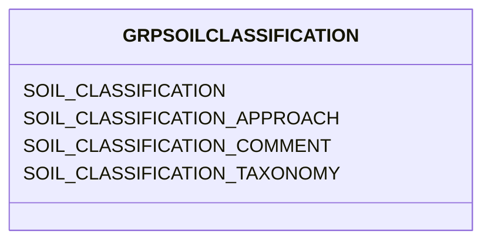

# Class: GRPSOILCLASSIFICATION


URI: [TEMP:GRPSOILCLASSIFICATION](https://example.org/TEMP/GRPSOILCLASSIFICATION)





<!-- no inheritance hierarchy -->


## Slots

| Name | Cardinality and Range | Description | Inheritance |
| ---  | --- | --- | --- |
| [SOIL_CLASSIFICATION](SOIL_CLASSIFICATION.md) | 0..1 <br/> [xsd:string](xsd:string) | Soil Classification for tower site according to a taxonomy | direct |
| [SOIL_CLASSIFICATION_TAXONOMY](SOIL_CLASSIFICATION_TAXONOMY.md) | 0..1 <br/> [SOILCLASSTAXON](SOILCLASSTAXON.md) | Specify the taxonomy used for Soil Classification | direct |
| [SOIL_CLASSIFICATION_APPROACH](SOIL_CLASSIFICATION_APPROACH.md) | 0..1 <br/> [xsd:string](xsd:string) | Approach used for assigning Soil Classification | direct |
| [SOIL_CLASSIFICATION_COMMENT](SOIL_CLASSIFICATION_COMMENT.md) | 0..1 <br/> [xsd:string](xsd:string) | Soil Classification comments | direct |


## Identifier and Mapping Information


### Schema Source


* from schema: TEMP


## Mappings

| Mapping Type | Mapped Value |
| ---  | ---  |
| self | TEMP:GRPSOILCLASSIFICATION |
| native | TEMP:GRPSOILCLASSIFICATION |


## LinkML Source

<!-- TODO: investigate https://stackoverflow.com/questions/37606292/how-to-create-tabbed-code-blocks-in-mkdocs-or-sphinx -->

### Direct

<details>
```yaml
name: GRP_SOIL_CLASSIFICATION
from_schema: TEMP
rank: 1000
slots:
- SOIL_CLASSIFICATION
- SOIL_CLASSIFICATION_TAXONOMY
- SOIL_CLASSIFICATION_APPROACH
- SOIL_CLASSIFICATION_COMMENT
slot_usage:
  SOIL_CLASSIFICATION:
    name: SOIL_CLASSIFICATION
    description: Soil Classification for tower site according to a taxonomy
    comments:
    - 'A more detailed description of the soil using a taxonomic system. Specify the
      taxonomy used in SOIL_CLASSIFICATION_TAXONOMY. Suggested taxonomies are NRCS
      and WRB (previously FAO). It is recommended to include texture, but not necessary.
      Two examples of Soil Classifications that includes texture are: fine, thermic
      Argixeroll and sandy, mixed, mesic Ultic Haploxeralf.'
    identifier: true
    domain_of:
    - GRP_SOIL_CLASSIFICATION
    - GRP_SOIL_CLASSIFICATION
  SOIL_CLASSIFICATION_APPROACH:
    name: SOIL_CLASSIFICATION_APPROACH
    description: Approach used for assigning Soil Classification
    domain_of:
    - GRP_SOIL_CLASSIFICATION
    - GRP_SOIL_CLASSIFICATION
  SOIL_CLASSIFICATION_COMMENT:
    name: SOIL_CLASSIFICATION_COMMENT
    description: Soil Classification comments
    domain_of:
    - GRP_SOIL_CLASSIFICATION
    - GRP_SOIL_CLASSIFICATION
  SOIL_CLASSIFICATION_TAXONOMY:
    name: SOIL_CLASSIFICATION_TAXONOMY
    description: Specify the taxonomy used for Soil Classification
    comments:
    - Use WRB (previously FAO) or NRCS as indicated in the predefined list. If you
      specify Other, report taxonomy in Approach.
    domain_of:
    - GRP_SOIL_CLASSIFICATION
    - GRP_SOIL_CLASSIFICATION

```
</details>

### Induced

<details>
```yaml
name: GRP_SOIL_CLASSIFICATION
from_schema: TEMP
rank: 1000
slot_usage:
  SOIL_CLASSIFICATION:
    name: SOIL_CLASSIFICATION
    description: Soil Classification for tower site according to a taxonomy
    comments:
    - 'A more detailed description of the soil using a taxonomic system. Specify the
      taxonomy used in SOIL_CLASSIFICATION_TAXONOMY. Suggested taxonomies are NRCS
      and WRB (previously FAO). It is recommended to include texture, but not necessary.
      Two examples of Soil Classifications that includes texture are: fine, thermic
      Argixeroll and sandy, mixed, mesic Ultic Haploxeralf.'
    identifier: true
    domain_of:
    - GRP_SOIL_CLASSIFICATION
    - GRP_SOIL_CLASSIFICATION
  SOIL_CLASSIFICATION_APPROACH:
    name: SOIL_CLASSIFICATION_APPROACH
    description: Approach used for assigning Soil Classification
    domain_of:
    - GRP_SOIL_CLASSIFICATION
    - GRP_SOIL_CLASSIFICATION
  SOIL_CLASSIFICATION_COMMENT:
    name: SOIL_CLASSIFICATION_COMMENT
    description: Soil Classification comments
    domain_of:
    - GRP_SOIL_CLASSIFICATION
    - GRP_SOIL_CLASSIFICATION
  SOIL_CLASSIFICATION_TAXONOMY:
    name: SOIL_CLASSIFICATION_TAXONOMY
    description: Specify the taxonomy used for Soil Classification
    comments:
    - Use WRB (previously FAO) or NRCS as indicated in the predefined list. If you
      specify Other, report taxonomy in Approach.
    domain_of:
    - GRP_SOIL_CLASSIFICATION
    - GRP_SOIL_CLASSIFICATION
attributes:
  SOIL_CLASSIFICATION:
    name: SOIL_CLASSIFICATION
    description: Soil Classification for tower site according to a taxonomy
    comments:
    - 'A more detailed description of the soil using a taxonomic system. Specify the
      taxonomy used in SOIL_CLASSIFICATION_TAXONOMY. Suggested taxonomies are NRCS
      and WRB (previously FAO). It is recommended to include texture, but not necessary.
      Two examples of Soil Classifications that includes texture are: fine, thermic
      Argixeroll and sandy, mixed, mesic Ultic Haploxeralf.'
    from_schema: TEMP
    rank: 1000
    identifier: true
    alias: SOIL_CLASSIFICATION
    owner: GRP_SOIL_CLASSIFICATION
    domain_of:
    - GRP_SOIL_CLASSIFICATION
    - GRP_SOIL_CLASSIFICATION
    range: string
  SOIL_CLASSIFICATION_TAXONOMY:
    name: SOIL_CLASSIFICATION_TAXONOMY
    description: Specify the taxonomy used for Soil Classification
    comments:
    - Use WRB (previously FAO) or NRCS as indicated in the predefined list. If you
      specify Other, report taxonomy in Approach.
    from_schema: TEMP
    rank: 1000
    alias: SOIL_CLASSIFICATION_TAXONOMY
    owner: GRP_SOIL_CLASSIFICATION
    domain_of:
    - GRP_SOIL_CLASSIFICATION
    - GRP_SOIL_CLASSIFICATION
    range: SOIL_CLASS_TAXON
  SOIL_CLASSIFICATION_APPROACH:
    name: SOIL_CLASSIFICATION_APPROACH
    description: Approach used for assigning Soil Classification
    from_schema: TEMP
    rank: 1000
    alias: SOIL_CLASSIFICATION_APPROACH
    owner: GRP_SOIL_CLASSIFICATION
    domain_of:
    - GRP_SOIL_CLASSIFICATION
    - GRP_SOIL_CLASSIFICATION
    range: string
  SOIL_CLASSIFICATION_COMMENT:
    name: SOIL_CLASSIFICATION_COMMENT
    description: Soil Classification comments
    from_schema: TEMP
    rank: 1000
    alias: SOIL_CLASSIFICATION_COMMENT
    owner: GRP_SOIL_CLASSIFICATION
    domain_of:
    - GRP_SOIL_CLASSIFICATION
    - GRP_SOIL_CLASSIFICATION
    range: string

```
</details>