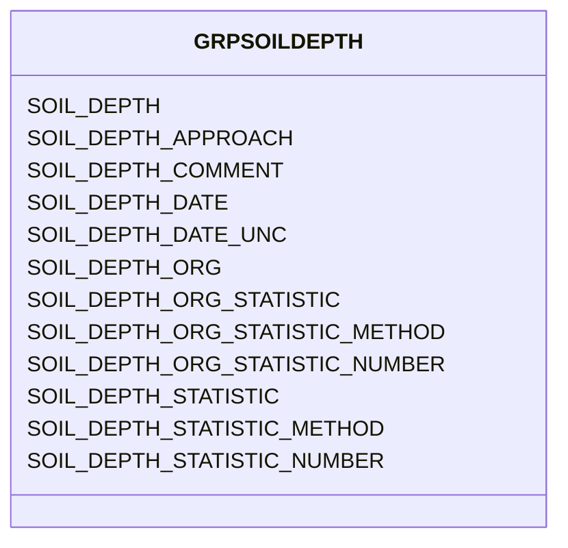

# Class: GRPSOILDEPTH


URI: [TEMP:GRPSOILDEPTH](https://example.org/TEMP/GRPSOILDEPTH)





<!-- no inheritance hierarchy -->


## Slots

| Name | Cardinality and Range | Description | Inheritance |
| ---  | --- | --- | --- |
| [SOIL_DEPTH](SOIL_DEPTH.md) | 0..1 <br/> [xsd:float](xsd:float) | Soil depth | direct |
| [SOIL_DEPTH_STATISTIC](SOIL_DEPTH_STATISTIC.md) | 0..1 <br/> [STATISTIC](STATISTIC.md) | Soil depth statistic | direct |
| [SOIL_DEPTH_STATISTIC_METHOD](SOIL_DEPTH_STATISTIC_METHOD.md) | 0..1 <br/> [STATISTICMETHOD](STATISTICMETHOD.md) | Soil depth statistic method | direct |
| [SOIL_DEPTH_STATISTIC_NUMBER](SOIL_DEPTH_STATISTIC_NUMBER.md) | 0..1 <br/> [xsd:integer](xsd:integer) | Number of observations used to determine soil depth statistic | direct |
| [SOIL_DEPTH_ORG](SOIL_DEPTH_ORG.md) | 0..1 <br/> [xsd:float](xsd:float) | Soil depth of organic horizon | direct |
| [SOIL_DEPTH_ORG_STATISTIC](SOIL_DEPTH_ORG_STATISTIC.md) | 0..1 <br/> [STATISTIC](STATISTIC.md) | Soil depth of organic horizon statistic | direct |
| [SOIL_DEPTH_ORG_STATISTIC_METHOD](SOIL_DEPTH_ORG_STATISTIC_METHOD.md) | 0..1 <br/> [STATISTICMETHOD](STATISTICMETHOD.md) | Soil depth of organic horizon statistic method | direct |
| [SOIL_DEPTH_ORG_STATISTIC_NUMBER](SOIL_DEPTH_ORG_STATISTIC_NUMBER.md) | 0..1 <br/> [xsd:integer](xsd:integer) | Number of observations used to determine soil depth of organic horizon statis... | direct |
| [SOIL_DEPTH_APPROACH](SOIL_DEPTH_APPROACH.md) | 0..1 <br/> [xsd:string](xsd:string) | Soil depth measurement approach | direct |
| [SOIL_DEPTH_DATE](SOIL_DEPTH_DATE.md) | 0..1 <br/> [xsd:float](xsd:float) | Soil depth measurement date | direct |
| [SOIL_DEPTH_DATE_UNC](SOIL_DEPTH_DATE_UNC.md) | 0..1 <br/> [xsd:float](xsd:float) | Uncertainty in the Soil depth measurement date | direct |
| [SOIL_DEPTH_COMMENT](SOIL_DEPTH_COMMENT.md) | 0..1 <br/> [xsd:string](xsd:string) | Soil depth comments | direct |


## Identifier and Mapping Information


### Schema Source


* from schema: TEMP


## Mappings

| Mapping Type | Mapped Value |
| ---  | ---  |
| self | TEMP:GRPSOILDEPTH |
| native | TEMP:GRPSOILDEPTH |


## LinkML Source

<!-- TODO: investigate https://stackoverflow.com/questions/37606292/how-to-create-tabbed-code-blocks-in-mkdocs-or-sphinx -->

### Direct

<details>
```yaml
name: GRP_SOIL_DEPTH
from_schema: TEMP
rank: 1000
slots:
- SOIL_DEPTH
- SOIL_DEPTH_STATISTIC
- SOIL_DEPTH_STATISTIC_METHOD
- SOIL_DEPTH_STATISTIC_NUMBER
- SOIL_DEPTH_ORG
- SOIL_DEPTH_ORG_STATISTIC
- SOIL_DEPTH_ORG_STATISTIC_METHOD
- SOIL_DEPTH_ORG_STATISTIC_NUMBER
- SOIL_DEPTH_APPROACH
- SOIL_DEPTH_DATE
- SOIL_DEPTH_DATE_UNC
- SOIL_DEPTH_COMMENT
slot_usage:
  SOIL_DEPTH:
    name: SOIL_DEPTH
    description: Soil depth
    comments:
    - Report the depth (thickness) of the soil that is in theory accessible to the
      plant roots or up to the first rock layer as measured from the top of the litter
      layer. Define depth used in Approach.
    multivalued: true
    identifier: true
    domain_of:
    - GRP_SOIL_DEPTH
    - GRP_SOIL_DEPTH
  SOIL_DEPTH_APPROACH:
    name: SOIL_DEPTH_APPROACH
    description: Soil depth measurement approach
    multivalued: true
    domain_of:
    - GRP_SOIL_DEPTH
    - GRP_SOIL_DEPTH
  SOIL_DEPTH_COMMENT:
    name: SOIL_DEPTH_COMMENT
    description: Soil depth comments
    multivalued: true
    domain_of:
    - GRP_SOIL_DEPTH
    - GRP_SOIL_DEPTH
  SOIL_DEPTH_DATE:
    name: SOIL_DEPTH_DATE
    description: Soil depth measurement date
    comments:
    - Please report the date at the precision known. Allowed reporting precisions
      are YYYY, YYYYMM, YYYYMMDD, and YYYYMMDDHHMM.
    multivalued: true
    domain_of:
    - GRP_SOIL_DEPTH
    - GRP_SOIL_DEPTH
    required: true
  SOIL_DEPTH_DATE_UNC:
    name: SOIL_DEPTH_DATE_UNC
    description: Uncertainty in the Soil depth measurement date
    multivalued: true
    domain_of:
    - GRP_SOIL_DEPTH
    - GRP_SOIL_DEPTH
  SOIL_DEPTH_ORG:
    name: SOIL_DEPTH_ORG
    description: Soil depth of organic horizon
    comments:
    - Report the depth (thickness) of the organic soil horizon as measured from the
      top of the litter layer.
    multivalued: true
    identifier: true
    domain_of:
    - GRP_SOIL_DEPTH
    - GRP_SOIL_DEPTH
  SOIL_DEPTH_ORG_STATISTIC:
    name: SOIL_DEPTH_ORG_STATISTIC
    description: Soil depth of organic horizon statistic
    comments:
    - The statistic for the measurement reported. Use predefined list (e.g., mean,
      min / max, standard deviation, etc).
    multivalued: true
    domain_of:
    - GRP_SOIL_DEPTH
    - GRP_SOIL_DEPTH
    required: true
  SOIL_DEPTH_ORG_STATISTIC_METHOD:
    name: SOIL_DEPTH_ORG_STATISTIC_METHOD
    description: Soil depth of organic horizon statistic method
    comments:
    - Method used to generate the reported statistic (e.g., aggregate of individuals,
      aggregate of sample aggregates) from observations representing the same time
      period. Use predefined list. The aggregation method is not meant to describe
      temporal aggregations for example in calculations of higher frequency observations
      (e.g., sub-minute) to lower frequency observations (e.g., hourly) at a single
      location.
    multivalued: true
    domain_of:
    - GRP_SOIL_DEPTH
    - GRP_SOIL_DEPTH
  SOIL_DEPTH_ORG_STATISTIC_NUMBER:
    name: SOIL_DEPTH_ORG_STATISTIC_NUMBER
    description: Number of observations used to determine soil depth of organic horizon
      statistic
    comments:
    - Number of observations (samples / replicates) used to calculate the STATISTIC
      for the reported measurement.
    multivalued: true
    domain_of:
    - GRP_SOIL_DEPTH
    - GRP_SOIL_DEPTH
  SOIL_DEPTH_STATISTIC:
    name: SOIL_DEPTH_STATISTIC
    description: Soil depth statistic
    comments:
    - The statistic for the measurement reported. Use predefined list (e.g., mean,
      min / max, standard deviation, etc).
    multivalued: true
    domain_of:
    - GRP_SOIL_DEPTH
    - GRP_SOIL_DEPTH
    required: true
  SOIL_DEPTH_STATISTIC_METHOD:
    name: SOIL_DEPTH_STATISTIC_METHOD
    description: Soil depth statistic method
    comments:
    - Method used to generate the reported statistic (e.g., aggregate of individuals,
      aggregate of sample aggregates) from observations representing the same time
      period. Use predefined list. The aggregation method is not meant to describe
      temporal aggregations for example in calculations of higher frequency observations
      (e.g., sub-minute) to lower frequency observations (e.g., hourly) at a single
      location.
    multivalued: true
    domain_of:
    - GRP_SOIL_DEPTH
    - GRP_SOIL_DEPTH
  SOIL_DEPTH_STATISTIC_NUMBER:
    name: SOIL_DEPTH_STATISTIC_NUMBER
    description: Number of observations used to determine soil depth statistic
    comments:
    - Number of observations (samples / replicates) used to calculate the STATISTIC
      for the reported measurement.
    multivalued: true
    domain_of:
    - GRP_SOIL_DEPTH
    - GRP_SOIL_DEPTH

```
</details>

### Induced

<details>
```yaml
name: GRP_SOIL_DEPTH
from_schema: TEMP
rank: 1000
slot_usage:
  SOIL_DEPTH:
    name: SOIL_DEPTH
    description: Soil depth
    comments:
    - Report the depth (thickness) of the soil that is in theory accessible to the
      plant roots or up to the first rock layer as measured from the top of the litter
      layer. Define depth used in Approach.
    multivalued: true
    identifier: true
    domain_of:
    - GRP_SOIL_DEPTH
    - GRP_SOIL_DEPTH
  SOIL_DEPTH_APPROACH:
    name: SOIL_DEPTH_APPROACH
    description: Soil depth measurement approach
    multivalued: true
    domain_of:
    - GRP_SOIL_DEPTH
    - GRP_SOIL_DEPTH
  SOIL_DEPTH_COMMENT:
    name: SOIL_DEPTH_COMMENT
    description: Soil depth comments
    multivalued: true
    domain_of:
    - GRP_SOIL_DEPTH
    - GRP_SOIL_DEPTH
  SOIL_DEPTH_DATE:
    name: SOIL_DEPTH_DATE
    description: Soil depth measurement date
    comments:
    - Please report the date at the precision known. Allowed reporting precisions
      are YYYY, YYYYMM, YYYYMMDD, and YYYYMMDDHHMM.
    multivalued: true
    domain_of:
    - GRP_SOIL_DEPTH
    - GRP_SOIL_DEPTH
    required: true
  SOIL_DEPTH_DATE_UNC:
    name: SOIL_DEPTH_DATE_UNC
    description: Uncertainty in the Soil depth measurement date
    multivalued: true
    domain_of:
    - GRP_SOIL_DEPTH
    - GRP_SOIL_DEPTH
  SOIL_DEPTH_ORG:
    name: SOIL_DEPTH_ORG
    description: Soil depth of organic horizon
    comments:
    - Report the depth (thickness) of the organic soil horizon as measured from the
      top of the litter layer.
    multivalued: true
    identifier: true
    domain_of:
    - GRP_SOIL_DEPTH
    - GRP_SOIL_DEPTH
  SOIL_DEPTH_ORG_STATISTIC:
    name: SOIL_DEPTH_ORG_STATISTIC
    description: Soil depth of organic horizon statistic
    comments:
    - The statistic for the measurement reported. Use predefined list (e.g., mean,
      min / max, standard deviation, etc).
    multivalued: true
    domain_of:
    - GRP_SOIL_DEPTH
    - GRP_SOIL_DEPTH
    required: true
  SOIL_DEPTH_ORG_STATISTIC_METHOD:
    name: SOIL_DEPTH_ORG_STATISTIC_METHOD
    description: Soil depth of organic horizon statistic method
    comments:
    - Method used to generate the reported statistic (e.g., aggregate of individuals,
      aggregate of sample aggregates) from observations representing the same time
      period. Use predefined list. The aggregation method is not meant to describe
      temporal aggregations for example in calculations of higher frequency observations
      (e.g., sub-minute) to lower frequency observations (e.g., hourly) at a single
      location.
    multivalued: true
    domain_of:
    - GRP_SOIL_DEPTH
    - GRP_SOIL_DEPTH
  SOIL_DEPTH_ORG_STATISTIC_NUMBER:
    name: SOIL_DEPTH_ORG_STATISTIC_NUMBER
    description: Number of observations used to determine soil depth of organic horizon
      statistic
    comments:
    - Number of observations (samples / replicates) used to calculate the STATISTIC
      for the reported measurement.
    multivalued: true
    domain_of:
    - GRP_SOIL_DEPTH
    - GRP_SOIL_DEPTH
  SOIL_DEPTH_STATISTIC:
    name: SOIL_DEPTH_STATISTIC
    description: Soil depth statistic
    comments:
    - The statistic for the measurement reported. Use predefined list (e.g., mean,
      min / max, standard deviation, etc).
    multivalued: true
    domain_of:
    - GRP_SOIL_DEPTH
    - GRP_SOIL_DEPTH
    required: true
  SOIL_DEPTH_STATISTIC_METHOD:
    name: SOIL_DEPTH_STATISTIC_METHOD
    description: Soil depth statistic method
    comments:
    - Method used to generate the reported statistic (e.g., aggregate of individuals,
      aggregate of sample aggregates) from observations representing the same time
      period. Use predefined list. The aggregation method is not meant to describe
      temporal aggregations for example in calculations of higher frequency observations
      (e.g., sub-minute) to lower frequency observations (e.g., hourly) at a single
      location.
    multivalued: true
    domain_of:
    - GRP_SOIL_DEPTH
    - GRP_SOIL_DEPTH
  SOIL_DEPTH_STATISTIC_NUMBER:
    name: SOIL_DEPTH_STATISTIC_NUMBER
    description: Number of observations used to determine soil depth statistic
    comments:
    - Number of observations (samples / replicates) used to calculate the STATISTIC
      for the reported measurement.
    multivalued: true
    domain_of:
    - GRP_SOIL_DEPTH
    - GRP_SOIL_DEPTH
attributes:
  SOIL_DEPTH:
    name: SOIL_DEPTH
    description: Soil depth
    comments:
    - Report the depth (thickness) of the soil that is in theory accessible to the
      plant roots or up to the first rock layer as measured from the top of the litter
      layer. Define depth used in Approach.
    from_schema: TEMP
    rank: 1000
    multivalued: true
    identifier: true
    alias: SOIL_DEPTH
    owner: GRP_SOIL_DEPTH
    domain_of:
    - GRP_SOIL_DEPTH
    - GRP_SOIL_DEPTH
    range: float
    unit:
      symbol: cm
  SOIL_DEPTH_STATISTIC:
    name: SOIL_DEPTH_STATISTIC
    description: Soil depth statistic
    comments:
    - The statistic for the measurement reported. Use predefined list (e.g., mean,
      min / max, standard deviation, etc).
    from_schema: TEMP
    rank: 1000
    multivalued: true
    alias: SOIL_DEPTH_STATISTIC
    owner: GRP_SOIL_DEPTH
    domain_of:
    - GRP_SOIL_DEPTH
    - GRP_SOIL_DEPTH
    range: STATISTIC
    required: true
  SOIL_DEPTH_STATISTIC_METHOD:
    name: SOIL_DEPTH_STATISTIC_METHOD
    description: Soil depth statistic method
    comments:
    - Method used to generate the reported statistic (e.g., aggregate of individuals,
      aggregate of sample aggregates) from observations representing the same time
      period. Use predefined list. The aggregation method is not meant to describe
      temporal aggregations for example in calculations of higher frequency observations
      (e.g., sub-minute) to lower frequency observations (e.g., hourly) at a single
      location.
    from_schema: TEMP
    rank: 1000
    multivalued: true
    alias: SOIL_DEPTH_STATISTIC_METHOD
    owner: GRP_SOIL_DEPTH
    domain_of:
    - GRP_SOIL_DEPTH
    - GRP_SOIL_DEPTH
    range: STATISTIC_METHOD
  SOIL_DEPTH_STATISTIC_NUMBER:
    name: SOIL_DEPTH_STATISTIC_NUMBER
    description: Number of observations used to determine soil depth statistic
    comments:
    - Number of observations (samples / replicates) used to calculate the STATISTIC
      for the reported measurement.
    from_schema: TEMP
    rank: 1000
    multivalued: true
    alias: SOIL_DEPTH_STATISTIC_NUMBER
    owner: GRP_SOIL_DEPTH
    domain_of:
    - GRP_SOIL_DEPTH
    - GRP_SOIL_DEPTH
    range: integer
  SOIL_DEPTH_ORG:
    name: SOIL_DEPTH_ORG
    description: Soil depth of organic horizon
    comments:
    - Report the depth (thickness) of the organic soil horizon as measured from the
      top of the litter layer.
    from_schema: TEMP
    rank: 1000
    multivalued: true
    identifier: true
    alias: SOIL_DEPTH_ORG
    owner: GRP_SOIL_DEPTH
    domain_of:
    - GRP_SOIL_DEPTH
    - GRP_SOIL_DEPTH
    range: float
    unit:
      symbol: cm
  SOIL_DEPTH_ORG_STATISTIC:
    name: SOIL_DEPTH_ORG_STATISTIC
    description: Soil depth of organic horizon statistic
    comments:
    - The statistic for the measurement reported. Use predefined list (e.g., mean,
      min / max, standard deviation, etc).
    from_schema: TEMP
    rank: 1000
    multivalued: true
    alias: SOIL_DEPTH_ORG_STATISTIC
    owner: GRP_SOIL_DEPTH
    domain_of:
    - GRP_SOIL_DEPTH
    - GRP_SOIL_DEPTH
    range: STATISTIC
    required: true
  SOIL_DEPTH_ORG_STATISTIC_METHOD:
    name: SOIL_DEPTH_ORG_STATISTIC_METHOD
    description: Soil depth of organic horizon statistic method
    comments:
    - Method used to generate the reported statistic (e.g., aggregate of individuals,
      aggregate of sample aggregates) from observations representing the same time
      period. Use predefined list. The aggregation method is not meant to describe
      temporal aggregations for example in calculations of higher frequency observations
      (e.g., sub-minute) to lower frequency observations (e.g., hourly) at a single
      location.
    from_schema: TEMP
    rank: 1000
    multivalued: true
    alias: SOIL_DEPTH_ORG_STATISTIC_METHOD
    owner: GRP_SOIL_DEPTH
    domain_of:
    - GRP_SOIL_DEPTH
    - GRP_SOIL_DEPTH
    range: STATISTIC_METHOD
  SOIL_DEPTH_ORG_STATISTIC_NUMBER:
    name: SOIL_DEPTH_ORG_STATISTIC_NUMBER
    description: Number of observations used to determine soil depth of organic horizon
      statistic
    comments:
    - Number of observations (samples / replicates) used to calculate the STATISTIC
      for the reported measurement.
    from_schema: TEMP
    rank: 1000
    multivalued: true
    alias: SOIL_DEPTH_ORG_STATISTIC_NUMBER
    owner: GRP_SOIL_DEPTH
    domain_of:
    - GRP_SOIL_DEPTH
    - GRP_SOIL_DEPTH
    range: integer
  SOIL_DEPTH_APPROACH:
    name: SOIL_DEPTH_APPROACH
    description: Soil depth measurement approach
    from_schema: TEMP
    rank: 1000
    multivalued: true
    alias: SOIL_DEPTH_APPROACH
    owner: GRP_SOIL_DEPTH
    domain_of:
    - GRP_SOIL_DEPTH
    - GRP_SOIL_DEPTH
    range: string
  SOIL_DEPTH_DATE:
    name: SOIL_DEPTH_DATE
    description: Soil depth measurement date
    comments:
    - Please report the date at the precision known. Allowed reporting precisions
      are YYYY, YYYYMM, YYYYMMDD, and YYYYMMDDHHMM.
    from_schema: TEMP
    rank: 1000
    multivalued: true
    alias: SOIL_DEPTH_DATE
    owner: GRP_SOIL_DEPTH
    domain_of:
    - GRP_SOIL_DEPTH
    - GRP_SOIL_DEPTH
    range: float
    required: true
    unit:
      symbol: YYYYMMDDHHMM
  SOIL_DEPTH_DATE_UNC:
    name: SOIL_DEPTH_DATE_UNC
    description: Uncertainty in the Soil depth measurement date
    from_schema: TEMP
    rank: 1000
    multivalued: true
    alias: SOIL_DEPTH_DATE_UNC
    owner: GRP_SOIL_DEPTH
    domain_of:
    - GRP_SOIL_DEPTH
    - GRP_SOIL_DEPTH
    range: float
    unit:
      symbol: days
  SOIL_DEPTH_COMMENT:
    name: SOIL_DEPTH_COMMENT
    description: Soil depth comments
    from_schema: TEMP
    rank: 1000
    multivalued: true
    alias: SOIL_DEPTH_COMMENT
    owner: GRP_SOIL_DEPTH
    domain_of:
    - GRP_SOIL_DEPTH
    - GRP_SOIL_DEPTH
    range: string

```
</details>