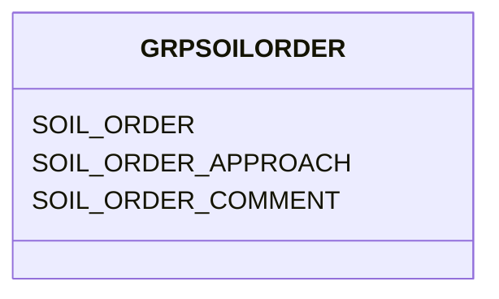

# Class: GRPSOILORDER


URI: [TEMP:GRPSOILORDER](https://example.org/TEMP/GRPSOILORDER)





<!-- no inheritance hierarchy -->


## Slots

| Name | Cardinality and Range | Description | Inheritance |
| ---  | --- | --- | --- |
| [SOIL_ORDER](SOIL_ORDER.md) | 0..1 <br/> [SOIL_ORDER](SOIL_ORDER.md) | Soil Order for tower site according to National Resource Conservation Service... | direct |
| [SOIL_ORDER_APPROACH](SOIL_ORDER_APPROACH.md) | 0..1 <br/> [xsd:string](xsd:string) | Approach used for assigning Soil Order | direct |
| [SOIL_ORDER_COMMENT](SOIL_ORDER_COMMENT.md) | 0..1 <br/> [xsd:string](xsd:string) | Soil Order comments | direct |


## Identifier and Mapping Information


### Schema Source


* from schema: TEMP


## Mappings

| Mapping Type | Mapped Value |
| ---  | ---  |
| self | TEMP:GRPSOILORDER |
| native | TEMP:GRPSOILORDER |


## LinkML Source

<!-- TODO: investigate https://stackoverflow.com/questions/37606292/how-to-create-tabbed-code-blocks-in-mkdocs-or-sphinx -->

### Direct

<details>
```yaml
name: GRP_SOIL_ORDER
from_schema: TEMP
rank: 1000
slots:
- SOIL_ORDER
- SOIL_ORDER_APPROACH
- SOIL_ORDER_COMMENT
slot_usage:
  SOIL_ORDER:
    name: SOIL_ORDER
    description: Soil Order for tower site according to National Resource Conservation
      Service (NRCS) Soil Taxonomy
    comments:
    - NRCS Soil Taxonomy is a soil classification system. It is based on soil properties
      as they appear in the field, such as presence and ordering of diagnostic horizons.
      Determine the Soil Order based on the appearance of the soil in the field. Choose
      the Order from the predefined list that best describes the dominant order within
      the tower site. SOIL_ORDER does not need to be reported if WRB_GROUP is.
    identifier: true
    domain_of:
    - GRP_SOIL_ORDER
    - GRP_SOIL_ORDER
  SOIL_ORDER_APPROACH:
    name: SOIL_ORDER_APPROACH
    description: Approach used for assigning Soil Order
    domain_of:
    - GRP_SOIL_ORDER
    - GRP_SOIL_ORDER
  SOIL_ORDER_COMMENT:
    name: SOIL_ORDER_COMMENT
    description: Soil Order comments
    domain_of:
    - GRP_SOIL_ORDER
    - GRP_SOIL_ORDER

```
</details>

### Induced

<details>
```yaml
name: GRP_SOIL_ORDER
from_schema: TEMP
rank: 1000
slot_usage:
  SOIL_ORDER:
    name: SOIL_ORDER
    description: Soil Order for tower site according to National Resource Conservation
      Service (NRCS) Soil Taxonomy
    comments:
    - NRCS Soil Taxonomy is a soil classification system. It is based on soil properties
      as they appear in the field, such as presence and ordering of diagnostic horizons.
      Determine the Soil Order based on the appearance of the soil in the field. Choose
      the Order from the predefined list that best describes the dominant order within
      the tower site. SOIL_ORDER does not need to be reported if WRB_GROUP is.
    identifier: true
    domain_of:
    - GRP_SOIL_ORDER
    - GRP_SOIL_ORDER
  SOIL_ORDER_APPROACH:
    name: SOIL_ORDER_APPROACH
    description: Approach used for assigning Soil Order
    domain_of:
    - GRP_SOIL_ORDER
    - GRP_SOIL_ORDER
  SOIL_ORDER_COMMENT:
    name: SOIL_ORDER_COMMENT
    description: Soil Order comments
    domain_of:
    - GRP_SOIL_ORDER
    - GRP_SOIL_ORDER
attributes:
  SOIL_ORDER:
    name: SOIL_ORDER
    description: Soil Order for tower site according to National Resource Conservation
      Service (NRCS) Soil Taxonomy
    comments:
    - NRCS Soil Taxonomy is a soil classification system. It is based on soil properties
      as they appear in the field, such as presence and ordering of diagnostic horizons.
      Determine the Soil Order based on the appearance of the soil in the field. Choose
      the Order from the predefined list that best describes the dominant order within
      the tower site. SOIL_ORDER does not need to be reported if WRB_GROUP is.
    from_schema: TEMP
    rank: 1000
    identifier: true
    alias: SOIL_ORDER
    owner: GRP_SOIL_ORDER
    domain_of:
    - GRP_SOIL_ORDER
    - GRP_SOIL_ORDER
    range: SOIL_ORDER
  SOIL_ORDER_APPROACH:
    name: SOIL_ORDER_APPROACH
    description: Approach used for assigning Soil Order
    from_schema: TEMP
    rank: 1000
    alias: SOIL_ORDER_APPROACH
    owner: GRP_SOIL_ORDER
    domain_of:
    - GRP_SOIL_ORDER
    - GRP_SOIL_ORDER
    range: string
  SOIL_ORDER_COMMENT:
    name: SOIL_ORDER_COMMENT
    description: Soil Order comments
    from_schema: TEMP
    rank: 1000
    alias: SOIL_ORDER_COMMENT
    owner: GRP_SOIL_ORDER
    domain_of:
    - GRP_SOIL_ORDER
    - GRP_SOIL_ORDER
    range: string

```
</details>