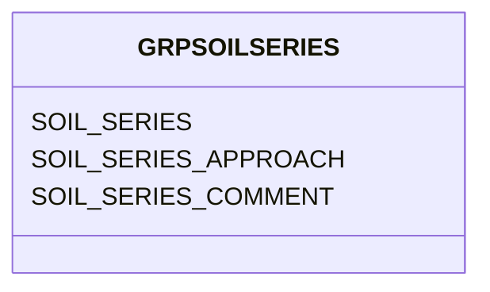

# Class: GRPSOILSERIES


URI: [TEMP:GRPSOILSERIES](https://example.org/TEMP/GRPSOILSERIES)





<!-- no inheritance hierarchy -->


## Slots

| Name | Cardinality and Range | Description | Inheritance |
| ---  | --- | --- | --- |
| [SOIL_SERIES](SOIL_SERIES.md) | 0..1 <br/> [xsd:string](xsd:string) | Soil Series for tower site according to a taxonomy | direct |
| [SOIL_SERIES_APPROACH](SOIL_SERIES_APPROACH.md) | 0..1 <br/> [xsd:string](xsd:string) | Approach used for assigning Soil Series | direct |
| [SOIL_SERIES_COMMENT](SOIL_SERIES_COMMENT.md) | 0..1 <br/> [xsd:string](xsd:string) | Soil Series comments | direct |


## Identifier and Mapping Information


### Schema Source


* from schema: TEMP


## Mappings

| Mapping Type | Mapped Value |
| ---  | ---  |
| self | TEMP:GRPSOILSERIES |
| native | TEMP:GRPSOILSERIES |


## LinkML Source

<!-- TODO: investigate https://stackoverflow.com/questions/37606292/how-to-create-tabbed-code-blocks-in-mkdocs-or-sphinx -->

### Direct

<details>
```yaml
name: GRP_SOIL_SERIES
from_schema: TEMP
rank: 1000
slots:
- SOIL_SERIES
- SOIL_SERIES_APPROACH
- SOIL_SERIES_COMMENT
slot_usage:
  SOIL_SERIES:
    name: SOIL_SERIES
    description: Soil Series for tower site according to a taxonomy
    comments:
    - The Soil Series is a level in some taxonomies that describes a set of pedons
      with similar pedogenesis, soil chemistry, and physical properties. If using
      a taxonomy with a Soil Series level, it can be reported here. Specify taxonomy
      used in Approach.
    identifier: true
    domain_of:
    - GRP_SOIL_SERIES
    - GRP_SOIL_SERIES
  SOIL_SERIES_APPROACH:
    name: SOIL_SERIES_APPROACH
    description: Approach used for assigning Soil Series
    domain_of:
    - GRP_SOIL_SERIES
    - GRP_SOIL_SERIES
  SOIL_SERIES_COMMENT:
    name: SOIL_SERIES_COMMENT
    description: Soil Series comments
    domain_of:
    - GRP_SOIL_SERIES
    - GRP_SOIL_SERIES

```
</details>

### Induced

<details>
```yaml
name: GRP_SOIL_SERIES
from_schema: TEMP
rank: 1000
slot_usage:
  SOIL_SERIES:
    name: SOIL_SERIES
    description: Soil Series for tower site according to a taxonomy
    comments:
    - The Soil Series is a level in some taxonomies that describes a set of pedons
      with similar pedogenesis, soil chemistry, and physical properties. If using
      a taxonomy with a Soil Series level, it can be reported here. Specify taxonomy
      used in Approach.
    identifier: true
    domain_of:
    - GRP_SOIL_SERIES
    - GRP_SOIL_SERIES
  SOIL_SERIES_APPROACH:
    name: SOIL_SERIES_APPROACH
    description: Approach used for assigning Soil Series
    domain_of:
    - GRP_SOIL_SERIES
    - GRP_SOIL_SERIES
  SOIL_SERIES_COMMENT:
    name: SOIL_SERIES_COMMENT
    description: Soil Series comments
    domain_of:
    - GRP_SOIL_SERIES
    - GRP_SOIL_SERIES
attributes:
  SOIL_SERIES:
    name: SOIL_SERIES
    description: Soil Series for tower site according to a taxonomy
    comments:
    - The Soil Series is a level in some taxonomies that describes a set of pedons
      with similar pedogenesis, soil chemistry, and physical properties. If using
      a taxonomy with a Soil Series level, it can be reported here. Specify taxonomy
      used in Approach.
    from_schema: TEMP
    rank: 1000
    identifier: true
    alias: SOIL_SERIES
    owner: GRP_SOIL_SERIES
    domain_of:
    - GRP_SOIL_SERIES
    - GRP_SOIL_SERIES
    range: string
  SOIL_SERIES_APPROACH:
    name: SOIL_SERIES_APPROACH
    description: Approach used for assigning Soil Series
    from_schema: TEMP
    rank: 1000
    alias: SOIL_SERIES_APPROACH
    owner: GRP_SOIL_SERIES
    domain_of:
    - GRP_SOIL_SERIES
    - GRP_SOIL_SERIES
    range: string
  SOIL_SERIES_COMMENT:
    name: SOIL_SERIES_COMMENT
    description: Soil Series comments
    from_schema: TEMP
    rank: 1000
    alias: SOIL_SERIES_COMMENT
    owner: GRP_SOIL_SERIES
    domain_of:
    - GRP_SOIL_SERIES
    - GRP_SOIL_SERIES
    range: string

```
</details>