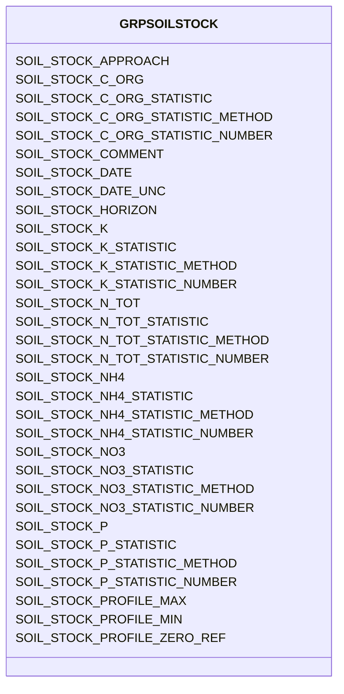

# Class: GRPSOILSTOCK


URI: [TEMP:GRPSOILSTOCK](https://example.org/TEMP/GRPSOILSTOCK)





<!-- no inheritance hierarchy -->


## Slots

| Name | Cardinality and Range | Description | Inheritance |
| ---  | --- | --- | --- |
| [SOIL_STOCK_C_ORG](SOIL_STOCK_C_ORG.md) | 0..1 <br/> [xsd:float](xsd:float) | Soil organic carbon stock | direct |
| [SOIL_STOCK_C_ORG_STATISTIC](SOIL_STOCK_C_ORG_STATISTIC.md) | 0..1 <br/> [STATISTIC](STATISTIC.md) | Soil organic carbon stock statistic | direct |
| [SOIL_STOCK_C_ORG_STATISTIC_METHOD](SOIL_STOCK_C_ORG_STATISTIC_METHOD.md) | 0..1 <br/> [STATISTICMETHOD](STATISTICMETHOD.md) | Soil organic carbon stock statistic method | direct |
| [SOIL_STOCK_C_ORG_STATISTIC_NUMBER](SOIL_STOCK_C_ORG_STATISTIC_NUMBER.md) | 0..1 <br/> [xsd:integer](xsd:integer) | Number of observations used to determine soil organic carbon stock statistic | direct |
| [SOIL_STOCK_N_TOT](SOIL_STOCK_N_TOT.md) | 0..1 <br/> [xsd:float](xsd:float) | Soil total nitrogen stock | direct |
| [SOIL_STOCK_N_TOT_STATISTIC](SOIL_STOCK_N_TOT_STATISTIC.md) | 0..1 <br/> [STATISTIC](STATISTIC.md) | Soil total nitrogen stock statistic | direct |
| [SOIL_STOCK_N_TOT_STATISTIC_METHOD](SOIL_STOCK_N_TOT_STATISTIC_METHOD.md) | 0..1 <br/> [STATISTICMETHOD](STATISTICMETHOD.md) | Soil total nitrogen stock statistic method | direct |
| [SOIL_STOCK_N_TOT_STATISTIC_NUMBER](SOIL_STOCK_N_TOT_STATISTIC_NUMBER.md) | 0..1 <br/> [xsd:integer](xsd:integer) | Number of observations used to determine soil total nitrogen stock statistic | direct |
| [SOIL_STOCK_NH4](SOIL_STOCK_NH4.md) | 0..1 <br/> [xsd:float](xsd:float) | Soil ammonium stock | direct |
| [SOIL_STOCK_NH4_STATISTIC](SOIL_STOCK_NH4_STATISTIC.md) | 0..1 <br/> [STATISTIC](STATISTIC.md) | Soil ammonium stock statistic | direct |
| [SOIL_STOCK_NH4_STATISTIC_METHOD](SOIL_STOCK_NH4_STATISTIC_METHOD.md) | 0..1 <br/> [STATISTICMETHOD](STATISTICMETHOD.md) | Soil ammonium stock statistic method | direct |
| [SOIL_STOCK_NH4_STATISTIC_NUMBER](SOIL_STOCK_NH4_STATISTIC_NUMBER.md) | 0..1 <br/> [xsd:integer](xsd:integer) | Number of observations used to determine soil ammonium stock statistic | direct |
| [SOIL_STOCK_NO3](SOIL_STOCK_NO3.md) | 0..1 <br/> [xsd:float](xsd:float) | Soil nitrate stock | direct |
| [SOIL_STOCK_NO3_STATISTIC](SOIL_STOCK_NO3_STATISTIC.md) | 0..1 <br/> [STATISTIC](STATISTIC.md) | Soil nitrate stock statistic | direct |
| [SOIL_STOCK_NO3_STATISTIC_METHOD](SOIL_STOCK_NO3_STATISTIC_METHOD.md) | 0..1 <br/> [STATISTICMETHOD](STATISTICMETHOD.md) | Soil nitrate stock statistic method | direct |
| [SOIL_STOCK_NO3_STATISTIC_NUMBER](SOIL_STOCK_NO3_STATISTIC_NUMBER.md) | 0..1 <br/> [xsd:integer](xsd:integer) | Number of observations used to determine soil nitrate stock statistic | direct |
| [SOIL_STOCK_K](SOIL_STOCK_K.md) | 0..1 <br/> [xsd:float](xsd:float) | Soil potassium stock | direct |
| [SOIL_STOCK_K_STATISTIC](SOIL_STOCK_K_STATISTIC.md) | 0..1 <br/> [STATISTIC](STATISTIC.md) | Soil potassium stock statistic | direct |
| [SOIL_STOCK_K_STATISTIC_METHOD](SOIL_STOCK_K_STATISTIC_METHOD.md) | 0..1 <br/> [STATISTICMETHOD](STATISTICMETHOD.md) | Soil potassium stock statistic method | direct |
| [SOIL_STOCK_K_STATISTIC_NUMBER](SOIL_STOCK_K_STATISTIC_NUMBER.md) | 0..1 <br/> [xsd:integer](xsd:integer) | Number of observations used to determine soil potassium stock statistic | direct |
| [SOIL_STOCK_P](SOIL_STOCK_P.md) | 0..1 <br/> [xsd:float](xsd:float) | Soil phosphorus stock | direct |
| [SOIL_STOCK_P_STATISTIC](SOIL_STOCK_P_STATISTIC.md) | 0..1 <br/> [STATISTIC](STATISTIC.md) | Soil phosphorus stock statistic | direct |
| [SOIL_STOCK_P_STATISTIC_METHOD](SOIL_STOCK_P_STATISTIC_METHOD.md) | 0..1 <br/> [STATISTICMETHOD](STATISTICMETHOD.md) | Soil phosphorus stock statistic method | direct |
| [SOIL_STOCK_P_STATISTIC_NUMBER](SOIL_STOCK_P_STATISTIC_NUMBER.md) | 0..1 <br/> [xsd:integer](xsd:integer) | Number of observations used to determine soil phosphorus stock statistic | direct |
| [SOIL_STOCK_PROFILE_ZERO_REF](SOIL_STOCK_PROFILE_ZERO_REF.md) | 0..1 <br/> [PROFILEZEROREF](PROFILEZEROREF.md) | Soil stock profile zero reference | direct |
| [SOIL_STOCK_PROFILE_MIN](SOIL_STOCK_PROFILE_MIN.md) | 0..1 <br/> [xsd:float](xsd:float) | Soil stock profile minimum depth | direct |
| [SOIL_STOCK_PROFILE_MAX](SOIL_STOCK_PROFILE_MAX.md) | 0..1 <br/> [xsd:float](xsd:float) | Soil stock profile maximum depth | direct |
| [SOIL_STOCK_HORIZON](SOIL_STOCK_HORIZON.md) | 0..1 <br/> [xsd:string](xsd:string) | Soil stock profile horizon | direct |
| [SOIL_STOCK_APPROACH](SOIL_STOCK_APPROACH.md) | 0..1 <br/> [xsd:string](xsd:string) | Soil stock measurement approach | direct |
| [SOIL_STOCK_DATE](SOIL_STOCK_DATE.md) | 0..1 <br/> [xsd:float](xsd:float) | Soil stock measurement sampling date | direct |
| [SOIL_STOCK_DATE_UNC](SOIL_STOCK_DATE_UNC.md) | 0..1 <br/> [xsd:float](xsd:float) | Uncertainty in the Soil stock measurement sampling date | direct |
| [SOIL_STOCK_COMMENT](SOIL_STOCK_COMMENT.md) | 0..1 <br/> [xsd:string](xsd:string) | Soil stock comments | direct |


## Identifier and Mapping Information


### Schema Source


* from schema: TEMP


## Mappings

| Mapping Type | Mapped Value |
| ---  | ---  |
| self | TEMP:GRPSOILSTOCK |
| native | TEMP:GRPSOILSTOCK |


## LinkML Source

<!-- TODO: investigate https://stackoverflow.com/questions/37606292/how-to-create-tabbed-code-blocks-in-mkdocs-or-sphinx -->

### Direct

<details>
```yaml
name: GRP_SOIL_STOCK
from_schema: TEMP
rank: 1000
slots:
- SOIL_STOCK_C_ORG
- SOIL_STOCK_C_ORG_STATISTIC
- SOIL_STOCK_C_ORG_STATISTIC_METHOD
- SOIL_STOCK_C_ORG_STATISTIC_NUMBER
- SOIL_STOCK_N_TOT
- SOIL_STOCK_N_TOT_STATISTIC
- SOIL_STOCK_N_TOT_STATISTIC_METHOD
- SOIL_STOCK_N_TOT_STATISTIC_NUMBER
- SOIL_STOCK_NH4
- SOIL_STOCK_NH4_STATISTIC
- SOIL_STOCK_NH4_STATISTIC_METHOD
- SOIL_STOCK_NH4_STATISTIC_NUMBER
- SOIL_STOCK_NO3
- SOIL_STOCK_NO3_STATISTIC
- SOIL_STOCK_NO3_STATISTIC_METHOD
- SOIL_STOCK_NO3_STATISTIC_NUMBER
- SOIL_STOCK_K
- SOIL_STOCK_K_STATISTIC
- SOIL_STOCK_K_STATISTIC_METHOD
- SOIL_STOCK_K_STATISTIC_NUMBER
- SOIL_STOCK_P
- SOIL_STOCK_P_STATISTIC
- SOIL_STOCK_P_STATISTIC_METHOD
- SOIL_STOCK_P_STATISTIC_NUMBER
- SOIL_STOCK_PROFILE_ZERO_REF
- SOIL_STOCK_PROFILE_MIN
- SOIL_STOCK_PROFILE_MAX
- SOIL_STOCK_HORIZON
- SOIL_STOCK_APPROACH
- SOIL_STOCK_DATE
- SOIL_STOCK_DATE_UNC
- SOIL_STOCK_COMMENT
slot_usage:
  SOIL_STOCK_APPROACH:
    name: SOIL_STOCK_APPROACH
    description: Soil stock measurement approach
    multivalued: true
    domain_of:
    - GRP_SOIL_STOCK
    - GRP_SOIL_STOCK
  SOIL_STOCK_COMMENT:
    name: SOIL_STOCK_COMMENT
    description: Soil stock comments
    multivalued: true
    domain_of:
    - GRP_SOIL_STOCK
    - GRP_SOIL_STOCK
  SOIL_STOCK_C_ORG:
    name: SOIL_STOCK_C_ORG
    description: Soil organic carbon stock
    multivalued: true
    identifier: true
    domain_of:
    - GRP_SOIL_STOCK
    - GRP_SOIL_STOCK
  SOIL_STOCK_C_ORG_STATISTIC:
    name: SOIL_STOCK_C_ORG_STATISTIC
    description: Soil organic carbon stock statistic
    comments:
    - The statistic for the measurement reported. Use predefined list (e.g., mean,
      min / max, standard deviation, etc).
    multivalued: true
    domain_of:
    - GRP_SOIL_STOCK
    - GRP_SOIL_STOCK
    required: true
  SOIL_STOCK_C_ORG_STATISTIC_METHOD:
    name: SOIL_STOCK_C_ORG_STATISTIC_METHOD
    description: Soil organic carbon stock statistic method
    comments:
    - Method used to generate the reported statistic (e.g., aggregate of individuals,
      aggregate of sample aggregates) from observations representing the same time
      period. Use predefined list. The aggregation method is not meant to describe
      temporal aggregations for example in calculations of higher frequency observations
      (e.g., sub-minute) to lower frequency observations (e.g., hourly) at a single
      location.
    multivalued: true
    domain_of:
    - GRP_SOIL_STOCK
    - GRP_SOIL_STOCK
  SOIL_STOCK_C_ORG_STATISTIC_NUMBER:
    name: SOIL_STOCK_C_ORG_STATISTIC_NUMBER
    description: Number of observations used to determine soil organic carbon stock
      statistic
    comments:
    - Number of observations (samples / replicates) used to calculate the STATISTIC
      for the reported measurement.
    multivalued: true
    domain_of:
    - GRP_SOIL_STOCK
    - GRP_SOIL_STOCK
  SOIL_STOCK_DATE:
    name: SOIL_STOCK_DATE
    description: Soil stock measurement sampling date
    comments:
    - Please report the date at the precision known. Allowed reporting precisions
      are YYYY, YYYYMM, YYYYMMDD, and YYYYMMDDHHMM.
    multivalued: true
    domain_of:
    - GRP_SOIL_STOCK
    - GRP_SOIL_STOCK
    required: true
  SOIL_STOCK_DATE_UNC:
    name: SOIL_STOCK_DATE_UNC
    description: Uncertainty in the Soil stock measurement sampling date
    multivalued: true
    domain_of:
    - GRP_SOIL_STOCK
    - GRP_SOIL_STOCK
  SOIL_STOCK_HORIZON:
    name: SOIL_STOCK_HORIZON
    description: Soil stock profile horizon
    comments:
    - Use soil horizon scheme best suited for your soil. Examples include O, Oa, B,
      Bt, C.
    multivalued: true
    domain_of:
    - GRP_SOIL_STOCK
    - GRP_SOIL_STOCK
  SOIL_STOCK_K:
    name: SOIL_STOCK_K
    description: Soil potassium stock
    multivalued: true
    identifier: true
    domain_of:
    - GRP_SOIL_STOCK
    - GRP_SOIL_STOCK
  SOIL_STOCK_K_STATISTIC:
    name: SOIL_STOCK_K_STATISTIC
    description: Soil potassium stock statistic
    comments:
    - The statistic for the measurement reported. Use predefined list (e.g., mean,
      min / max, standard deviation, etc).
    multivalued: true
    domain_of:
    - GRP_SOIL_STOCK
    - GRP_SOIL_STOCK
    required: true
  SOIL_STOCK_K_STATISTIC_METHOD:
    name: SOIL_STOCK_K_STATISTIC_METHOD
    description: Soil potassium stock statistic method
    comments:
    - Method used to generate the reported statistic (e.g., aggregate of individuals,
      aggregate of sample aggregates) from observations representing the same time
      period. Use predefined list. The aggregation method is not meant to describe
      temporal aggregations for example in calculations of higher frequency observations
      (e.g., sub-minute) to lower frequency observations (e.g., hourly) at a single
      location.
    multivalued: true
    domain_of:
    - GRP_SOIL_STOCK
    - GRP_SOIL_STOCK
  SOIL_STOCK_K_STATISTIC_NUMBER:
    name: SOIL_STOCK_K_STATISTIC_NUMBER
    description: Number of observations used to determine soil potassium stock statistic
    comments:
    - Number of observations (samples / replicates) used to calculate the STATISTIC
      for the reported measurement.
    multivalued: true
    domain_of:
    - GRP_SOIL_STOCK
    - GRP_SOIL_STOCK
  SOIL_STOCK_NH4:
    name: SOIL_STOCK_NH4
    description: Soil ammonium stock
    multivalued: true
    identifier: true
    domain_of:
    - GRP_SOIL_STOCK
    - GRP_SOIL_STOCK
  SOIL_STOCK_NH4_STATISTIC:
    name: SOIL_STOCK_NH4_STATISTIC
    description: Soil ammonium stock statistic
    comments:
    - The statistic for the measurement reported. Use predefined list (e.g., mean,
      min / max, standard deviation, etc).
    multivalued: true
    domain_of:
    - GRP_SOIL_STOCK
    - GRP_SOIL_STOCK
    required: true
  SOIL_STOCK_NH4_STATISTIC_METHOD:
    name: SOIL_STOCK_NH4_STATISTIC_METHOD
    description: Soil ammonium stock statistic method
    comments:
    - Method used to generate the reported statistic (e.g., aggregate of individuals,
      aggregate of sample aggregates) from observations representing the same time
      period. Use predefined list. The aggregation method is not meant to describe
      temporal aggregations for example in calculations of higher frequency observations
      (e.g., sub-minute) to lower frequency observations (e.g., hourly) at a single
      location.
    multivalued: true
    domain_of:
    - GRP_SOIL_STOCK
    - GRP_SOIL_STOCK
  SOIL_STOCK_NH4_STATISTIC_NUMBER:
    name: SOIL_STOCK_NH4_STATISTIC_NUMBER
    description: Number of observations used to determine soil ammonium stock statistic
    comments:
    - Number of observations (samples / replicates) used to calculate the STATISTIC
      for the reported measurement.
    multivalued: true
    domain_of:
    - GRP_SOIL_STOCK
    - GRP_SOIL_STOCK
  SOIL_STOCK_NO3:
    name: SOIL_STOCK_NO3
    description: Soil nitrate stock
    multivalued: true
    identifier: true
    domain_of:
    - GRP_SOIL_STOCK
    - GRP_SOIL_STOCK
  SOIL_STOCK_NO3_STATISTIC:
    name: SOIL_STOCK_NO3_STATISTIC
    description: Soil nitrate stock statistic
    comments:
    - The statistic for the measurement reported. Use predefined list (e.g., mean,
      min / max, standard deviation, etc).
    multivalued: true
    domain_of:
    - GRP_SOIL_STOCK
    - GRP_SOIL_STOCK
    required: true
  SOIL_STOCK_NO3_STATISTIC_METHOD:
    name: SOIL_STOCK_NO3_STATISTIC_METHOD
    description: Soil nitrate stock statistic method
    comments:
    - Method used to generate the reported statistic (e.g., aggregate of individuals,
      aggregate of sample aggregates) from observations representing the same time
      period. Use predefined list. The aggregation method is not meant to describe
      temporal aggregations for example in calculations of higher frequency observations
      (e.g., sub-minute) to lower frequency observations (e.g., hourly) at a single
      location.
    multivalued: true
    domain_of:
    - GRP_SOIL_STOCK
    - GRP_SOIL_STOCK
  SOIL_STOCK_NO3_STATISTIC_NUMBER:
    name: SOIL_STOCK_NO3_STATISTIC_NUMBER
    description: Number of observations used to determine soil nitrate stock statistic
    comments:
    - Number of observations (samples / replicates) used to calculate the STATISTIC
      for the reported measurement.
    multivalued: true
    domain_of:
    - GRP_SOIL_STOCK
    - GRP_SOIL_STOCK
  SOIL_STOCK_N_TOT:
    name: SOIL_STOCK_N_TOT
    description: Soil total nitrogen stock
    multivalued: true
    identifier: true
    domain_of:
    - GRP_SOIL_STOCK
    - GRP_SOIL_STOCK
  SOIL_STOCK_N_TOT_STATISTIC:
    name: SOIL_STOCK_N_TOT_STATISTIC
    description: Soil total nitrogen stock statistic
    comments:
    - The statistic for the measurement reported. Use predefined list (e.g., mean,
      min / max, standard deviation, etc).
    multivalued: true
    domain_of:
    - GRP_SOIL_STOCK
    - GRP_SOIL_STOCK
    required: true
  SOIL_STOCK_N_TOT_STATISTIC_METHOD:
    name: SOIL_STOCK_N_TOT_STATISTIC_METHOD
    description: Soil total nitrogen stock statistic method
    comments:
    - Method used to generate the reported statistic (e.g., aggregate of individuals,
      aggregate of sample aggregates) from observations representing the same time
      period. Use predefined list. The aggregation method is not meant to describe
      temporal aggregations for example in calculations of higher frequency observations
      (e.g., sub-minute) to lower frequency observations (e.g., hourly) at a single
      location.
    multivalued: true
    domain_of:
    - GRP_SOIL_STOCK
    - GRP_SOIL_STOCK
  SOIL_STOCK_N_TOT_STATISTIC_NUMBER:
    name: SOIL_STOCK_N_TOT_STATISTIC_NUMBER
    description: Number of observations used to determine soil total nitrogen stock
      statistic
    comments:
    - Number of observations (samples / replicates) used to calculate the STATISTIC
      for the reported measurement.
    multivalued: true
    domain_of:
    - GRP_SOIL_STOCK
    - GRP_SOIL_STOCK
  SOIL_STOCK_P:
    name: SOIL_STOCK_P
    description: Soil phosphorus stock
    multivalued: true
    identifier: true
    domain_of:
    - GRP_SOIL_STOCK
    - GRP_SOIL_STOCK
  SOIL_STOCK_PROFILE_MAX:
    name: SOIL_STOCK_PROFILE_MAX
    description: Soil stock profile maximum depth
    comments:
    - Profile maximum depth is the vertical distance from profile zero reference to
      the bottom of soil layer being measured.
    multivalued: true
    domain_of:
    - GRP_SOIL_STOCK
    - GRP_SOIL_STOCK
  SOIL_STOCK_PROFILE_MIN:
    name: SOIL_STOCK_PROFILE_MIN
    description: Soil stock profile minimum depth
    comments:
    - Profile minimum depth is the vertical distance from profile zero reference to
      the top of soil layer being measured.
    multivalued: true
    domain_of:
    - GRP_SOIL_STOCK
    - GRP_SOIL_STOCK
  SOIL_STOCK_PROFILE_ZERO_REF:
    name: SOIL_STOCK_PROFILE_ZERO_REF
    description: Soil stock profile zero reference
    comments:
    - Profile Zero Reference is the horizontal plane from which the soil profile minimum
      and maximum depths are measured. For example, top of mineral soil or top of
      litter layer. Use predefined list.
    multivalued: true
    domain_of:
    - GRP_SOIL_STOCK
    - GRP_SOIL_STOCK
  SOIL_STOCK_P_STATISTIC:
    name: SOIL_STOCK_P_STATISTIC
    description: Soil phosphorus stock statistic
    comments:
    - The statistic for the measurement reported. Use predefined list (e.g., mean,
      min / max, standard deviation, etc).
    multivalued: true
    domain_of:
    - GRP_SOIL_STOCK
    - GRP_SOIL_STOCK
    required: true
  SOIL_STOCK_P_STATISTIC_METHOD:
    name: SOIL_STOCK_P_STATISTIC_METHOD
    description: Soil phosphorus stock statistic method
    comments:
    - Method used to generate the reported statistic (e.g., aggregate of individuals,
      aggregate of sample aggregates) from observations representing the same time
      period. Use predefined list. The aggregation method is not meant to describe
      temporal aggregations for example in calculations of higher frequency observations
      (e.g., sub-minute) to lower frequency observations (e.g., hourly) at a single
      location.
    multivalued: true
    domain_of:
    - GRP_SOIL_STOCK
    - GRP_SOIL_STOCK
  SOIL_STOCK_P_STATISTIC_NUMBER:
    name: SOIL_STOCK_P_STATISTIC_NUMBER
    description: Number of observations used to determine soil phosphorus stock statistic
    comments:
    - Number of observations (samples / replicates) used to calculate the STATISTIC
      for the reported measurement.
    multivalued: true
    domain_of:
    - GRP_SOIL_STOCK
    - GRP_SOIL_STOCK

```
</details>

### Induced

<details>
```yaml
name: GRP_SOIL_STOCK
from_schema: TEMP
rank: 1000
slot_usage:
  SOIL_STOCK_APPROACH:
    name: SOIL_STOCK_APPROACH
    description: Soil stock measurement approach
    multivalued: true
    domain_of:
    - GRP_SOIL_STOCK
    - GRP_SOIL_STOCK
  SOIL_STOCK_COMMENT:
    name: SOIL_STOCK_COMMENT
    description: Soil stock comments
    multivalued: true
    domain_of:
    - GRP_SOIL_STOCK
    - GRP_SOIL_STOCK
  SOIL_STOCK_C_ORG:
    name: SOIL_STOCK_C_ORG
    description: Soil organic carbon stock
    multivalued: true
    identifier: true
    domain_of:
    - GRP_SOIL_STOCK
    - GRP_SOIL_STOCK
  SOIL_STOCK_C_ORG_STATISTIC:
    name: SOIL_STOCK_C_ORG_STATISTIC
    description: Soil organic carbon stock statistic
    comments:
    - The statistic for the measurement reported. Use predefined list (e.g., mean,
      min / max, standard deviation, etc).
    multivalued: true
    domain_of:
    - GRP_SOIL_STOCK
    - GRP_SOIL_STOCK
    required: true
  SOIL_STOCK_C_ORG_STATISTIC_METHOD:
    name: SOIL_STOCK_C_ORG_STATISTIC_METHOD
    description: Soil organic carbon stock statistic method
    comments:
    - Method used to generate the reported statistic (e.g., aggregate of individuals,
      aggregate of sample aggregates) from observations representing the same time
      period. Use predefined list. The aggregation method is not meant to describe
      temporal aggregations for example in calculations of higher frequency observations
      (e.g., sub-minute) to lower frequency observations (e.g., hourly) at a single
      location.
    multivalued: true
    domain_of:
    - GRP_SOIL_STOCK
    - GRP_SOIL_STOCK
  SOIL_STOCK_C_ORG_STATISTIC_NUMBER:
    name: SOIL_STOCK_C_ORG_STATISTIC_NUMBER
    description: Number of observations used to determine soil organic carbon stock
      statistic
    comments:
    - Number of observations (samples / replicates) used to calculate the STATISTIC
      for the reported measurement.
    multivalued: true
    domain_of:
    - GRP_SOIL_STOCK
    - GRP_SOIL_STOCK
  SOIL_STOCK_DATE:
    name: SOIL_STOCK_DATE
    description: Soil stock measurement sampling date
    comments:
    - Please report the date at the precision known. Allowed reporting precisions
      are YYYY, YYYYMM, YYYYMMDD, and YYYYMMDDHHMM.
    multivalued: true
    domain_of:
    - GRP_SOIL_STOCK
    - GRP_SOIL_STOCK
    required: true
  SOIL_STOCK_DATE_UNC:
    name: SOIL_STOCK_DATE_UNC
    description: Uncertainty in the Soil stock measurement sampling date
    multivalued: true
    domain_of:
    - GRP_SOIL_STOCK
    - GRP_SOIL_STOCK
  SOIL_STOCK_HORIZON:
    name: SOIL_STOCK_HORIZON
    description: Soil stock profile horizon
    comments:
    - Use soil horizon scheme best suited for your soil. Examples include O, Oa, B,
      Bt, C.
    multivalued: true
    domain_of:
    - GRP_SOIL_STOCK
    - GRP_SOIL_STOCK
  SOIL_STOCK_K:
    name: SOIL_STOCK_K
    description: Soil potassium stock
    multivalued: true
    identifier: true
    domain_of:
    - GRP_SOIL_STOCK
    - GRP_SOIL_STOCK
  SOIL_STOCK_K_STATISTIC:
    name: SOIL_STOCK_K_STATISTIC
    description: Soil potassium stock statistic
    comments:
    - The statistic for the measurement reported. Use predefined list (e.g., mean,
      min / max, standard deviation, etc).
    multivalued: true
    domain_of:
    - GRP_SOIL_STOCK
    - GRP_SOIL_STOCK
    required: true
  SOIL_STOCK_K_STATISTIC_METHOD:
    name: SOIL_STOCK_K_STATISTIC_METHOD
    description: Soil potassium stock statistic method
    comments:
    - Method used to generate the reported statistic (e.g., aggregate of individuals,
      aggregate of sample aggregates) from observations representing the same time
      period. Use predefined list. The aggregation method is not meant to describe
      temporal aggregations for example in calculations of higher frequency observations
      (e.g., sub-minute) to lower frequency observations (e.g., hourly) at a single
      location.
    multivalued: true
    domain_of:
    - GRP_SOIL_STOCK
    - GRP_SOIL_STOCK
  SOIL_STOCK_K_STATISTIC_NUMBER:
    name: SOIL_STOCK_K_STATISTIC_NUMBER
    description: Number of observations used to determine soil potassium stock statistic
    comments:
    - Number of observations (samples / replicates) used to calculate the STATISTIC
      for the reported measurement.
    multivalued: true
    domain_of:
    - GRP_SOIL_STOCK
    - GRP_SOIL_STOCK
  SOIL_STOCK_NH4:
    name: SOIL_STOCK_NH4
    description: Soil ammonium stock
    multivalued: true
    identifier: true
    domain_of:
    - GRP_SOIL_STOCK
    - GRP_SOIL_STOCK
  SOIL_STOCK_NH4_STATISTIC:
    name: SOIL_STOCK_NH4_STATISTIC
    description: Soil ammonium stock statistic
    comments:
    - The statistic for the measurement reported. Use predefined list (e.g., mean,
      min / max, standard deviation, etc).
    multivalued: true
    domain_of:
    - GRP_SOIL_STOCK
    - GRP_SOIL_STOCK
    required: true
  SOIL_STOCK_NH4_STATISTIC_METHOD:
    name: SOIL_STOCK_NH4_STATISTIC_METHOD
    description: Soil ammonium stock statistic method
    comments:
    - Method used to generate the reported statistic (e.g., aggregate of individuals,
      aggregate of sample aggregates) from observations representing the same time
      period. Use predefined list. The aggregation method is not meant to describe
      temporal aggregations for example in calculations of higher frequency observations
      (e.g., sub-minute) to lower frequency observations (e.g., hourly) at a single
      location.
    multivalued: true
    domain_of:
    - GRP_SOIL_STOCK
    - GRP_SOIL_STOCK
  SOIL_STOCK_NH4_STATISTIC_NUMBER:
    name: SOIL_STOCK_NH4_STATISTIC_NUMBER
    description: Number of observations used to determine soil ammonium stock statistic
    comments:
    - Number of observations (samples / replicates) used to calculate the STATISTIC
      for the reported measurement.
    multivalued: true
    domain_of:
    - GRP_SOIL_STOCK
    - GRP_SOIL_STOCK
  SOIL_STOCK_NO3:
    name: SOIL_STOCK_NO3
    description: Soil nitrate stock
    multivalued: true
    identifier: true
    domain_of:
    - GRP_SOIL_STOCK
    - GRP_SOIL_STOCK
  SOIL_STOCK_NO3_STATISTIC:
    name: SOIL_STOCK_NO3_STATISTIC
    description: Soil nitrate stock statistic
    comments:
    - The statistic for the measurement reported. Use predefined list (e.g., mean,
      min / max, standard deviation, etc).
    multivalued: true
    domain_of:
    - GRP_SOIL_STOCK
    - GRP_SOIL_STOCK
    required: true
  SOIL_STOCK_NO3_STATISTIC_METHOD:
    name: SOIL_STOCK_NO3_STATISTIC_METHOD
    description: Soil nitrate stock statistic method
    comments:
    - Method used to generate the reported statistic (e.g., aggregate of individuals,
      aggregate of sample aggregates) from observations representing the same time
      period. Use predefined list. The aggregation method is not meant to describe
      temporal aggregations for example in calculations of higher frequency observations
      (e.g., sub-minute) to lower frequency observations (e.g., hourly) at a single
      location.
    multivalued: true
    domain_of:
    - GRP_SOIL_STOCK
    - GRP_SOIL_STOCK
  SOIL_STOCK_NO3_STATISTIC_NUMBER:
    name: SOIL_STOCK_NO3_STATISTIC_NUMBER
    description: Number of observations used to determine soil nitrate stock statistic
    comments:
    - Number of observations (samples / replicates) used to calculate the STATISTIC
      for the reported measurement.
    multivalued: true
    domain_of:
    - GRP_SOIL_STOCK
    - GRP_SOIL_STOCK
  SOIL_STOCK_N_TOT:
    name: SOIL_STOCK_N_TOT
    description: Soil total nitrogen stock
    multivalued: true
    identifier: true
    domain_of:
    - GRP_SOIL_STOCK
    - GRP_SOIL_STOCK
  SOIL_STOCK_N_TOT_STATISTIC:
    name: SOIL_STOCK_N_TOT_STATISTIC
    description: Soil total nitrogen stock statistic
    comments:
    - The statistic for the measurement reported. Use predefined list (e.g., mean,
      min / max, standard deviation, etc).
    multivalued: true
    domain_of:
    - GRP_SOIL_STOCK
    - GRP_SOIL_STOCK
    required: true
  SOIL_STOCK_N_TOT_STATISTIC_METHOD:
    name: SOIL_STOCK_N_TOT_STATISTIC_METHOD
    description: Soil total nitrogen stock statistic method
    comments:
    - Method used to generate the reported statistic (e.g., aggregate of individuals,
      aggregate of sample aggregates) from observations representing the same time
      period. Use predefined list. The aggregation method is not meant to describe
      temporal aggregations for example in calculations of higher frequency observations
      (e.g., sub-minute) to lower frequency observations (e.g., hourly) at a single
      location.
    multivalued: true
    domain_of:
    - GRP_SOIL_STOCK
    - GRP_SOIL_STOCK
  SOIL_STOCK_N_TOT_STATISTIC_NUMBER:
    name: SOIL_STOCK_N_TOT_STATISTIC_NUMBER
    description: Number of observations used to determine soil total nitrogen stock
      statistic
    comments:
    - Number of observations (samples / replicates) used to calculate the STATISTIC
      for the reported measurement.
    multivalued: true
    domain_of:
    - GRP_SOIL_STOCK
    - GRP_SOIL_STOCK
  SOIL_STOCK_P:
    name: SOIL_STOCK_P
    description: Soil phosphorus stock
    multivalued: true
    identifier: true
    domain_of:
    - GRP_SOIL_STOCK
    - GRP_SOIL_STOCK
  SOIL_STOCK_PROFILE_MAX:
    name: SOIL_STOCK_PROFILE_MAX
    description: Soil stock profile maximum depth
    comments:
    - Profile maximum depth is the vertical distance from profile zero reference to
      the bottom of soil layer being measured.
    multivalued: true
    domain_of:
    - GRP_SOIL_STOCK
    - GRP_SOIL_STOCK
  SOIL_STOCK_PROFILE_MIN:
    name: SOIL_STOCK_PROFILE_MIN
    description: Soil stock profile minimum depth
    comments:
    - Profile minimum depth is the vertical distance from profile zero reference to
      the top of soil layer being measured.
    multivalued: true
    domain_of:
    - GRP_SOIL_STOCK
    - GRP_SOIL_STOCK
  SOIL_STOCK_PROFILE_ZERO_REF:
    name: SOIL_STOCK_PROFILE_ZERO_REF
    description: Soil stock profile zero reference
    comments:
    - Profile Zero Reference is the horizontal plane from which the soil profile minimum
      and maximum depths are measured. For example, top of mineral soil or top of
      litter layer. Use predefined list.
    multivalued: true
    domain_of:
    - GRP_SOIL_STOCK
    - GRP_SOIL_STOCK
  SOIL_STOCK_P_STATISTIC:
    name: SOIL_STOCK_P_STATISTIC
    description: Soil phosphorus stock statistic
    comments:
    - The statistic for the measurement reported. Use predefined list (e.g., mean,
      min / max, standard deviation, etc).
    multivalued: true
    domain_of:
    - GRP_SOIL_STOCK
    - GRP_SOIL_STOCK
    required: true
  SOIL_STOCK_P_STATISTIC_METHOD:
    name: SOIL_STOCK_P_STATISTIC_METHOD
    description: Soil phosphorus stock statistic method
    comments:
    - Method used to generate the reported statistic (e.g., aggregate of individuals,
      aggregate of sample aggregates) from observations representing the same time
      period. Use predefined list. The aggregation method is not meant to describe
      temporal aggregations for example in calculations of higher frequency observations
      (e.g., sub-minute) to lower frequency observations (e.g., hourly) at a single
      location.
    multivalued: true
    domain_of:
    - GRP_SOIL_STOCK
    - GRP_SOIL_STOCK
  SOIL_STOCK_P_STATISTIC_NUMBER:
    name: SOIL_STOCK_P_STATISTIC_NUMBER
    description: Number of observations used to determine soil phosphorus stock statistic
    comments:
    - Number of observations (samples / replicates) used to calculate the STATISTIC
      for the reported measurement.
    multivalued: true
    domain_of:
    - GRP_SOIL_STOCK
    - GRP_SOIL_STOCK
attributes:
  SOIL_STOCK_C_ORG:
    name: SOIL_STOCK_C_ORG
    description: Soil organic carbon stock
    from_schema: TEMP
    rank: 1000
    multivalued: true
    identifier: true
    alias: SOIL_STOCK_C_ORG
    owner: GRP_SOIL_STOCK
    domain_of:
    - GRP_SOIL_STOCK
    - GRP_SOIL_STOCK
    range: float
    unit:
      symbol: g C m-2
  SOIL_STOCK_C_ORG_STATISTIC:
    name: SOIL_STOCK_C_ORG_STATISTIC
    description: Soil organic carbon stock statistic
    comments:
    - The statistic for the measurement reported. Use predefined list (e.g., mean,
      min / max, standard deviation, etc).
    from_schema: TEMP
    rank: 1000
    multivalued: true
    alias: SOIL_STOCK_C_ORG_STATISTIC
    owner: GRP_SOIL_STOCK
    domain_of:
    - GRP_SOIL_STOCK
    - GRP_SOIL_STOCK
    range: STATISTIC
    required: true
  SOIL_STOCK_C_ORG_STATISTIC_METHOD:
    name: SOIL_STOCK_C_ORG_STATISTIC_METHOD
    description: Soil organic carbon stock statistic method
    comments:
    - Method used to generate the reported statistic (e.g., aggregate of individuals,
      aggregate of sample aggregates) from observations representing the same time
      period. Use predefined list. The aggregation method is not meant to describe
      temporal aggregations for example in calculations of higher frequency observations
      (e.g., sub-minute) to lower frequency observations (e.g., hourly) at a single
      location.
    from_schema: TEMP
    rank: 1000
    multivalued: true
    alias: SOIL_STOCK_C_ORG_STATISTIC_METHOD
    owner: GRP_SOIL_STOCK
    domain_of:
    - GRP_SOIL_STOCK
    - GRP_SOIL_STOCK
    range: STATISTIC_METHOD
  SOIL_STOCK_C_ORG_STATISTIC_NUMBER:
    name: SOIL_STOCK_C_ORG_STATISTIC_NUMBER
    description: Number of observations used to determine soil organic carbon stock
      statistic
    comments:
    - Number of observations (samples / replicates) used to calculate the STATISTIC
      for the reported measurement.
    from_schema: TEMP
    rank: 1000
    multivalued: true
    alias: SOIL_STOCK_C_ORG_STATISTIC_NUMBER
    owner: GRP_SOIL_STOCK
    domain_of:
    - GRP_SOIL_STOCK
    - GRP_SOIL_STOCK
    range: integer
  SOIL_STOCK_N_TOT:
    name: SOIL_STOCK_N_TOT
    description: Soil total nitrogen stock
    from_schema: TEMP
    rank: 1000
    multivalued: true
    identifier: true
    alias: SOIL_STOCK_N_TOT
    owner: GRP_SOIL_STOCK
    domain_of:
    - GRP_SOIL_STOCK
    - GRP_SOIL_STOCK
    range: float
    unit:
      symbol: g N m-2
  SOIL_STOCK_N_TOT_STATISTIC:
    name: SOIL_STOCK_N_TOT_STATISTIC
    description: Soil total nitrogen stock statistic
    comments:
    - The statistic for the measurement reported. Use predefined list (e.g., mean,
      min / max, standard deviation, etc).
    from_schema: TEMP
    rank: 1000
    multivalued: true
    alias: SOIL_STOCK_N_TOT_STATISTIC
    owner: GRP_SOIL_STOCK
    domain_of:
    - GRP_SOIL_STOCK
    - GRP_SOIL_STOCK
    range: STATISTIC
    required: true
  SOIL_STOCK_N_TOT_STATISTIC_METHOD:
    name: SOIL_STOCK_N_TOT_STATISTIC_METHOD
    description: Soil total nitrogen stock statistic method
    comments:
    - Method used to generate the reported statistic (e.g., aggregate of individuals,
      aggregate of sample aggregates) from observations representing the same time
      period. Use predefined list. The aggregation method is not meant to describe
      temporal aggregations for example in calculations of higher frequency observations
      (e.g., sub-minute) to lower frequency observations (e.g., hourly) at a single
      location.
    from_schema: TEMP
    rank: 1000
    multivalued: true
    alias: SOIL_STOCK_N_TOT_STATISTIC_METHOD
    owner: GRP_SOIL_STOCK
    domain_of:
    - GRP_SOIL_STOCK
    - GRP_SOIL_STOCK
    range: STATISTIC_METHOD
  SOIL_STOCK_N_TOT_STATISTIC_NUMBER:
    name: SOIL_STOCK_N_TOT_STATISTIC_NUMBER
    description: Number of observations used to determine soil total nitrogen stock
      statistic
    comments:
    - Number of observations (samples / replicates) used to calculate the STATISTIC
      for the reported measurement.
    from_schema: TEMP
    rank: 1000
    multivalued: true
    alias: SOIL_STOCK_N_TOT_STATISTIC_NUMBER
    owner: GRP_SOIL_STOCK
    domain_of:
    - GRP_SOIL_STOCK
    - GRP_SOIL_STOCK
    range: integer
  SOIL_STOCK_NH4:
    name: SOIL_STOCK_NH4
    description: Soil ammonium stock
    from_schema: TEMP
    rank: 1000
    multivalued: true
    identifier: true
    alias: SOIL_STOCK_NH4
    owner: GRP_SOIL_STOCK
    domain_of:
    - GRP_SOIL_STOCK
    - GRP_SOIL_STOCK
    range: float
    unit:
      symbol: g NH4 m-2
  SOIL_STOCK_NH4_STATISTIC:
    name: SOIL_STOCK_NH4_STATISTIC
    description: Soil ammonium stock statistic
    comments:
    - The statistic for the measurement reported. Use predefined list (e.g., mean,
      min / max, standard deviation, etc).
    from_schema: TEMP
    rank: 1000
    multivalued: true
    alias: SOIL_STOCK_NH4_STATISTIC
    owner: GRP_SOIL_STOCK
    domain_of:
    - GRP_SOIL_STOCK
    - GRP_SOIL_STOCK
    range: STATISTIC
    required: true
  SOIL_STOCK_NH4_STATISTIC_METHOD:
    name: SOIL_STOCK_NH4_STATISTIC_METHOD
    description: Soil ammonium stock statistic method
    comments:
    - Method used to generate the reported statistic (e.g., aggregate of individuals,
      aggregate of sample aggregates) from observations representing the same time
      period. Use predefined list. The aggregation method is not meant to describe
      temporal aggregations for example in calculations of higher frequency observations
      (e.g., sub-minute) to lower frequency observations (e.g., hourly) at a single
      location.
    from_schema: TEMP
    rank: 1000
    multivalued: true
    alias: SOIL_STOCK_NH4_STATISTIC_METHOD
    owner: GRP_SOIL_STOCK
    domain_of:
    - GRP_SOIL_STOCK
    - GRP_SOIL_STOCK
    range: STATISTIC_METHOD
  SOIL_STOCK_NH4_STATISTIC_NUMBER:
    name: SOIL_STOCK_NH4_STATISTIC_NUMBER
    description: Number of observations used to determine soil ammonium stock statistic
    comments:
    - Number of observations (samples / replicates) used to calculate the STATISTIC
      for the reported measurement.
    from_schema: TEMP
    rank: 1000
    multivalued: true
    alias: SOIL_STOCK_NH4_STATISTIC_NUMBER
    owner: GRP_SOIL_STOCK
    domain_of:
    - GRP_SOIL_STOCK
    - GRP_SOIL_STOCK
    range: integer
  SOIL_STOCK_NO3:
    name: SOIL_STOCK_NO3
    description: Soil nitrate stock
    from_schema: TEMP
    rank: 1000
    multivalued: true
    identifier: true
    alias: SOIL_STOCK_NO3
    owner: GRP_SOIL_STOCK
    domain_of:
    - GRP_SOIL_STOCK
    - GRP_SOIL_STOCK
    range: float
    unit:
      symbol: g NO3 m-2
  SOIL_STOCK_NO3_STATISTIC:
    name: SOIL_STOCK_NO3_STATISTIC
    description: Soil nitrate stock statistic
    comments:
    - The statistic for the measurement reported. Use predefined list (e.g., mean,
      min / max, standard deviation, etc).
    from_schema: TEMP
    rank: 1000
    multivalued: true
    alias: SOIL_STOCK_NO3_STATISTIC
    owner: GRP_SOIL_STOCK
    domain_of:
    - GRP_SOIL_STOCK
    - GRP_SOIL_STOCK
    range: STATISTIC
    required: true
  SOIL_STOCK_NO3_STATISTIC_METHOD:
    name: SOIL_STOCK_NO3_STATISTIC_METHOD
    description: Soil nitrate stock statistic method
    comments:
    - Method used to generate the reported statistic (e.g., aggregate of individuals,
      aggregate of sample aggregates) from observations representing the same time
      period. Use predefined list. The aggregation method is not meant to describe
      temporal aggregations for example in calculations of higher frequency observations
      (e.g., sub-minute) to lower frequency observations (e.g., hourly) at a single
      location.
    from_schema: TEMP
    rank: 1000
    multivalued: true
    alias: SOIL_STOCK_NO3_STATISTIC_METHOD
    owner: GRP_SOIL_STOCK
    domain_of:
    - GRP_SOIL_STOCK
    - GRP_SOIL_STOCK
    range: STATISTIC_METHOD
  SOIL_STOCK_NO3_STATISTIC_NUMBER:
    name: SOIL_STOCK_NO3_STATISTIC_NUMBER
    description: Number of observations used to determine soil nitrate stock statistic
    comments:
    - Number of observations (samples / replicates) used to calculate the STATISTIC
      for the reported measurement.
    from_schema: TEMP
    rank: 1000
    multivalued: true
    alias: SOIL_STOCK_NO3_STATISTIC_NUMBER
    owner: GRP_SOIL_STOCK
    domain_of:
    - GRP_SOIL_STOCK
    - GRP_SOIL_STOCK
    range: integer
  SOIL_STOCK_K:
    name: SOIL_STOCK_K
    description: Soil potassium stock
    from_schema: TEMP
    rank: 1000
    multivalued: true
    identifier: true
    alias: SOIL_STOCK_K
    owner: GRP_SOIL_STOCK
    domain_of:
    - GRP_SOIL_STOCK
    - GRP_SOIL_STOCK
    range: float
    unit:
      symbol: g K m-2
  SOIL_STOCK_K_STATISTIC:
    name: SOIL_STOCK_K_STATISTIC
    description: Soil potassium stock statistic
    comments:
    - The statistic for the measurement reported. Use predefined list (e.g., mean,
      min / max, standard deviation, etc).
    from_schema: TEMP
    rank: 1000
    multivalued: true
    alias: SOIL_STOCK_K_STATISTIC
    owner: GRP_SOIL_STOCK
    domain_of:
    - GRP_SOIL_STOCK
    - GRP_SOIL_STOCK
    range: STATISTIC
    required: true
  SOIL_STOCK_K_STATISTIC_METHOD:
    name: SOIL_STOCK_K_STATISTIC_METHOD
    description: Soil potassium stock statistic method
    comments:
    - Method used to generate the reported statistic (e.g., aggregate of individuals,
      aggregate of sample aggregates) from observations representing the same time
      period. Use predefined list. The aggregation method is not meant to describe
      temporal aggregations for example in calculations of higher frequency observations
      (e.g., sub-minute) to lower frequency observations (e.g., hourly) at a single
      location.
    from_schema: TEMP
    rank: 1000
    multivalued: true
    alias: SOIL_STOCK_K_STATISTIC_METHOD
    owner: GRP_SOIL_STOCK
    domain_of:
    - GRP_SOIL_STOCK
    - GRP_SOIL_STOCK
    range: STATISTIC_METHOD
  SOIL_STOCK_K_STATISTIC_NUMBER:
    name: SOIL_STOCK_K_STATISTIC_NUMBER
    description: Number of observations used to determine soil potassium stock statistic
    comments:
    - Number of observations (samples / replicates) used to calculate the STATISTIC
      for the reported measurement.
    from_schema: TEMP
    rank: 1000
    multivalued: true
    alias: SOIL_STOCK_K_STATISTIC_NUMBER
    owner: GRP_SOIL_STOCK
    domain_of:
    - GRP_SOIL_STOCK
    - GRP_SOIL_STOCK
    range: integer
  SOIL_STOCK_P:
    name: SOIL_STOCK_P
    description: Soil phosphorus stock
    from_schema: TEMP
    rank: 1000
    multivalued: true
    identifier: true
    alias: SOIL_STOCK_P
    owner: GRP_SOIL_STOCK
    domain_of:
    - GRP_SOIL_STOCK
    - GRP_SOIL_STOCK
    range: float
    unit:
      symbol: g P m-2
  SOIL_STOCK_P_STATISTIC:
    name: SOIL_STOCK_P_STATISTIC
    description: Soil phosphorus stock statistic
    comments:
    - The statistic for the measurement reported. Use predefined list (e.g., mean,
      min / max, standard deviation, etc).
    from_schema: TEMP
    rank: 1000
    multivalued: true
    alias: SOIL_STOCK_P_STATISTIC
    owner: GRP_SOIL_STOCK
    domain_of:
    - GRP_SOIL_STOCK
    - GRP_SOIL_STOCK
    range: STATISTIC
    required: true
  SOIL_STOCK_P_STATISTIC_METHOD:
    name: SOIL_STOCK_P_STATISTIC_METHOD
    description: Soil phosphorus stock statistic method
    comments:
    - Method used to generate the reported statistic (e.g., aggregate of individuals,
      aggregate of sample aggregates) from observations representing the same time
      period. Use predefined list. The aggregation method is not meant to describe
      temporal aggregations for example in calculations of higher frequency observations
      (e.g., sub-minute) to lower frequency observations (e.g., hourly) at a single
      location.
    from_schema: TEMP
    rank: 1000
    multivalued: true
    alias: SOIL_STOCK_P_STATISTIC_METHOD
    owner: GRP_SOIL_STOCK
    domain_of:
    - GRP_SOIL_STOCK
    - GRP_SOIL_STOCK
    range: STATISTIC_METHOD
  SOIL_STOCK_P_STATISTIC_NUMBER:
    name: SOIL_STOCK_P_STATISTIC_NUMBER
    description: Number of observations used to determine soil phosphorus stock statistic
    comments:
    - Number of observations (samples / replicates) used to calculate the STATISTIC
      for the reported measurement.
    from_schema: TEMP
    rank: 1000
    multivalued: true
    alias: SOIL_STOCK_P_STATISTIC_NUMBER
    owner: GRP_SOIL_STOCK
    domain_of:
    - GRP_SOIL_STOCK
    - GRP_SOIL_STOCK
    range: integer
  SOIL_STOCK_PROFILE_ZERO_REF:
    name: SOIL_STOCK_PROFILE_ZERO_REF
    description: Soil stock profile zero reference
    comments:
    - Profile Zero Reference is the horizontal plane from which the soil profile minimum
      and maximum depths are measured. For example, top of mineral soil or top of
      litter layer. Use predefined list.
    from_schema: TEMP
    rank: 1000
    multivalued: true
    alias: SOIL_STOCK_PROFILE_ZERO_REF
    owner: GRP_SOIL_STOCK
    domain_of:
    - GRP_SOIL_STOCK
    - GRP_SOIL_STOCK
    range: PROFILE_ZERO_REF
  SOIL_STOCK_PROFILE_MIN:
    name: SOIL_STOCK_PROFILE_MIN
    description: Soil stock profile minimum depth
    comments:
    - Profile minimum depth is the vertical distance from profile zero reference to
      the top of soil layer being measured.
    from_schema: TEMP
    rank: 1000
    multivalued: true
    alias: SOIL_STOCK_PROFILE_MIN
    owner: GRP_SOIL_STOCK
    domain_of:
    - GRP_SOIL_STOCK
    - GRP_SOIL_STOCK
    range: float
    unit:
      symbol: cm
  SOIL_STOCK_PROFILE_MAX:
    name: SOIL_STOCK_PROFILE_MAX
    description: Soil stock profile maximum depth
    comments:
    - Profile maximum depth is the vertical distance from profile zero reference to
      the bottom of soil layer being measured.
    from_schema: TEMP
    rank: 1000
    multivalued: true
    alias: SOIL_STOCK_PROFILE_MAX
    owner: GRP_SOIL_STOCK
    domain_of:
    - GRP_SOIL_STOCK
    - GRP_SOIL_STOCK
    range: float
    unit:
      symbol: cm
  SOIL_STOCK_HORIZON:
    name: SOIL_STOCK_HORIZON
    description: Soil stock profile horizon
    comments:
    - Use soil horizon scheme best suited for your soil. Examples include O, Oa, B,
      Bt, C.
    from_schema: TEMP
    rank: 1000
    multivalued: true
    alias: SOIL_STOCK_HORIZON
    owner: GRP_SOIL_STOCK
    domain_of:
    - GRP_SOIL_STOCK
    - GRP_SOIL_STOCK
    range: string
  SOIL_STOCK_APPROACH:
    name: SOIL_STOCK_APPROACH
    description: Soil stock measurement approach
    from_schema: TEMP
    rank: 1000
    multivalued: true
    alias: SOIL_STOCK_APPROACH
    owner: GRP_SOIL_STOCK
    domain_of:
    - GRP_SOIL_STOCK
    - GRP_SOIL_STOCK
    range: string
  SOIL_STOCK_DATE:
    name: SOIL_STOCK_DATE
    description: Soil stock measurement sampling date
    comments:
    - Please report the date at the precision known. Allowed reporting precisions
      are YYYY, YYYYMM, YYYYMMDD, and YYYYMMDDHHMM.
    from_schema: TEMP
    rank: 1000
    multivalued: true
    alias: SOIL_STOCK_DATE
    owner: GRP_SOIL_STOCK
    domain_of:
    - GRP_SOIL_STOCK
    - GRP_SOIL_STOCK
    range: float
    required: true
    unit:
      symbol: YYYYMMDDHHMM
  SOIL_STOCK_DATE_UNC:
    name: SOIL_STOCK_DATE_UNC
    description: Uncertainty in the Soil stock measurement sampling date
    from_schema: TEMP
    rank: 1000
    multivalued: true
    alias: SOIL_STOCK_DATE_UNC
    owner: GRP_SOIL_STOCK
    domain_of:
    - GRP_SOIL_STOCK
    - GRP_SOIL_STOCK
    range: float
    unit:
      symbol: days
  SOIL_STOCK_COMMENT:
    name: SOIL_STOCK_COMMENT
    description: Soil stock comments
    from_schema: TEMP
    rank: 1000
    multivalued: true
    alias: SOIL_STOCK_COMMENT
    owner: GRP_SOIL_STOCK
    domain_of:
    - GRP_SOIL_STOCK
    - GRP_SOIL_STOCK
    range: string

```
</details>