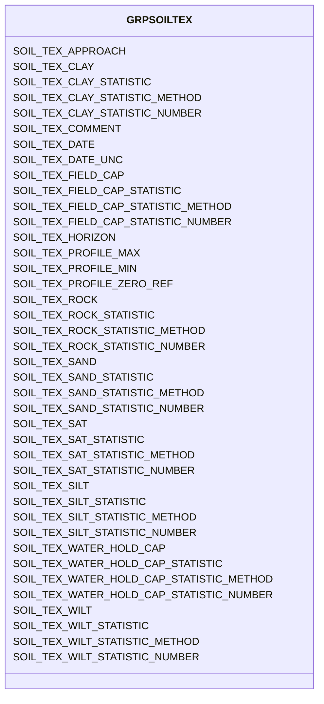

# Class: GRPSOILTEX


URI: [TEMP:GRPSOILTEX](https://example.org/TEMP/GRPSOILTEX)





<!-- no inheritance hierarchy -->


## Slots

| Name | Cardinality and Range | Description | Inheritance |
| ---  | --- | --- | --- |
| [SOIL_TEX_SAND](SOIL_TEX_SAND.md) | 0..1 <br/> [xsd:float](xsd:float) | Sand content | direct |
| [SOIL_TEX_SAND_STATISTIC](SOIL_TEX_SAND_STATISTIC.md) | 0..1 <br/> [STATISTIC](STATISTIC.md) | Sand content statistic | direct |
| [SOIL_TEX_SAND_STATISTIC_METHOD](SOIL_TEX_SAND_STATISTIC_METHOD.md) | 0..1 <br/> [STATISTICMETHOD](STATISTICMETHOD.md) | Sand content statistic method | direct |
| [SOIL_TEX_SAND_STATISTIC_NUMBER](SOIL_TEX_SAND_STATISTIC_NUMBER.md) | 0..1 <br/> [xsd:integer](xsd:integer) | Number of observations used to determine sand content statistic | direct |
| [SOIL_TEX_SILT](SOIL_TEX_SILT.md) | 0..1 <br/> [xsd:float](xsd:float) | Silt content | direct |
| [SOIL_TEX_SILT_STATISTIC](SOIL_TEX_SILT_STATISTIC.md) | 0..1 <br/> [STATISTIC](STATISTIC.md) | Silt content statistic | direct |
| [SOIL_TEX_SILT_STATISTIC_METHOD](SOIL_TEX_SILT_STATISTIC_METHOD.md) | 0..1 <br/> [STATISTICMETHOD](STATISTICMETHOD.md) | Silt content statistic method | direct |
| [SOIL_TEX_SILT_STATISTIC_NUMBER](SOIL_TEX_SILT_STATISTIC_NUMBER.md) | 0..1 <br/> [xsd:integer](xsd:integer) | Number of observations used to determine silt content statistic | direct |
| [SOIL_TEX_CLAY](SOIL_TEX_CLAY.md) | 0..1 <br/> [xsd:float](xsd:float) | Clay content | direct |
| [SOIL_TEX_CLAY_STATISTIC](SOIL_TEX_CLAY_STATISTIC.md) | 0..1 <br/> [STATISTIC](STATISTIC.md) | Clay content statistic | direct |
| [SOIL_TEX_CLAY_STATISTIC_METHOD](SOIL_TEX_CLAY_STATISTIC_METHOD.md) | 0..1 <br/> [STATISTICMETHOD](STATISTICMETHOD.md) | Clay content statistic method | direct |
| [SOIL_TEX_CLAY_STATISTIC_NUMBER](SOIL_TEX_CLAY_STATISTIC_NUMBER.md) | 0..1 <br/> [xsd:integer](xsd:integer) | Number of observations used to determine clay content statistic | direct |
| [SOIL_TEX_ROCK](SOIL_TEX_ROCK.md) | 0..1 <br/> [xsd:float](xsd:float) | Rock content (>2mm) | direct |
| [SOIL_TEX_ROCK_STATISTIC](SOIL_TEX_ROCK_STATISTIC.md) | 0..1 <br/> [STATISTIC](STATISTIC.md) | Rock content (>2mm) statistic | direct |
| [SOIL_TEX_ROCK_STATISTIC_METHOD](SOIL_TEX_ROCK_STATISTIC_METHOD.md) | 0..1 <br/> [STATISTICMETHOD](STATISTICMETHOD.md) | Rock content (>2mm) statistic method | direct |
| [SOIL_TEX_ROCK_STATISTIC_NUMBER](SOIL_TEX_ROCK_STATISTIC_NUMBER.md) | 0..1 <br/> [xsd:integer](xsd:integer) | Number of observations used to determine rock content (>2mm) statistic | direct |
| [SOIL_TEX_WATER_HOLD_CAP](SOIL_TEX_WATER_HOLD_CAP.md) | 0..1 <br/> [xsd:float](xsd:float) | Soil water holding capacity | direct |
| [SOIL_TEX_WATER_HOLD_CAP_STATISTIC](SOIL_TEX_WATER_HOLD_CAP_STATISTIC.md) | 0..1 <br/> [STATISTIC](STATISTIC.md) | Soil water holding capacity statistic | direct |
| [SOIL_TEX_WATER_HOLD_CAP_STATISTIC_METHOD](SOIL_TEX_WATER_HOLD_CAP_STATISTIC_METHOD.md) | 0..1 <br/> [STATISTICMETHOD](STATISTICMETHOD.md) | Soil water holding capacity statistic method | direct |
| [SOIL_TEX_WATER_HOLD_CAP_STATISTIC_NUMBER](SOIL_TEX_WATER_HOLD_CAP_STATISTIC_NUMBER.md) | 0..1 <br/> [xsd:integer](xsd:integer) | Number of observations used to determine soil water holding capacity statisti... | direct |
| [SOIL_TEX_WILT](SOIL_TEX_WILT.md) | 0..1 <br/> [xsd:float](xsd:float) | Wilting point | direct |
| [SOIL_TEX_WILT_STATISTIC](SOIL_TEX_WILT_STATISTIC.md) | 0..1 <br/> [STATISTIC](STATISTIC.md) | Wilting point statistic | direct |
| [SOIL_TEX_WILT_STATISTIC_METHOD](SOIL_TEX_WILT_STATISTIC_METHOD.md) | 0..1 <br/> [STATISTICMETHOD](STATISTICMETHOD.md) | Wilting point statistic method | direct |
| [SOIL_TEX_WILT_STATISTIC_NUMBER](SOIL_TEX_WILT_STATISTIC_NUMBER.md) | 0..1 <br/> [xsd:integer](xsd:integer) | Number of observations used to determine wilting point statistic | direct |
| [SOIL_TEX_SAT](SOIL_TEX_SAT.md) | 0..1 <br/> [xsd:float](xsd:float) | Soil water saturation point | direct |
| [SOIL_TEX_SAT_STATISTIC](SOIL_TEX_SAT_STATISTIC.md) | 0..1 <br/> [STATISTIC](STATISTIC.md) | Soil water saturation point statistic | direct |
| [SOIL_TEX_SAT_STATISTIC_METHOD](SOIL_TEX_SAT_STATISTIC_METHOD.md) | 0..1 <br/> [STATISTICMETHOD](STATISTICMETHOD.md) | Soil water saturation point statistic method | direct |
| [SOIL_TEX_SAT_STATISTIC_NUMBER](SOIL_TEX_SAT_STATISTIC_NUMBER.md) | 0..1 <br/> [xsd:integer](xsd:integer) | Number of observations used to determine soil water saturation point statisti... | direct |
| [SOIL_TEX_FIELD_CAP](SOIL_TEX_FIELD_CAP.md) | 0..1 <br/> [xsd:float](xsd:float) | Field capacity | direct |
| [SOIL_TEX_FIELD_CAP_STATISTIC](SOIL_TEX_FIELD_CAP_STATISTIC.md) | 0..1 <br/> [STATISTIC](STATISTIC.md) | Field capacity statistic | direct |
| [SOIL_TEX_FIELD_CAP_STATISTIC_METHOD](SOIL_TEX_FIELD_CAP_STATISTIC_METHOD.md) | 0..1 <br/> [STATISTICMETHOD](STATISTICMETHOD.md) | Field capacity statistic method | direct |
| [SOIL_TEX_FIELD_CAP_STATISTIC_NUMBER](SOIL_TEX_FIELD_CAP_STATISTIC_NUMBER.md) | 0..1 <br/> [xsd:integer](xsd:integer) | Number of observations used to determine field capacity statistic | direct |
| [SOIL_TEX_PROFILE_ZERO_REF](SOIL_TEX_PROFILE_ZERO_REF.md) | 0..1 <br/> [PROFILEZEROREF](PROFILEZEROREF.md) | Soil texture profile zero reference | direct |
| [SOIL_TEX_PROFILE_MIN](SOIL_TEX_PROFILE_MIN.md) | 0..1 <br/> [xsd:float](xsd:float) | Soil texture profile minimum depth | direct |
| [SOIL_TEX_PROFILE_MAX](SOIL_TEX_PROFILE_MAX.md) | 0..1 <br/> [xsd:float](xsd:float) | Soil texture profile maximum depth | direct |
| [SOIL_TEX_HORIZON](SOIL_TEX_HORIZON.md) | 0..1 <br/> [xsd:string](xsd:string) | Soil texture profile horizon | direct |
| [SOIL_TEX_APPROACH](SOIL_TEX_APPROACH.md) | 0..1 <br/> [xsd:string](xsd:string) | Soil texture measurement approach | direct |
| [SOIL_TEX_DATE](SOIL_TEX_DATE.md) | 0..1 <br/> [xsd:float](xsd:float) | Soil texture measurement date | direct |
| [SOIL_TEX_DATE_UNC](SOIL_TEX_DATE_UNC.md) | 0..1 <br/> [xsd:float](xsd:float) | Uncertainty in the Soil texture measurement date | direct |
| [SOIL_TEX_COMMENT](SOIL_TEX_COMMENT.md) | 0..1 <br/> [xsd:string](xsd:string) | Soil texture comments | direct |


## Identifier and Mapping Information


### Schema Source


* from schema: TEMP


## Mappings

| Mapping Type | Mapped Value |
| ---  | ---  |
| self | TEMP:GRPSOILTEX |
| native | TEMP:GRPSOILTEX |


## LinkML Source

<!-- TODO: investigate https://stackoverflow.com/questions/37606292/how-to-create-tabbed-code-blocks-in-mkdocs-or-sphinx -->

### Direct

<details>
```yaml
name: GRP_SOIL_TEX
from_schema: TEMP
rank: 1000
slots:
- SOIL_TEX_SAND
- SOIL_TEX_SAND_STATISTIC
- SOIL_TEX_SAND_STATISTIC_METHOD
- SOIL_TEX_SAND_STATISTIC_NUMBER
- SOIL_TEX_SILT
- SOIL_TEX_SILT_STATISTIC
- SOIL_TEX_SILT_STATISTIC_METHOD
- SOIL_TEX_SILT_STATISTIC_NUMBER
- SOIL_TEX_CLAY
- SOIL_TEX_CLAY_STATISTIC
- SOIL_TEX_CLAY_STATISTIC_METHOD
- SOIL_TEX_CLAY_STATISTIC_NUMBER
- SOIL_TEX_ROCK
- SOIL_TEX_ROCK_STATISTIC
- SOIL_TEX_ROCK_STATISTIC_METHOD
- SOIL_TEX_ROCK_STATISTIC_NUMBER
- SOIL_TEX_WATER_HOLD_CAP
- SOIL_TEX_WATER_HOLD_CAP_STATISTIC
- SOIL_TEX_WATER_HOLD_CAP_STATISTIC_METHOD
- SOIL_TEX_WATER_HOLD_CAP_STATISTIC_NUMBER
- SOIL_TEX_WILT
- SOIL_TEX_WILT_STATISTIC
- SOIL_TEX_WILT_STATISTIC_METHOD
- SOIL_TEX_WILT_STATISTIC_NUMBER
- SOIL_TEX_SAT
- SOIL_TEX_SAT_STATISTIC
- SOIL_TEX_SAT_STATISTIC_METHOD
- SOIL_TEX_SAT_STATISTIC_NUMBER
- SOIL_TEX_FIELD_CAP
- SOIL_TEX_FIELD_CAP_STATISTIC
- SOIL_TEX_FIELD_CAP_STATISTIC_METHOD
- SOIL_TEX_FIELD_CAP_STATISTIC_NUMBER
- SOIL_TEX_PROFILE_ZERO_REF
- SOIL_TEX_PROFILE_MIN
- SOIL_TEX_PROFILE_MAX
- SOIL_TEX_HORIZON
- SOIL_TEX_APPROACH
- SOIL_TEX_DATE
- SOIL_TEX_DATE_UNC
- SOIL_TEX_COMMENT
slot_usage:
  SOIL_TEX_APPROACH:
    name: SOIL_TEX_APPROACH
    description: Soil texture measurement approach
    multivalued: true
    domain_of:
    - GRP_SOIL_TEX
    - GRP_SOIL_TEX
  SOIL_TEX_CLAY:
    name: SOIL_TEX_CLAY
    description: Clay content
    multivalued: true
    identifier: true
    domain_of:
    - GRP_SOIL_TEX
    - GRP_SOIL_TEX
  SOIL_TEX_CLAY_STATISTIC:
    name: SOIL_TEX_CLAY_STATISTIC
    description: Clay content statistic
    comments:
    - The statistic for the measurement reported. Use predefined list (e.g., mean,
      min / max, standard deviation, etc).
    multivalued: true
    domain_of:
    - GRP_SOIL_TEX
    - GRP_SOIL_TEX
    required: true
  SOIL_TEX_CLAY_STATISTIC_METHOD:
    name: SOIL_TEX_CLAY_STATISTIC_METHOD
    description: Clay content statistic method
    comments:
    - Method used to generate the reported statistic (e.g., aggregate of individuals,
      aggregate of sample aggregates) from observations representing the same time
      period. Use predefined list. The aggregation method is not meant to describe
      temporal aggregations for example in calculations of higher frequency observations
      (e.g., sub-minute) to lower frequency observations (e.g., hourly) at a single
      location.
    multivalued: true
    domain_of:
    - GRP_SOIL_TEX
    - GRP_SOIL_TEX
  SOIL_TEX_CLAY_STATISTIC_NUMBER:
    name: SOIL_TEX_CLAY_STATISTIC_NUMBER
    description: Number of observations used to determine clay content statistic
    comments:
    - Number of observations (samples / replicates) used to calculate the STATISTIC
      for the reported measurement.
    multivalued: true
    domain_of:
    - GRP_SOIL_TEX
    - GRP_SOIL_TEX
  SOIL_TEX_COMMENT:
    name: SOIL_TEX_COMMENT
    description: Soil texture comments
    multivalued: true
    domain_of:
    - GRP_SOIL_TEX
    - GRP_SOIL_TEX
  SOIL_TEX_DATE:
    name: SOIL_TEX_DATE
    description: Soil texture measurement date
    comments:
    - Please report the date at the precision known. Allowed reporting precisions
      are YYYY, YYYYMM, YYYYMMDD, and YYYYMMDDHHMM.
    multivalued: true
    domain_of:
    - GRP_SOIL_TEX
    - GRP_SOIL_TEX
    required: true
  SOIL_TEX_DATE_UNC:
    name: SOIL_TEX_DATE_UNC
    description: Uncertainty in the Soil texture measurement date
    multivalued: true
    domain_of:
    - GRP_SOIL_TEX
    - GRP_SOIL_TEX
  SOIL_TEX_FIELD_CAP:
    name: SOIL_TEX_FIELD_CAP
    description: Field capacity
    comments:
    - Amount of water in the soil at -33 kPa (-0.33 Bar) or that remains after soil
      has been saturated and free drainage stops. Please define in Approach.
    multivalued: true
    identifier: true
    domain_of:
    - GRP_SOIL_TEX
    - GRP_SOIL_TEX
  SOIL_TEX_FIELD_CAP_STATISTIC:
    name: SOIL_TEX_FIELD_CAP_STATISTIC
    description: Field capacity statistic
    comments:
    - The statistic for the measurement reported. Use predefined list (e.g., mean,
      min / max, standard deviation, etc).
    multivalued: true
    domain_of:
    - GRP_SOIL_TEX
    - GRP_SOIL_TEX
    required: true
  SOIL_TEX_FIELD_CAP_STATISTIC_METHOD:
    name: SOIL_TEX_FIELD_CAP_STATISTIC_METHOD
    description: Field capacity statistic method
    comments:
    - Method used to generate the reported statistic (e.g., aggregate of individuals,
      aggregate of sample aggregates) from observations representing the same time
      period. Use predefined list. The aggregation method is not meant to describe
      temporal aggregations for example in calculations of higher frequency observations
      (e.g., sub-minute) to lower frequency observations (e.g., hourly) at a single
      location.
    multivalued: true
    domain_of:
    - GRP_SOIL_TEX
    - GRP_SOIL_TEX
  SOIL_TEX_FIELD_CAP_STATISTIC_NUMBER:
    name: SOIL_TEX_FIELD_CAP_STATISTIC_NUMBER
    description: Number of observations used to determine field capacity statistic
    comments:
    - Number of observations (samples / replicates) used to calculate the STATISTIC
      for the reported measurement.
    multivalued: true
    domain_of:
    - GRP_SOIL_TEX
    - GRP_SOIL_TEX
  SOIL_TEX_HORIZON:
    name: SOIL_TEX_HORIZON
    description: Soil texture profile horizon
    comments:
    - Use soil horizon scheme best suited for your soil. Examples include O, Oa, B,
      Bt, C.
    multivalued: true
    domain_of:
    - GRP_SOIL_TEX
    - GRP_SOIL_TEX
  SOIL_TEX_PROFILE_MAX:
    name: SOIL_TEX_PROFILE_MAX
    description: Soil texture profile maximum depth
    comments:
    - Profile maximum depth is the vertical distance from profile zero reference to
      the bottom of soil layer being measured.
    multivalued: true
    domain_of:
    - GRP_SOIL_TEX
    - GRP_SOIL_TEX
  SOIL_TEX_PROFILE_MIN:
    name: SOIL_TEX_PROFILE_MIN
    description: Soil texture profile minimum depth
    comments:
    - Profile minimum depth is the vertical distance from profile zero reference to
      the top of soil layer being measured.
    multivalued: true
    domain_of:
    - GRP_SOIL_TEX
    - GRP_SOIL_TEX
  SOIL_TEX_PROFILE_ZERO_REF:
    name: SOIL_TEX_PROFILE_ZERO_REF
    description: Soil texture profile zero reference
    comments:
    - Profile Zero Reference is the horizontal plane from which the soil profile minimum
      and maximum depths are measured. For example, top of mineral soil or top of
      litter layer. Use predefined list.
    multivalued: true
    domain_of:
    - GRP_SOIL_TEX
    - GRP_SOIL_TEX
  SOIL_TEX_ROCK:
    name: SOIL_TEX_ROCK
    description: Rock content (>2mm)
    multivalued: true
    identifier: true
    domain_of:
    - GRP_SOIL_TEX
    - GRP_SOIL_TEX
  SOIL_TEX_ROCK_STATISTIC:
    name: SOIL_TEX_ROCK_STATISTIC
    description: Rock content (>2mm) statistic
    comments:
    - The statistic for the measurement reported. Use predefined list (e.g., mean,
      min / max, standard deviation, etc).
    multivalued: true
    domain_of:
    - GRP_SOIL_TEX
    - GRP_SOIL_TEX
    required: true
  SOIL_TEX_ROCK_STATISTIC_METHOD:
    name: SOIL_TEX_ROCK_STATISTIC_METHOD
    description: Rock content (>2mm) statistic method
    comments:
    - Method used to generate the reported statistic (e.g., aggregate of individuals,
      aggregate of sample aggregates) from observations representing the same time
      period. Use predefined list. The aggregation method is not meant to describe
      temporal aggregations for example in calculations of higher frequency observations
      (e.g., sub-minute) to lower frequency observations (e.g., hourly) at a single
      location.
    multivalued: true
    domain_of:
    - GRP_SOIL_TEX
    - GRP_SOIL_TEX
  SOIL_TEX_ROCK_STATISTIC_NUMBER:
    name: SOIL_TEX_ROCK_STATISTIC_NUMBER
    description: Number of observations used to determine rock content (>2mm) statistic
    comments:
    - Number of observations (samples / replicates) used to calculate the STATISTIC
      for the reported measurement.
    multivalued: true
    domain_of:
    - GRP_SOIL_TEX
    - GRP_SOIL_TEX
  SOIL_TEX_SAND:
    name: SOIL_TEX_SAND
    description: Sand content
    multivalued: true
    identifier: true
    domain_of:
    - GRP_SOIL_TEX
    - GRP_SOIL_TEX
  SOIL_TEX_SAND_STATISTIC:
    name: SOIL_TEX_SAND_STATISTIC
    description: Sand content statistic
    comments:
    - The statistic for the measurement reported. Use predefined list (e.g., mean,
      min / max, standard deviation, etc).
    multivalued: true
    domain_of:
    - GRP_SOIL_TEX
    - GRP_SOIL_TEX
    required: true
  SOIL_TEX_SAND_STATISTIC_METHOD:
    name: SOIL_TEX_SAND_STATISTIC_METHOD
    description: Sand content statistic method
    comments:
    - Method used to generate the reported statistic (e.g., aggregate of individuals,
      aggregate of sample aggregates) from observations representing the same time
      period. Use predefined list. The aggregation method is not meant to describe
      temporal aggregations for example in calculations of higher frequency observations
      (e.g., sub-minute) to lower frequency observations (e.g., hourly) at a single
      location.
    multivalued: true
    domain_of:
    - GRP_SOIL_TEX
    - GRP_SOIL_TEX
  SOIL_TEX_SAND_STATISTIC_NUMBER:
    name: SOIL_TEX_SAND_STATISTIC_NUMBER
    description: Number of observations used to determine sand content statistic
    comments:
    - Number of observations (samples / replicates) used to calculate the STATISTIC
      for the reported measurement.
    multivalued: true
    domain_of:
    - GRP_SOIL_TEX
    - GRP_SOIL_TEX
  SOIL_TEX_SAT:
    name: SOIL_TEX_SAT
    description: Soil water saturation point
    comments:
    - The amount of water in soil at saturation (or when no pressure is required to
      remove water from the soil).
    multivalued: true
    identifier: true
    domain_of:
    - GRP_SOIL_TEX
    - GRP_SOIL_TEX
  SOIL_TEX_SAT_STATISTIC:
    name: SOIL_TEX_SAT_STATISTIC
    description: Soil water saturation point statistic
    comments:
    - The statistic for the measurement reported. Use predefined list (e.g., mean,
      min / max, standard deviation, etc).
    multivalued: true
    domain_of:
    - GRP_SOIL_TEX
    - GRP_SOIL_TEX
    required: true
  SOIL_TEX_SAT_STATISTIC_METHOD:
    name: SOIL_TEX_SAT_STATISTIC_METHOD
    description: Soil water saturation point statistic method
    comments:
    - Method used to generate the reported statistic (e.g., aggregate of individuals,
      aggregate of sample aggregates) from observations representing the same time
      period. Use predefined list. The aggregation method is not meant to describe
      temporal aggregations for example in calculations of higher frequency observations
      (e.g., sub-minute) to lower frequency observations (e.g., hourly) at a single
      location.
    multivalued: true
    domain_of:
    - GRP_SOIL_TEX
    - GRP_SOIL_TEX
  SOIL_TEX_SAT_STATISTIC_NUMBER:
    name: SOIL_TEX_SAT_STATISTIC_NUMBER
    description: Number of observations used to determine soil water saturation point
      statistic
    comments:
    - Number of observations (samples / replicates) used to calculate the STATISTIC
      for the reported measurement.
    multivalued: true
    domain_of:
    - GRP_SOIL_TEX
    - GRP_SOIL_TEX
  SOIL_TEX_SILT:
    name: SOIL_TEX_SILT
    description: Silt content
    multivalued: true
    identifier: true
    domain_of:
    - GRP_SOIL_TEX
    - GRP_SOIL_TEX
  SOIL_TEX_SILT_STATISTIC:
    name: SOIL_TEX_SILT_STATISTIC
    description: Silt content statistic
    comments:
    - The statistic for the measurement reported. Use predefined list (e.g., mean,
      min / max, standard deviation, etc).
    multivalued: true
    domain_of:
    - GRP_SOIL_TEX
    - GRP_SOIL_TEX
    required: true
  SOIL_TEX_SILT_STATISTIC_METHOD:
    name: SOIL_TEX_SILT_STATISTIC_METHOD
    description: Silt content statistic method
    comments:
    - Method used to generate the reported statistic (e.g., aggregate of individuals,
      aggregate of sample aggregates) from observations representing the same time
      period. Use predefined list. The aggregation method is not meant to describe
      temporal aggregations for example in calculations of higher frequency observations
      (e.g., sub-minute) to lower frequency observations (e.g., hourly) at a single
      location.
    multivalued: true
    domain_of:
    - GRP_SOIL_TEX
    - GRP_SOIL_TEX
  SOIL_TEX_SILT_STATISTIC_NUMBER:
    name: SOIL_TEX_SILT_STATISTIC_NUMBER
    description: Number of observations used to determine silt content statistic
    comments:
    - Number of observations (samples / replicates) used to calculate the STATISTIC
      for the reported measurement.
    multivalued: true
    domain_of:
    - GRP_SOIL_TEX
    - GRP_SOIL_TEX
  SOIL_TEX_WATER_HOLD_CAP:
    name: SOIL_TEX_WATER_HOLD_CAP
    description: Soil water holding capacity
    comments:
    - Amount of water in the soil that is held between field capacity and wilting
      point.
    multivalued: true
    identifier: true
    domain_of:
    - GRP_SOIL_TEX
    - GRP_SOIL_TEX
  SOIL_TEX_WATER_HOLD_CAP_STATISTIC:
    name: SOIL_TEX_WATER_HOLD_CAP_STATISTIC
    description: Soil water holding capacity statistic
    comments:
    - The statistic for the measurement reported. Use predefined list (e.g., mean,
      min / max, standard deviation, etc).
    multivalued: true
    domain_of:
    - GRP_SOIL_TEX
    - GRP_SOIL_TEX
    required: true
  SOIL_TEX_WATER_HOLD_CAP_STATISTIC_METHOD:
    name: SOIL_TEX_WATER_HOLD_CAP_STATISTIC_METHOD
    description: Soil water holding capacity statistic method
    comments:
    - Method used to generate the reported statistic (e.g., aggregate of individuals,
      aggregate of sample aggregates) from observations representing the same time
      period. Use predefined list. The aggregation method is not meant to describe
      temporal aggregations for example in calculations of higher frequency observations
      (e.g., sub-minute) to lower frequency observations (e.g., hourly) at a single
      location.
    multivalued: true
    domain_of:
    - GRP_SOIL_TEX
    - GRP_SOIL_TEX
  SOIL_TEX_WATER_HOLD_CAP_STATISTIC_NUMBER:
    name: SOIL_TEX_WATER_HOLD_CAP_STATISTIC_NUMBER
    description: Number of observations used to determine soil water holding capacity
      statistic
    comments:
    - Number of observations (samples / replicates) used to calculate the STATISTIC
      for the reported measurement.
    multivalued: true
    domain_of:
    - GRP_SOIL_TEX
    - GRP_SOIL_TEX
  SOIL_TEX_WILT:
    name: SOIL_TEX_WILT
    description: Wilting point
    comments:
    - The amount of water in the soil at -1500 kPa (-15 Bar) or at which plants wilt.
      Please define in Approach.
    multivalued: true
    identifier: true
    domain_of:
    - GRP_SOIL_TEX
    - GRP_SOIL_TEX
  SOIL_TEX_WILT_STATISTIC:
    name: SOIL_TEX_WILT_STATISTIC
    description: Wilting point statistic
    comments:
    - The statistic for the measurement reported. Use predefined list (e.g., mean,
      min / max, standard deviation, etc).
    multivalued: true
    domain_of:
    - GRP_SOIL_TEX
    - GRP_SOIL_TEX
    required: true
  SOIL_TEX_WILT_STATISTIC_METHOD:
    name: SOIL_TEX_WILT_STATISTIC_METHOD
    description: Wilting point statistic method
    comments:
    - Method used to generate the reported statistic (e.g., aggregate of individuals,
      aggregate of sample aggregates) from observations representing the same time
      period. Use predefined list. The aggregation method is not meant to describe
      temporal aggregations for example in calculations of higher frequency observations
      (e.g., sub-minute) to lower frequency observations (e.g., hourly) at a single
      location.
    multivalued: true
    domain_of:
    - GRP_SOIL_TEX
    - GRP_SOIL_TEX
  SOIL_TEX_WILT_STATISTIC_NUMBER:
    name: SOIL_TEX_WILT_STATISTIC_NUMBER
    description: Number of observations used to determine wilting point statistic
    comments:
    - Number of observations (samples / replicates) used to calculate the STATISTIC
      for the reported measurement.
    multivalued: true
    domain_of:
    - GRP_SOIL_TEX
    - GRP_SOIL_TEX

```
</details>

### Induced

<details>
```yaml
name: GRP_SOIL_TEX
from_schema: TEMP
rank: 1000
slot_usage:
  SOIL_TEX_APPROACH:
    name: SOIL_TEX_APPROACH
    description: Soil texture measurement approach
    multivalued: true
    domain_of:
    - GRP_SOIL_TEX
    - GRP_SOIL_TEX
  SOIL_TEX_CLAY:
    name: SOIL_TEX_CLAY
    description: Clay content
    multivalued: true
    identifier: true
    domain_of:
    - GRP_SOIL_TEX
    - GRP_SOIL_TEX
  SOIL_TEX_CLAY_STATISTIC:
    name: SOIL_TEX_CLAY_STATISTIC
    description: Clay content statistic
    comments:
    - The statistic for the measurement reported. Use predefined list (e.g., mean,
      min / max, standard deviation, etc).
    multivalued: true
    domain_of:
    - GRP_SOIL_TEX
    - GRP_SOIL_TEX
    required: true
  SOIL_TEX_CLAY_STATISTIC_METHOD:
    name: SOIL_TEX_CLAY_STATISTIC_METHOD
    description: Clay content statistic method
    comments:
    - Method used to generate the reported statistic (e.g., aggregate of individuals,
      aggregate of sample aggregates) from observations representing the same time
      period. Use predefined list. The aggregation method is not meant to describe
      temporal aggregations for example in calculations of higher frequency observations
      (e.g., sub-minute) to lower frequency observations (e.g., hourly) at a single
      location.
    multivalued: true
    domain_of:
    - GRP_SOIL_TEX
    - GRP_SOIL_TEX
  SOIL_TEX_CLAY_STATISTIC_NUMBER:
    name: SOIL_TEX_CLAY_STATISTIC_NUMBER
    description: Number of observations used to determine clay content statistic
    comments:
    - Number of observations (samples / replicates) used to calculate the STATISTIC
      for the reported measurement.
    multivalued: true
    domain_of:
    - GRP_SOIL_TEX
    - GRP_SOIL_TEX
  SOIL_TEX_COMMENT:
    name: SOIL_TEX_COMMENT
    description: Soil texture comments
    multivalued: true
    domain_of:
    - GRP_SOIL_TEX
    - GRP_SOIL_TEX
  SOIL_TEX_DATE:
    name: SOIL_TEX_DATE
    description: Soil texture measurement date
    comments:
    - Please report the date at the precision known. Allowed reporting precisions
      are YYYY, YYYYMM, YYYYMMDD, and YYYYMMDDHHMM.
    multivalued: true
    domain_of:
    - GRP_SOIL_TEX
    - GRP_SOIL_TEX
    required: true
  SOIL_TEX_DATE_UNC:
    name: SOIL_TEX_DATE_UNC
    description: Uncertainty in the Soil texture measurement date
    multivalued: true
    domain_of:
    - GRP_SOIL_TEX
    - GRP_SOIL_TEX
  SOIL_TEX_FIELD_CAP:
    name: SOIL_TEX_FIELD_CAP
    description: Field capacity
    comments:
    - Amount of water in the soil at -33 kPa (-0.33 Bar) or that remains after soil
      has been saturated and free drainage stops. Please define in Approach.
    multivalued: true
    identifier: true
    domain_of:
    - GRP_SOIL_TEX
    - GRP_SOIL_TEX
  SOIL_TEX_FIELD_CAP_STATISTIC:
    name: SOIL_TEX_FIELD_CAP_STATISTIC
    description: Field capacity statistic
    comments:
    - The statistic for the measurement reported. Use predefined list (e.g., mean,
      min / max, standard deviation, etc).
    multivalued: true
    domain_of:
    - GRP_SOIL_TEX
    - GRP_SOIL_TEX
    required: true
  SOIL_TEX_FIELD_CAP_STATISTIC_METHOD:
    name: SOIL_TEX_FIELD_CAP_STATISTIC_METHOD
    description: Field capacity statistic method
    comments:
    - Method used to generate the reported statistic (e.g., aggregate of individuals,
      aggregate of sample aggregates) from observations representing the same time
      period. Use predefined list. The aggregation method is not meant to describe
      temporal aggregations for example in calculations of higher frequency observations
      (e.g., sub-minute) to lower frequency observations (e.g., hourly) at a single
      location.
    multivalued: true
    domain_of:
    - GRP_SOIL_TEX
    - GRP_SOIL_TEX
  SOIL_TEX_FIELD_CAP_STATISTIC_NUMBER:
    name: SOIL_TEX_FIELD_CAP_STATISTIC_NUMBER
    description: Number of observations used to determine field capacity statistic
    comments:
    - Number of observations (samples / replicates) used to calculate the STATISTIC
      for the reported measurement.
    multivalued: true
    domain_of:
    - GRP_SOIL_TEX
    - GRP_SOIL_TEX
  SOIL_TEX_HORIZON:
    name: SOIL_TEX_HORIZON
    description: Soil texture profile horizon
    comments:
    - Use soil horizon scheme best suited for your soil. Examples include O, Oa, B,
      Bt, C.
    multivalued: true
    domain_of:
    - GRP_SOIL_TEX
    - GRP_SOIL_TEX
  SOIL_TEX_PROFILE_MAX:
    name: SOIL_TEX_PROFILE_MAX
    description: Soil texture profile maximum depth
    comments:
    - Profile maximum depth is the vertical distance from profile zero reference to
      the bottom of soil layer being measured.
    multivalued: true
    domain_of:
    - GRP_SOIL_TEX
    - GRP_SOIL_TEX
  SOIL_TEX_PROFILE_MIN:
    name: SOIL_TEX_PROFILE_MIN
    description: Soil texture profile minimum depth
    comments:
    - Profile minimum depth is the vertical distance from profile zero reference to
      the top of soil layer being measured.
    multivalued: true
    domain_of:
    - GRP_SOIL_TEX
    - GRP_SOIL_TEX
  SOIL_TEX_PROFILE_ZERO_REF:
    name: SOIL_TEX_PROFILE_ZERO_REF
    description: Soil texture profile zero reference
    comments:
    - Profile Zero Reference is the horizontal plane from which the soil profile minimum
      and maximum depths are measured. For example, top of mineral soil or top of
      litter layer. Use predefined list.
    multivalued: true
    domain_of:
    - GRP_SOIL_TEX
    - GRP_SOIL_TEX
  SOIL_TEX_ROCK:
    name: SOIL_TEX_ROCK
    description: Rock content (>2mm)
    multivalued: true
    identifier: true
    domain_of:
    - GRP_SOIL_TEX
    - GRP_SOIL_TEX
  SOIL_TEX_ROCK_STATISTIC:
    name: SOIL_TEX_ROCK_STATISTIC
    description: Rock content (>2mm) statistic
    comments:
    - The statistic for the measurement reported. Use predefined list (e.g., mean,
      min / max, standard deviation, etc).
    multivalued: true
    domain_of:
    - GRP_SOIL_TEX
    - GRP_SOIL_TEX
    required: true
  SOIL_TEX_ROCK_STATISTIC_METHOD:
    name: SOIL_TEX_ROCK_STATISTIC_METHOD
    description: Rock content (>2mm) statistic method
    comments:
    - Method used to generate the reported statistic (e.g., aggregate of individuals,
      aggregate of sample aggregates) from observations representing the same time
      period. Use predefined list. The aggregation method is not meant to describe
      temporal aggregations for example in calculations of higher frequency observations
      (e.g., sub-minute) to lower frequency observations (e.g., hourly) at a single
      location.
    multivalued: true
    domain_of:
    - GRP_SOIL_TEX
    - GRP_SOIL_TEX
  SOIL_TEX_ROCK_STATISTIC_NUMBER:
    name: SOIL_TEX_ROCK_STATISTIC_NUMBER
    description: Number of observations used to determine rock content (>2mm) statistic
    comments:
    - Number of observations (samples / replicates) used to calculate the STATISTIC
      for the reported measurement.
    multivalued: true
    domain_of:
    - GRP_SOIL_TEX
    - GRP_SOIL_TEX
  SOIL_TEX_SAND:
    name: SOIL_TEX_SAND
    description: Sand content
    multivalued: true
    identifier: true
    domain_of:
    - GRP_SOIL_TEX
    - GRP_SOIL_TEX
  SOIL_TEX_SAND_STATISTIC:
    name: SOIL_TEX_SAND_STATISTIC
    description: Sand content statistic
    comments:
    - The statistic for the measurement reported. Use predefined list (e.g., mean,
      min / max, standard deviation, etc).
    multivalued: true
    domain_of:
    - GRP_SOIL_TEX
    - GRP_SOIL_TEX
    required: true
  SOIL_TEX_SAND_STATISTIC_METHOD:
    name: SOIL_TEX_SAND_STATISTIC_METHOD
    description: Sand content statistic method
    comments:
    - Method used to generate the reported statistic (e.g., aggregate of individuals,
      aggregate of sample aggregates) from observations representing the same time
      period. Use predefined list. The aggregation method is not meant to describe
      temporal aggregations for example in calculations of higher frequency observations
      (e.g., sub-minute) to lower frequency observations (e.g., hourly) at a single
      location.
    multivalued: true
    domain_of:
    - GRP_SOIL_TEX
    - GRP_SOIL_TEX
  SOIL_TEX_SAND_STATISTIC_NUMBER:
    name: SOIL_TEX_SAND_STATISTIC_NUMBER
    description: Number of observations used to determine sand content statistic
    comments:
    - Number of observations (samples / replicates) used to calculate the STATISTIC
      for the reported measurement.
    multivalued: true
    domain_of:
    - GRP_SOIL_TEX
    - GRP_SOIL_TEX
  SOIL_TEX_SAT:
    name: SOIL_TEX_SAT
    description: Soil water saturation point
    comments:
    - The amount of water in soil at saturation (or when no pressure is required to
      remove water from the soil).
    multivalued: true
    identifier: true
    domain_of:
    - GRP_SOIL_TEX
    - GRP_SOIL_TEX
  SOIL_TEX_SAT_STATISTIC:
    name: SOIL_TEX_SAT_STATISTIC
    description: Soil water saturation point statistic
    comments:
    - The statistic for the measurement reported. Use predefined list (e.g., mean,
      min / max, standard deviation, etc).
    multivalued: true
    domain_of:
    - GRP_SOIL_TEX
    - GRP_SOIL_TEX
    required: true
  SOIL_TEX_SAT_STATISTIC_METHOD:
    name: SOIL_TEX_SAT_STATISTIC_METHOD
    description: Soil water saturation point statistic method
    comments:
    - Method used to generate the reported statistic (e.g., aggregate of individuals,
      aggregate of sample aggregates) from observations representing the same time
      period. Use predefined list. The aggregation method is not meant to describe
      temporal aggregations for example in calculations of higher frequency observations
      (e.g., sub-minute) to lower frequency observations (e.g., hourly) at a single
      location.
    multivalued: true
    domain_of:
    - GRP_SOIL_TEX
    - GRP_SOIL_TEX
  SOIL_TEX_SAT_STATISTIC_NUMBER:
    name: SOIL_TEX_SAT_STATISTIC_NUMBER
    description: Number of observations used to determine soil water saturation point
      statistic
    comments:
    - Number of observations (samples / replicates) used to calculate the STATISTIC
      for the reported measurement.
    multivalued: true
    domain_of:
    - GRP_SOIL_TEX
    - GRP_SOIL_TEX
  SOIL_TEX_SILT:
    name: SOIL_TEX_SILT
    description: Silt content
    multivalued: true
    identifier: true
    domain_of:
    - GRP_SOIL_TEX
    - GRP_SOIL_TEX
  SOIL_TEX_SILT_STATISTIC:
    name: SOIL_TEX_SILT_STATISTIC
    description: Silt content statistic
    comments:
    - The statistic for the measurement reported. Use predefined list (e.g., mean,
      min / max, standard deviation, etc).
    multivalued: true
    domain_of:
    - GRP_SOIL_TEX
    - GRP_SOIL_TEX
    required: true
  SOIL_TEX_SILT_STATISTIC_METHOD:
    name: SOIL_TEX_SILT_STATISTIC_METHOD
    description: Silt content statistic method
    comments:
    - Method used to generate the reported statistic (e.g., aggregate of individuals,
      aggregate of sample aggregates) from observations representing the same time
      period. Use predefined list. The aggregation method is not meant to describe
      temporal aggregations for example in calculations of higher frequency observations
      (e.g., sub-minute) to lower frequency observations (e.g., hourly) at a single
      location.
    multivalued: true
    domain_of:
    - GRP_SOIL_TEX
    - GRP_SOIL_TEX
  SOIL_TEX_SILT_STATISTIC_NUMBER:
    name: SOIL_TEX_SILT_STATISTIC_NUMBER
    description: Number of observations used to determine silt content statistic
    comments:
    - Number of observations (samples / replicates) used to calculate the STATISTIC
      for the reported measurement.
    multivalued: true
    domain_of:
    - GRP_SOIL_TEX
    - GRP_SOIL_TEX
  SOIL_TEX_WATER_HOLD_CAP:
    name: SOIL_TEX_WATER_HOLD_CAP
    description: Soil water holding capacity
    comments:
    - Amount of water in the soil that is held between field capacity and wilting
      point.
    multivalued: true
    identifier: true
    domain_of:
    - GRP_SOIL_TEX
    - GRP_SOIL_TEX
  SOIL_TEX_WATER_HOLD_CAP_STATISTIC:
    name: SOIL_TEX_WATER_HOLD_CAP_STATISTIC
    description: Soil water holding capacity statistic
    comments:
    - The statistic for the measurement reported. Use predefined list (e.g., mean,
      min / max, standard deviation, etc).
    multivalued: true
    domain_of:
    - GRP_SOIL_TEX
    - GRP_SOIL_TEX
    required: true
  SOIL_TEX_WATER_HOLD_CAP_STATISTIC_METHOD:
    name: SOIL_TEX_WATER_HOLD_CAP_STATISTIC_METHOD
    description: Soil water holding capacity statistic method
    comments:
    - Method used to generate the reported statistic (e.g., aggregate of individuals,
      aggregate of sample aggregates) from observations representing the same time
      period. Use predefined list. The aggregation method is not meant to describe
      temporal aggregations for example in calculations of higher frequency observations
      (e.g., sub-minute) to lower frequency observations (e.g., hourly) at a single
      location.
    multivalued: true
    domain_of:
    - GRP_SOIL_TEX
    - GRP_SOIL_TEX
  SOIL_TEX_WATER_HOLD_CAP_STATISTIC_NUMBER:
    name: SOIL_TEX_WATER_HOLD_CAP_STATISTIC_NUMBER
    description: Number of observations used to determine soil water holding capacity
      statistic
    comments:
    - Number of observations (samples / replicates) used to calculate the STATISTIC
      for the reported measurement.
    multivalued: true
    domain_of:
    - GRP_SOIL_TEX
    - GRP_SOIL_TEX
  SOIL_TEX_WILT:
    name: SOIL_TEX_WILT
    description: Wilting point
    comments:
    - The amount of water in the soil at -1500 kPa (-15 Bar) or at which plants wilt.
      Please define in Approach.
    multivalued: true
    identifier: true
    domain_of:
    - GRP_SOIL_TEX
    - GRP_SOIL_TEX
  SOIL_TEX_WILT_STATISTIC:
    name: SOIL_TEX_WILT_STATISTIC
    description: Wilting point statistic
    comments:
    - The statistic for the measurement reported. Use predefined list (e.g., mean,
      min / max, standard deviation, etc).
    multivalued: true
    domain_of:
    - GRP_SOIL_TEX
    - GRP_SOIL_TEX
    required: true
  SOIL_TEX_WILT_STATISTIC_METHOD:
    name: SOIL_TEX_WILT_STATISTIC_METHOD
    description: Wilting point statistic method
    comments:
    - Method used to generate the reported statistic (e.g., aggregate of individuals,
      aggregate of sample aggregates) from observations representing the same time
      period. Use predefined list. The aggregation method is not meant to describe
      temporal aggregations for example in calculations of higher frequency observations
      (e.g., sub-minute) to lower frequency observations (e.g., hourly) at a single
      location.
    multivalued: true
    domain_of:
    - GRP_SOIL_TEX
    - GRP_SOIL_TEX
  SOIL_TEX_WILT_STATISTIC_NUMBER:
    name: SOIL_TEX_WILT_STATISTIC_NUMBER
    description: Number of observations used to determine wilting point statistic
    comments:
    - Number of observations (samples / replicates) used to calculate the STATISTIC
      for the reported measurement.
    multivalued: true
    domain_of:
    - GRP_SOIL_TEX
    - GRP_SOIL_TEX
attributes:
  SOIL_TEX_SAND:
    name: SOIL_TEX_SAND
    description: Sand content
    from_schema: TEMP
    rank: 1000
    multivalued: true
    identifier: true
    alias: SOIL_TEX_SAND
    owner: GRP_SOIL_TEX
    domain_of:
    - GRP_SOIL_TEX
    - GRP_SOIL_TEX
    range: float
    unit:
      symbol: '%'
  SOIL_TEX_SAND_STATISTIC:
    name: SOIL_TEX_SAND_STATISTIC
    description: Sand content statistic
    comments:
    - The statistic for the measurement reported. Use predefined list (e.g., mean,
      min / max, standard deviation, etc).
    from_schema: TEMP
    rank: 1000
    multivalued: true
    alias: SOIL_TEX_SAND_STATISTIC
    owner: GRP_SOIL_TEX
    domain_of:
    - GRP_SOIL_TEX
    - GRP_SOIL_TEX
    range: STATISTIC
    required: true
  SOIL_TEX_SAND_STATISTIC_METHOD:
    name: SOIL_TEX_SAND_STATISTIC_METHOD
    description: Sand content statistic method
    comments:
    - Method used to generate the reported statistic (e.g., aggregate of individuals,
      aggregate of sample aggregates) from observations representing the same time
      period. Use predefined list. The aggregation method is not meant to describe
      temporal aggregations for example in calculations of higher frequency observations
      (e.g., sub-minute) to lower frequency observations (e.g., hourly) at a single
      location.
    from_schema: TEMP
    rank: 1000
    multivalued: true
    alias: SOIL_TEX_SAND_STATISTIC_METHOD
    owner: GRP_SOIL_TEX
    domain_of:
    - GRP_SOIL_TEX
    - GRP_SOIL_TEX
    range: STATISTIC_METHOD
  SOIL_TEX_SAND_STATISTIC_NUMBER:
    name: SOIL_TEX_SAND_STATISTIC_NUMBER
    description: Number of observations used to determine sand content statistic
    comments:
    - Number of observations (samples / replicates) used to calculate the STATISTIC
      for the reported measurement.
    from_schema: TEMP
    rank: 1000
    multivalued: true
    alias: SOIL_TEX_SAND_STATISTIC_NUMBER
    owner: GRP_SOIL_TEX
    domain_of:
    - GRP_SOIL_TEX
    - GRP_SOIL_TEX
    range: integer
  SOIL_TEX_SILT:
    name: SOIL_TEX_SILT
    description: Silt content
    from_schema: TEMP
    rank: 1000
    multivalued: true
    identifier: true
    alias: SOIL_TEX_SILT
    owner: GRP_SOIL_TEX
    domain_of:
    - GRP_SOIL_TEX
    - GRP_SOIL_TEX
    range: float
    unit:
      symbol: '%'
  SOIL_TEX_SILT_STATISTIC:
    name: SOIL_TEX_SILT_STATISTIC
    description: Silt content statistic
    comments:
    - The statistic for the measurement reported. Use predefined list (e.g., mean,
      min / max, standard deviation, etc).
    from_schema: TEMP
    rank: 1000
    multivalued: true
    alias: SOIL_TEX_SILT_STATISTIC
    owner: GRP_SOIL_TEX
    domain_of:
    - GRP_SOIL_TEX
    - GRP_SOIL_TEX
    range: STATISTIC
    required: true
  SOIL_TEX_SILT_STATISTIC_METHOD:
    name: SOIL_TEX_SILT_STATISTIC_METHOD
    description: Silt content statistic method
    comments:
    - Method used to generate the reported statistic (e.g., aggregate of individuals,
      aggregate of sample aggregates) from observations representing the same time
      period. Use predefined list. The aggregation method is not meant to describe
      temporal aggregations for example in calculations of higher frequency observations
      (e.g., sub-minute) to lower frequency observations (e.g., hourly) at a single
      location.
    from_schema: TEMP
    rank: 1000
    multivalued: true
    alias: SOIL_TEX_SILT_STATISTIC_METHOD
    owner: GRP_SOIL_TEX
    domain_of:
    - GRP_SOIL_TEX
    - GRP_SOIL_TEX
    range: STATISTIC_METHOD
  SOIL_TEX_SILT_STATISTIC_NUMBER:
    name: SOIL_TEX_SILT_STATISTIC_NUMBER
    description: Number of observations used to determine silt content statistic
    comments:
    - Number of observations (samples / replicates) used to calculate the STATISTIC
      for the reported measurement.
    from_schema: TEMP
    rank: 1000
    multivalued: true
    alias: SOIL_TEX_SILT_STATISTIC_NUMBER
    owner: GRP_SOIL_TEX
    domain_of:
    - GRP_SOIL_TEX
    - GRP_SOIL_TEX
    range: integer
  SOIL_TEX_CLAY:
    name: SOIL_TEX_CLAY
    description: Clay content
    from_schema: TEMP
    rank: 1000
    multivalued: true
    identifier: true
    alias: SOIL_TEX_CLAY
    owner: GRP_SOIL_TEX
    domain_of:
    - GRP_SOIL_TEX
    - GRP_SOIL_TEX
    range: float
    unit:
      symbol: '%'
  SOIL_TEX_CLAY_STATISTIC:
    name: SOIL_TEX_CLAY_STATISTIC
    description: Clay content statistic
    comments:
    - The statistic for the measurement reported. Use predefined list (e.g., mean,
      min / max, standard deviation, etc).
    from_schema: TEMP
    rank: 1000
    multivalued: true
    alias: SOIL_TEX_CLAY_STATISTIC
    owner: GRP_SOIL_TEX
    domain_of:
    - GRP_SOIL_TEX
    - GRP_SOIL_TEX
    range: STATISTIC
    required: true
  SOIL_TEX_CLAY_STATISTIC_METHOD:
    name: SOIL_TEX_CLAY_STATISTIC_METHOD
    description: Clay content statistic method
    comments:
    - Method used to generate the reported statistic (e.g., aggregate of individuals,
      aggregate of sample aggregates) from observations representing the same time
      period. Use predefined list. The aggregation method is not meant to describe
      temporal aggregations for example in calculations of higher frequency observations
      (e.g., sub-minute) to lower frequency observations (e.g., hourly) at a single
      location.
    from_schema: TEMP
    rank: 1000
    multivalued: true
    alias: SOIL_TEX_CLAY_STATISTIC_METHOD
    owner: GRP_SOIL_TEX
    domain_of:
    - GRP_SOIL_TEX
    - GRP_SOIL_TEX
    range: STATISTIC_METHOD
  SOIL_TEX_CLAY_STATISTIC_NUMBER:
    name: SOIL_TEX_CLAY_STATISTIC_NUMBER
    description: Number of observations used to determine clay content statistic
    comments:
    - Number of observations (samples / replicates) used to calculate the STATISTIC
      for the reported measurement.
    from_schema: TEMP
    rank: 1000
    multivalued: true
    alias: SOIL_TEX_CLAY_STATISTIC_NUMBER
    owner: GRP_SOIL_TEX
    domain_of:
    - GRP_SOIL_TEX
    - GRP_SOIL_TEX
    range: integer
  SOIL_TEX_ROCK:
    name: SOIL_TEX_ROCK
    description: Rock content (>2mm)
    from_schema: TEMP
    rank: 1000
    multivalued: true
    identifier: true
    alias: SOIL_TEX_ROCK
    owner: GRP_SOIL_TEX
    domain_of:
    - GRP_SOIL_TEX
    - GRP_SOIL_TEX
    range: float
    unit:
      symbol: '%'
  SOIL_TEX_ROCK_STATISTIC:
    name: SOIL_TEX_ROCK_STATISTIC
    description: Rock content (>2mm) statistic
    comments:
    - The statistic for the measurement reported. Use predefined list (e.g., mean,
      min / max, standard deviation, etc).
    from_schema: TEMP
    rank: 1000
    multivalued: true
    alias: SOIL_TEX_ROCK_STATISTIC
    owner: GRP_SOIL_TEX
    domain_of:
    - GRP_SOIL_TEX
    - GRP_SOIL_TEX
    range: STATISTIC
    required: true
  SOIL_TEX_ROCK_STATISTIC_METHOD:
    name: SOIL_TEX_ROCK_STATISTIC_METHOD
    description: Rock content (>2mm) statistic method
    comments:
    - Method used to generate the reported statistic (e.g., aggregate of individuals,
      aggregate of sample aggregates) from observations representing the same time
      period. Use predefined list. The aggregation method is not meant to describe
      temporal aggregations for example in calculations of higher frequency observations
      (e.g., sub-minute) to lower frequency observations (e.g., hourly) at a single
      location.
    from_schema: TEMP
    rank: 1000
    multivalued: true
    alias: SOIL_TEX_ROCK_STATISTIC_METHOD
    owner: GRP_SOIL_TEX
    domain_of:
    - GRP_SOIL_TEX
    - GRP_SOIL_TEX
    range: STATISTIC_METHOD
  SOIL_TEX_ROCK_STATISTIC_NUMBER:
    name: SOIL_TEX_ROCK_STATISTIC_NUMBER
    description: Number of observations used to determine rock content (>2mm) statistic
    comments:
    - Number of observations (samples / replicates) used to calculate the STATISTIC
      for the reported measurement.
    from_schema: TEMP
    rank: 1000
    multivalued: true
    alias: SOIL_TEX_ROCK_STATISTIC_NUMBER
    owner: GRP_SOIL_TEX
    domain_of:
    - GRP_SOIL_TEX
    - GRP_SOIL_TEX
    range: integer
  SOIL_TEX_WATER_HOLD_CAP:
    name: SOIL_TEX_WATER_HOLD_CAP
    description: Soil water holding capacity
    comments:
    - Amount of water in the soil that is held between field capacity and wilting
      point.
    from_schema: TEMP
    rank: 1000
    multivalued: true
    identifier: true
    alias: SOIL_TEX_WATER_HOLD_CAP
    owner: GRP_SOIL_TEX
    domain_of:
    - GRP_SOIL_TEX
    - GRP_SOIL_TEX
    range: float
    unit:
      symbol: '%vol'
  SOIL_TEX_WATER_HOLD_CAP_STATISTIC:
    name: SOIL_TEX_WATER_HOLD_CAP_STATISTIC
    description: Soil water holding capacity statistic
    comments:
    - The statistic for the measurement reported. Use predefined list (e.g., mean,
      min / max, standard deviation, etc).
    from_schema: TEMP
    rank: 1000
    multivalued: true
    alias: SOIL_TEX_WATER_HOLD_CAP_STATISTIC
    owner: GRP_SOIL_TEX
    domain_of:
    - GRP_SOIL_TEX
    - GRP_SOIL_TEX
    range: STATISTIC
    required: true
  SOIL_TEX_WATER_HOLD_CAP_STATISTIC_METHOD:
    name: SOIL_TEX_WATER_HOLD_CAP_STATISTIC_METHOD
    description: Soil water holding capacity statistic method
    comments:
    - Method used to generate the reported statistic (e.g., aggregate of individuals,
      aggregate of sample aggregates) from observations representing the same time
      period. Use predefined list. The aggregation method is not meant to describe
      temporal aggregations for example in calculations of higher frequency observations
      (e.g., sub-minute) to lower frequency observations (e.g., hourly) at a single
      location.
    from_schema: TEMP
    rank: 1000
    multivalued: true
    alias: SOIL_TEX_WATER_HOLD_CAP_STATISTIC_METHOD
    owner: GRP_SOIL_TEX
    domain_of:
    - GRP_SOIL_TEX
    - GRP_SOIL_TEX
    range: STATISTIC_METHOD
  SOIL_TEX_WATER_HOLD_CAP_STATISTIC_NUMBER:
    name: SOIL_TEX_WATER_HOLD_CAP_STATISTIC_NUMBER
    description: Number of observations used to determine soil water holding capacity
      statistic
    comments:
    - Number of observations (samples / replicates) used to calculate the STATISTIC
      for the reported measurement.
    from_schema: TEMP
    rank: 1000
    multivalued: true
    alias: SOIL_TEX_WATER_HOLD_CAP_STATISTIC_NUMBER
    owner: GRP_SOIL_TEX
    domain_of:
    - GRP_SOIL_TEX
    - GRP_SOIL_TEX
    range: integer
  SOIL_TEX_WILT:
    name: SOIL_TEX_WILT
    description: Wilting point
    comments:
    - The amount of water in the soil at -1500 kPa (-15 Bar) or at which plants wilt.
      Please define in Approach.
    from_schema: TEMP
    rank: 1000
    multivalued: true
    identifier: true
    alias: SOIL_TEX_WILT
    owner: GRP_SOIL_TEX
    domain_of:
    - GRP_SOIL_TEX
    - GRP_SOIL_TEX
    range: float
    unit:
      symbol: '%vol'
  SOIL_TEX_WILT_STATISTIC:
    name: SOIL_TEX_WILT_STATISTIC
    description: Wilting point statistic
    comments:
    - The statistic for the measurement reported. Use predefined list (e.g., mean,
      min / max, standard deviation, etc).
    from_schema: TEMP
    rank: 1000
    multivalued: true
    alias: SOIL_TEX_WILT_STATISTIC
    owner: GRP_SOIL_TEX
    domain_of:
    - GRP_SOIL_TEX
    - GRP_SOIL_TEX
    range: STATISTIC
    required: true
  SOIL_TEX_WILT_STATISTIC_METHOD:
    name: SOIL_TEX_WILT_STATISTIC_METHOD
    description: Wilting point statistic method
    comments:
    - Method used to generate the reported statistic (e.g., aggregate of individuals,
      aggregate of sample aggregates) from observations representing the same time
      period. Use predefined list. The aggregation method is not meant to describe
      temporal aggregations for example in calculations of higher frequency observations
      (e.g., sub-minute) to lower frequency observations (e.g., hourly) at a single
      location.
    from_schema: TEMP
    rank: 1000
    multivalued: true
    alias: SOIL_TEX_WILT_STATISTIC_METHOD
    owner: GRP_SOIL_TEX
    domain_of:
    - GRP_SOIL_TEX
    - GRP_SOIL_TEX
    range: STATISTIC_METHOD
  SOIL_TEX_WILT_STATISTIC_NUMBER:
    name: SOIL_TEX_WILT_STATISTIC_NUMBER
    description: Number of observations used to determine wilting point statistic
    comments:
    - Number of observations (samples / replicates) used to calculate the STATISTIC
      for the reported measurement.
    from_schema: TEMP
    rank: 1000
    multivalued: true
    alias: SOIL_TEX_WILT_STATISTIC_NUMBER
    owner: GRP_SOIL_TEX
    domain_of:
    - GRP_SOIL_TEX
    - GRP_SOIL_TEX
    range: integer
  SOIL_TEX_SAT:
    name: SOIL_TEX_SAT
    description: Soil water saturation point
    comments:
    - The amount of water in soil at saturation (or when no pressure is required to
      remove water from the soil).
    from_schema: TEMP
    rank: 1000
    multivalued: true
    identifier: true
    alias: SOIL_TEX_SAT
    owner: GRP_SOIL_TEX
    domain_of:
    - GRP_SOIL_TEX
    - GRP_SOIL_TEX
    range: float
    unit:
      symbol: '%vol'
  SOIL_TEX_SAT_STATISTIC:
    name: SOIL_TEX_SAT_STATISTIC
    description: Soil water saturation point statistic
    comments:
    - The statistic for the measurement reported. Use predefined list (e.g., mean,
      min / max, standard deviation, etc).
    from_schema: TEMP
    rank: 1000
    multivalued: true
    alias: SOIL_TEX_SAT_STATISTIC
    owner: GRP_SOIL_TEX
    domain_of:
    - GRP_SOIL_TEX
    - GRP_SOIL_TEX
    range: STATISTIC
    required: true
  SOIL_TEX_SAT_STATISTIC_METHOD:
    name: SOIL_TEX_SAT_STATISTIC_METHOD
    description: Soil water saturation point statistic method
    comments:
    - Method used to generate the reported statistic (e.g., aggregate of individuals,
      aggregate of sample aggregates) from observations representing the same time
      period. Use predefined list. The aggregation method is not meant to describe
      temporal aggregations for example in calculations of higher frequency observations
      (e.g., sub-minute) to lower frequency observations (e.g., hourly) at a single
      location.
    from_schema: TEMP
    rank: 1000
    multivalued: true
    alias: SOIL_TEX_SAT_STATISTIC_METHOD
    owner: GRP_SOIL_TEX
    domain_of:
    - GRP_SOIL_TEX
    - GRP_SOIL_TEX
    range: STATISTIC_METHOD
  SOIL_TEX_SAT_STATISTIC_NUMBER:
    name: SOIL_TEX_SAT_STATISTIC_NUMBER
    description: Number of observations used to determine soil water saturation point
      statistic
    comments:
    - Number of observations (samples / replicates) used to calculate the STATISTIC
      for the reported measurement.
    from_schema: TEMP
    rank: 1000
    multivalued: true
    alias: SOIL_TEX_SAT_STATISTIC_NUMBER
    owner: GRP_SOIL_TEX
    domain_of:
    - GRP_SOIL_TEX
    - GRP_SOIL_TEX
    range: integer
  SOIL_TEX_FIELD_CAP:
    name: SOIL_TEX_FIELD_CAP
    description: Field capacity
    comments:
    - Amount of water in the soil at -33 kPa (-0.33 Bar) or that remains after soil
      has been saturated and free drainage stops. Please define in Approach.
    from_schema: TEMP
    rank: 1000
    multivalued: true
    identifier: true
    alias: SOIL_TEX_FIELD_CAP
    owner: GRP_SOIL_TEX
    domain_of:
    - GRP_SOIL_TEX
    - GRP_SOIL_TEX
    range: float
    unit:
      symbol: '%vol'
  SOIL_TEX_FIELD_CAP_STATISTIC:
    name: SOIL_TEX_FIELD_CAP_STATISTIC
    description: Field capacity statistic
    comments:
    - The statistic for the measurement reported. Use predefined list (e.g., mean,
      min / max, standard deviation, etc).
    from_schema: TEMP
    rank: 1000
    multivalued: true
    alias: SOIL_TEX_FIELD_CAP_STATISTIC
    owner: GRP_SOIL_TEX
    domain_of:
    - GRP_SOIL_TEX
    - GRP_SOIL_TEX
    range: STATISTIC
    required: true
  SOIL_TEX_FIELD_CAP_STATISTIC_METHOD:
    name: SOIL_TEX_FIELD_CAP_STATISTIC_METHOD
    description: Field capacity statistic method
    comments:
    - Method used to generate the reported statistic (e.g., aggregate of individuals,
      aggregate of sample aggregates) from observations representing the same time
      period. Use predefined list. The aggregation method is not meant to describe
      temporal aggregations for example in calculations of higher frequency observations
      (e.g., sub-minute) to lower frequency observations (e.g., hourly) at a single
      location.
    from_schema: TEMP
    rank: 1000
    multivalued: true
    alias: SOIL_TEX_FIELD_CAP_STATISTIC_METHOD
    owner: GRP_SOIL_TEX
    domain_of:
    - GRP_SOIL_TEX
    - GRP_SOIL_TEX
    range: STATISTIC_METHOD
  SOIL_TEX_FIELD_CAP_STATISTIC_NUMBER:
    name: SOIL_TEX_FIELD_CAP_STATISTIC_NUMBER
    description: Number of observations used to determine field capacity statistic
    comments:
    - Number of observations (samples / replicates) used to calculate the STATISTIC
      for the reported measurement.
    from_schema: TEMP
    rank: 1000
    multivalued: true
    alias: SOIL_TEX_FIELD_CAP_STATISTIC_NUMBER
    owner: GRP_SOIL_TEX
    domain_of:
    - GRP_SOIL_TEX
    - GRP_SOIL_TEX
    range: integer
  SOIL_TEX_PROFILE_ZERO_REF:
    name: SOIL_TEX_PROFILE_ZERO_REF
    description: Soil texture profile zero reference
    comments:
    - Profile Zero Reference is the horizontal plane from which the soil profile minimum
      and maximum depths are measured. For example, top of mineral soil or top of
      litter layer. Use predefined list.
    from_schema: TEMP
    rank: 1000
    multivalued: true
    alias: SOIL_TEX_PROFILE_ZERO_REF
    owner: GRP_SOIL_TEX
    domain_of:
    - GRP_SOIL_TEX
    - GRP_SOIL_TEX
    range: PROFILE_ZERO_REF
  SOIL_TEX_PROFILE_MIN:
    name: SOIL_TEX_PROFILE_MIN
    description: Soil texture profile minimum depth
    comments:
    - Profile minimum depth is the vertical distance from profile zero reference to
      the top of soil layer being measured.
    from_schema: TEMP
    rank: 1000
    multivalued: true
    alias: SOIL_TEX_PROFILE_MIN
    owner: GRP_SOIL_TEX
    domain_of:
    - GRP_SOIL_TEX
    - GRP_SOIL_TEX
    range: float
    unit:
      symbol: cm
  SOIL_TEX_PROFILE_MAX:
    name: SOIL_TEX_PROFILE_MAX
    description: Soil texture profile maximum depth
    comments:
    - Profile maximum depth is the vertical distance from profile zero reference to
      the bottom of soil layer being measured.
    from_schema: TEMP
    rank: 1000
    multivalued: true
    alias: SOIL_TEX_PROFILE_MAX
    owner: GRP_SOIL_TEX
    domain_of:
    - GRP_SOIL_TEX
    - GRP_SOIL_TEX
    range: float
    unit:
      symbol: cm
  SOIL_TEX_HORIZON:
    name: SOIL_TEX_HORIZON
    description: Soil texture profile horizon
    comments:
    - Use soil horizon scheme best suited for your soil. Examples include O, Oa, B,
      Bt, C.
    from_schema: TEMP
    rank: 1000
    multivalued: true
    alias: SOIL_TEX_HORIZON
    owner: GRP_SOIL_TEX
    domain_of:
    - GRP_SOIL_TEX
    - GRP_SOIL_TEX
    range: string
  SOIL_TEX_APPROACH:
    name: SOIL_TEX_APPROACH
    description: Soil texture measurement approach
    from_schema: TEMP
    rank: 1000
    multivalued: true
    alias: SOIL_TEX_APPROACH
    owner: GRP_SOIL_TEX
    domain_of:
    - GRP_SOIL_TEX
    - GRP_SOIL_TEX
    range: string
  SOIL_TEX_DATE:
    name: SOIL_TEX_DATE
    description: Soil texture measurement date
    comments:
    - Please report the date at the precision known. Allowed reporting precisions
      are YYYY, YYYYMM, YYYYMMDD, and YYYYMMDDHHMM.
    from_schema: TEMP
    rank: 1000
    multivalued: true
    alias: SOIL_TEX_DATE
    owner: GRP_SOIL_TEX
    domain_of:
    - GRP_SOIL_TEX
    - GRP_SOIL_TEX
    range: float
    required: true
    unit:
      symbol: YYYYMMDDHHMM
  SOIL_TEX_DATE_UNC:
    name: SOIL_TEX_DATE_UNC
    description: Uncertainty in the Soil texture measurement date
    from_schema: TEMP
    rank: 1000
    multivalued: true
    alias: SOIL_TEX_DATE_UNC
    owner: GRP_SOIL_TEX
    domain_of:
    - GRP_SOIL_TEX
    - GRP_SOIL_TEX
    range: float
    unit:
      symbol: days
  SOIL_TEX_COMMENT:
    name: SOIL_TEX_COMMENT
    description: Soil texture comments
    from_schema: TEMP
    rank: 1000
    multivalued: true
    alias: SOIL_TEX_COMMENT
    owner: GRP_SOIL_TEX
    domain_of:
    - GRP_SOIL_TEX
    - GRP_SOIL_TEX
    range: string

```
</details>