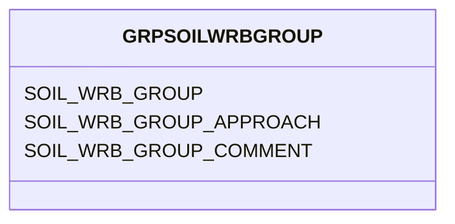

# Class: GRPSOILWRBGROUP


URI: [TEMP:GRPSOILWRBGROUP](https://example.org/TEMP/GRPSOILWRBGROUP)





<!-- no inheritance hierarchy -->


## Slots

| Name | Cardinality and Range | Description | Inheritance |
| ---  | --- | --- | --- |
| [SOIL_WRB_GROUP](SOIL_WRB_GROUP.md) | 0..1 <br/> [SOILGROUP](SOILGROUP.md) | Soil Group for tower site according to the Soil World Reference Base for Soil... | direct |
| [SOIL_WRB_GROUP_APPROACH](SOIL_WRB_GROUP_APPROACH.md) | 0..1 <br/> [xsd:string](xsd:string) | Approach used for assigning Soil WRB Group | direct |
| [SOIL_WRB_GROUP_COMMENT](SOIL_WRB_GROUP_COMMENT.md) | 0..1 <br/> [xsd:string](xsd:string) | Soil WRB Group comments | direct |


## Identifier and Mapping Information


### Schema Source


* from schema: TEMP


## Mappings

| Mapping Type | Mapped Value |
| ---  | ---  |
| self | TEMP:GRPSOILWRBGROUP |
| native | TEMP:GRPSOILWRBGROUP |


## LinkML Source

<!-- TODO: investigate https://stackoverflow.com/questions/37606292/how-to-create-tabbed-code-blocks-in-mkdocs-or-sphinx -->

### Direct

<details>
```yaml
name: GRP_SOIL_WRB_GROUP
from_schema: TEMP
rank: 1000
slots:
- SOIL_WRB_GROUP
- SOIL_WRB_GROUP_APPROACH
- SOIL_WRB_GROUP_COMMENT
slot_usage:
  SOIL_WRB_GROUP:
    name: SOIL_WRB_GROUP
    description: Soil Group for tower site according to the Soil World Reference Base
      for Soil Resources (WRB)
    comments:
    - WRB (previously FAO) is a soil classification system. It describes soils with
      a two-level nomenclature comprising the name of a Soil Group and a modifying
      adjective that serves to identify a soil unit within a Group on the FAO Soil
      Map of the World. For the tower site, specify the Soil Group only from the predefined
      list. Do not report a modifying adjective. WRB_GROUP does not need to be reported
      if SOIL_ORDER is.
    identifier: true
    domain_of:
    - GRP_SOIL_WRB_GROUP
    - GRP_SOIL_WRB_GROUP
  SOIL_WRB_GROUP_APPROACH:
    name: SOIL_WRB_GROUP_APPROACH
    description: Approach used for assigning Soil WRB Group
    domain_of:
    - GRP_SOIL_WRB_GROUP
    - GRP_SOIL_WRB_GROUP
  SOIL_WRB_GROUP_COMMENT:
    name: SOIL_WRB_GROUP_COMMENT
    description: Soil WRB Group comments
    domain_of:
    - GRP_SOIL_WRB_GROUP
    - GRP_SOIL_WRB_GROUP

```
</details>

### Induced

<details>
```yaml
name: GRP_SOIL_WRB_GROUP
from_schema: TEMP
rank: 1000
slot_usage:
  SOIL_WRB_GROUP:
    name: SOIL_WRB_GROUP
    description: Soil Group for tower site according to the Soil World Reference Base
      for Soil Resources (WRB)
    comments:
    - WRB (previously FAO) is a soil classification system. It describes soils with
      a two-level nomenclature comprising the name of a Soil Group and a modifying
      adjective that serves to identify a soil unit within a Group on the FAO Soil
      Map of the World. For the tower site, specify the Soil Group only from the predefined
      list. Do not report a modifying adjective. WRB_GROUP does not need to be reported
      if SOIL_ORDER is.
    identifier: true
    domain_of:
    - GRP_SOIL_WRB_GROUP
    - GRP_SOIL_WRB_GROUP
  SOIL_WRB_GROUP_APPROACH:
    name: SOIL_WRB_GROUP_APPROACH
    description: Approach used for assigning Soil WRB Group
    domain_of:
    - GRP_SOIL_WRB_GROUP
    - GRP_SOIL_WRB_GROUP
  SOIL_WRB_GROUP_COMMENT:
    name: SOIL_WRB_GROUP_COMMENT
    description: Soil WRB Group comments
    domain_of:
    - GRP_SOIL_WRB_GROUP
    - GRP_SOIL_WRB_GROUP
attributes:
  SOIL_WRB_GROUP:
    name: SOIL_WRB_GROUP
    description: Soil Group for tower site according to the Soil World Reference Base
      for Soil Resources (WRB)
    comments:
    - WRB (previously FAO) is a soil classification system. It describes soils with
      a two-level nomenclature comprising the name of a Soil Group and a modifying
      adjective that serves to identify a soil unit within a Group on the FAO Soil
      Map of the World. For the tower site, specify the Soil Group only from the predefined
      list. Do not report a modifying adjective. WRB_GROUP does not need to be reported
      if SOIL_ORDER is.
    from_schema: TEMP
    rank: 1000
    identifier: true
    alias: SOIL_WRB_GROUP
    owner: GRP_SOIL_WRB_GROUP
    domain_of:
    - GRP_SOIL_WRB_GROUP
    - GRP_SOIL_WRB_GROUP
    range: SOIL_GROUP
  SOIL_WRB_GROUP_APPROACH:
    name: SOIL_WRB_GROUP_APPROACH
    description: Approach used for assigning Soil WRB Group
    from_schema: TEMP
    rank: 1000
    alias: SOIL_WRB_GROUP_APPROACH
    owner: GRP_SOIL_WRB_GROUP
    domain_of:
    - GRP_SOIL_WRB_GROUP
    - GRP_SOIL_WRB_GROUP
    range: string
  SOIL_WRB_GROUP_COMMENT:
    name: SOIL_WRB_GROUP_COMMENT
    description: Soil WRB Group comments
    from_schema: TEMP
    rank: 1000
    alias: SOIL_WRB_GROUP_COMMENT
    owner: GRP_SOIL_WRB_GROUP
    domain_of:
    - GRP_SOIL_WRB_GROUP
    - GRP_SOIL_WRB_GROUP
    range: string

```
</details>