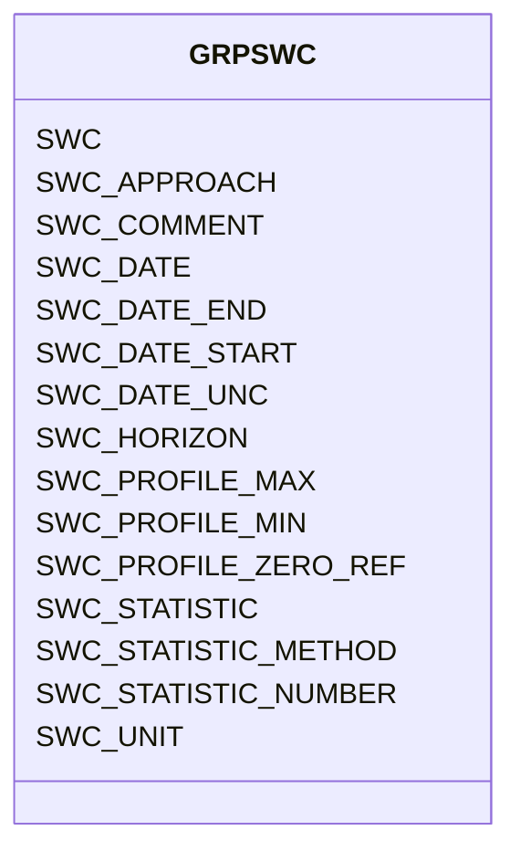

# Class: GRPSWC


URI: [TEMP:GRPSWC](https://example.org/TEMP/GRPSWC)





<!-- no inheritance hierarchy -->


## Slots

| Name | Cardinality and Range | Description | Inheritance |
| ---  | --- | --- | --- |
| [SWC](SWC.md) | 0..1 <br/> [xsd:float](xsd:float) | Soil water content (not continuous measurements) | direct |
| [SWC_STATISTIC](SWC_STATISTIC.md) | 0..1 <br/> [STATISTIC](STATISTIC.md) | Soil water content statistic | direct |
| [SWC_STATISTIC_METHOD](SWC_STATISTIC_METHOD.md) | 0..1 <br/> [STATISTICMETHOD](STATISTICMETHOD.md) | Soil water content statistic method | direct |
| [SWC_STATISTIC_NUMBER](SWC_STATISTIC_NUMBER.md) | 0..1 <br/> [xsd:integer](xsd:integer) | Number of observations used to determine soil water content statistic | direct |
| [SWC_UNIT](SWC_UNIT.md) | 0..1 <br/> [UNITSWC](UNITSWC.md) | Measurement unit of Soil water content | direct |
| [SWC_PROFILE_ZERO_REF](SWC_PROFILE_ZERO_REF.md) | 0..1 <br/> [PROFILEZEROREF](PROFILEZEROREF.md) | Soil water content profile zero reference | direct |
| [SWC_PROFILE_MIN](SWC_PROFILE_MIN.md) | 0..1 <br/> [xsd:float](xsd:float) | Soil water content profile minimum depth | direct |
| [SWC_PROFILE_MAX](SWC_PROFILE_MAX.md) | 0..1 <br/> [xsd:float](xsd:float) | Soil water content profile maximum depth | direct |
| [SWC_HORIZON](SWC_HORIZON.md) | 0..1 <br/> [xsd:string](xsd:string) | Soil water content horizon | direct |
| [SWC_APPROACH](SWC_APPROACH.md) | 0..1 <br/> [xsd:string](xsd:string) | Soil water content measurement approach | direct |
| [SWC_DATE](SWC_DATE.md) | 0..1 <br/> [xsd:float](xsd:float) | Soil water content measurement date | direct |
| [SWC_DATE_START](SWC_DATE_START.md) | 0..1 <br/> [xsd:float](xsd:float) | Start date of Soil water content measurment | direct |
| [SWC_DATE_END](SWC_DATE_END.md) | 0..1 <br/> [xsd:float](xsd:float) | End date of Soil water content measurement | direct |
| [SWC_DATE_UNC](SWC_DATE_UNC.md) | 0..1 <br/> [xsd:float](xsd:float) | Uncertainty in the Date(s) of Soil water content measurement | direct |
| [SWC_COMMENT](SWC_COMMENT.md) | 0..1 <br/> [xsd:string](xsd:string) | Soil water content comments | direct |


## Identifier and Mapping Information


### Schema Source


* from schema: TEMP


## Mappings

| Mapping Type | Mapped Value |
| ---  | ---  |
| self | TEMP:GRPSWC |
| native | TEMP:GRPSWC |


## LinkML Source

<!-- TODO: investigate https://stackoverflow.com/questions/37606292/how-to-create-tabbed-code-blocks-in-mkdocs-or-sphinx -->

### Direct

<details>
```yaml
name: GRP_SWC
from_schema: TEMP
rank: 1000
slots:
- SWC
- SWC_STATISTIC
- SWC_STATISTIC_METHOD
- SWC_STATISTIC_NUMBER
- SWC_UNIT
- SWC_PROFILE_ZERO_REF
- SWC_PROFILE_MIN
- SWC_PROFILE_MAX
- SWC_HORIZON
- SWC_APPROACH
- SWC_DATE
- SWC_DATE_START
- SWC_DATE_END
- SWC_DATE_UNC
- SWC_COMMENT
slot_usage:
  SWC:
    name: SWC
    description: Soil water content (not continuous measurements)
    comments:
    - Report continuous half-hourly or hourly measurements with flux/met data.
    multivalued: true
    identifier: true
    domain_of:
    - GRP_SWC
    - GRP_SWC
  SWC_APPROACH:
    name: SWC_APPROACH
    description: Soil water content measurement approach
    multivalued: true
    domain_of:
    - GRP_SWC
    - GRP_SWC
  SWC_COMMENT:
    name: SWC_COMMENT
    description: Soil water content comments
    multivalued: true
    domain_of:
    - GRP_SWC
    - GRP_SWC
  SWC_DATE:
    name: SWC_DATE
    description: Soil water content measurement date
    comments:
    - Please report the date at the precision known. Allowed reporting precisions
      are YYYY, YYYYMM, YYYYMMDD, and YYYYMMDDHHMM. For soil moisture campaigns or
      temporal averages, SWC_DATE_START and SWC_DATE_END can be used.
    multivalued: true
    domain_of:
    - GRP_SWC
    - GRP_SWC
    required: true
  SWC_DATE_END:
    name: SWC_DATE_END
    description: End date of Soil water content measurement
    comments:
    - End date of a soil moisure measurement campaign or end date of a temporal average.
      Please report the date at the precision known. Allowed reporting precisions
      are YYYY, YYYYMM, YYYYMMDD, and YYYYMMDDHHMM.
    multivalued: true
    domain_of:
    - GRP_SWC
    - GRP_SWC
  SWC_DATE_START:
    name: SWC_DATE_START
    description: Start date of Soil water content measurment
    comments:
    - Start date of a soil moisure measurement campaign or start date of a temporal
      average. Please report the date at the precision known. Allowed reporting precisions
      are YYYY, YYYYMM, YYYYMMDD, and YYYYMMDDHHMM.
    multivalued: true
    domain_of:
    - GRP_SWC
    - GRP_SWC
    required: true
  SWC_DATE_UNC:
    name: SWC_DATE_UNC
    description: Uncertainty in the Date(s) of Soil water content measurement
    multivalued: true
    domain_of:
    - GRP_SWC
    - GRP_SWC
  SWC_HORIZON:
    name: SWC_HORIZON
    description: Soil water content horizon
    comments:
    - Use soil horizon scheme best suited for your soil. Examples include O, Oa, B,
      Bt, C.
    multivalued: true
    domain_of:
    - GRP_SWC
    - GRP_SWC
  SWC_PROFILE_MAX:
    name: SWC_PROFILE_MAX
    description: Soil water content profile maximum depth
    comments:
    - Profile maximum depth is the vertical distance from profile zero reference to
      the bottom of soil layer being measured.
    multivalued: true
    domain_of:
    - GRP_SWC
    - GRP_SWC
  SWC_PROFILE_MIN:
    name: SWC_PROFILE_MIN
    description: Soil water content profile minimum depth
    comments:
    - Profile minimum depth is the vertical distance from profile zero reference to
      the top of soil layer being measured.
    multivalued: true
    domain_of:
    - GRP_SWC
    - GRP_SWC
  SWC_PROFILE_ZERO_REF:
    name: SWC_PROFILE_ZERO_REF
    description: Soil water content profile zero reference
    comments:
    - Profile Zero Reference is the horizontal plane from which the soil profile minimum
      and maximum depths are measured. For example, top of mineral soil or top of
      litter layer. Use predefined list.
    multivalued: true
    domain_of:
    - GRP_SWC
    - GRP_SWC
  SWC_STATISTIC:
    name: SWC_STATISTIC
    description: Soil water content statistic
    comments:
    - The statistic for the measurement reported. Use predefined list (e.g., mean,
      min / max, standard deviation, etc).
    multivalued: true
    domain_of:
    - GRP_SWC
    - GRP_SWC
    required: true
  SWC_STATISTIC_METHOD:
    name: SWC_STATISTIC_METHOD
    description: Soil water content statistic method
    comments:
    - Method used to generate the reported statistic (e.g., aggregate of individuals,
      aggregate of sample aggregates) from observations representing the same time
      period. Use predefined list. The aggregation method is not meant to describe
      temporal aggregations for example in calculations of higher frequency observations
      (e.g., sub-minute) to lower frequency observations (e.g., hourly) at a single
      location.
    multivalued: true
    domain_of:
    - GRP_SWC
    - GRP_SWC
  SWC_STATISTIC_NUMBER:
    name: SWC_STATISTIC_NUMBER
    description: Number of observations used to determine soil water content statistic
    comments:
    - Number of observations (samples / replicates) used to calculate the STATISTIC
      for the reported measurement.
    multivalued: true
    domain_of:
    - GRP_SWC
    - GRP_SWC
  SWC_UNIT:
    name: SWC_UNIT
    description: Measurement unit of Soil water content
    comments:
    - Use the predefined list to specify gravimetric (mass water / mass dry soil)
      or volumetric (volume water / volume soil) water content.
    multivalued: true
    domain_of:
    - GRP_SWC
    - GRP_SWC
    required: true

```
</details>

### Induced

<details>
```yaml
name: GRP_SWC
from_schema: TEMP
rank: 1000
slot_usage:
  SWC:
    name: SWC
    description: Soil water content (not continuous measurements)
    comments:
    - Report continuous half-hourly or hourly measurements with flux/met data.
    multivalued: true
    identifier: true
    domain_of:
    - GRP_SWC
    - GRP_SWC
  SWC_APPROACH:
    name: SWC_APPROACH
    description: Soil water content measurement approach
    multivalued: true
    domain_of:
    - GRP_SWC
    - GRP_SWC
  SWC_COMMENT:
    name: SWC_COMMENT
    description: Soil water content comments
    multivalued: true
    domain_of:
    - GRP_SWC
    - GRP_SWC
  SWC_DATE:
    name: SWC_DATE
    description: Soil water content measurement date
    comments:
    - Please report the date at the precision known. Allowed reporting precisions
      are YYYY, YYYYMM, YYYYMMDD, and YYYYMMDDHHMM. For soil moisture campaigns or
      temporal averages, SWC_DATE_START and SWC_DATE_END can be used.
    multivalued: true
    domain_of:
    - GRP_SWC
    - GRP_SWC
    required: true
  SWC_DATE_END:
    name: SWC_DATE_END
    description: End date of Soil water content measurement
    comments:
    - End date of a soil moisure measurement campaign or end date of a temporal average.
      Please report the date at the precision known. Allowed reporting precisions
      are YYYY, YYYYMM, YYYYMMDD, and YYYYMMDDHHMM.
    multivalued: true
    domain_of:
    - GRP_SWC
    - GRP_SWC
  SWC_DATE_START:
    name: SWC_DATE_START
    description: Start date of Soil water content measurment
    comments:
    - Start date of a soil moisure measurement campaign or start date of a temporal
      average. Please report the date at the precision known. Allowed reporting precisions
      are YYYY, YYYYMM, YYYYMMDD, and YYYYMMDDHHMM.
    multivalued: true
    domain_of:
    - GRP_SWC
    - GRP_SWC
    required: true
  SWC_DATE_UNC:
    name: SWC_DATE_UNC
    description: Uncertainty in the Date(s) of Soil water content measurement
    multivalued: true
    domain_of:
    - GRP_SWC
    - GRP_SWC
  SWC_HORIZON:
    name: SWC_HORIZON
    description: Soil water content horizon
    comments:
    - Use soil horizon scheme best suited for your soil. Examples include O, Oa, B,
      Bt, C.
    multivalued: true
    domain_of:
    - GRP_SWC
    - GRP_SWC
  SWC_PROFILE_MAX:
    name: SWC_PROFILE_MAX
    description: Soil water content profile maximum depth
    comments:
    - Profile maximum depth is the vertical distance from profile zero reference to
      the bottom of soil layer being measured.
    multivalued: true
    domain_of:
    - GRP_SWC
    - GRP_SWC
  SWC_PROFILE_MIN:
    name: SWC_PROFILE_MIN
    description: Soil water content profile minimum depth
    comments:
    - Profile minimum depth is the vertical distance from profile zero reference to
      the top of soil layer being measured.
    multivalued: true
    domain_of:
    - GRP_SWC
    - GRP_SWC
  SWC_PROFILE_ZERO_REF:
    name: SWC_PROFILE_ZERO_REF
    description: Soil water content profile zero reference
    comments:
    - Profile Zero Reference is the horizontal plane from which the soil profile minimum
      and maximum depths are measured. For example, top of mineral soil or top of
      litter layer. Use predefined list.
    multivalued: true
    domain_of:
    - GRP_SWC
    - GRP_SWC
  SWC_STATISTIC:
    name: SWC_STATISTIC
    description: Soil water content statistic
    comments:
    - The statistic for the measurement reported. Use predefined list (e.g., mean,
      min / max, standard deviation, etc).
    multivalued: true
    domain_of:
    - GRP_SWC
    - GRP_SWC
    required: true
  SWC_STATISTIC_METHOD:
    name: SWC_STATISTIC_METHOD
    description: Soil water content statistic method
    comments:
    - Method used to generate the reported statistic (e.g., aggregate of individuals,
      aggregate of sample aggregates) from observations representing the same time
      period. Use predefined list. The aggregation method is not meant to describe
      temporal aggregations for example in calculations of higher frequency observations
      (e.g., sub-minute) to lower frequency observations (e.g., hourly) at a single
      location.
    multivalued: true
    domain_of:
    - GRP_SWC
    - GRP_SWC
  SWC_STATISTIC_NUMBER:
    name: SWC_STATISTIC_NUMBER
    description: Number of observations used to determine soil water content statistic
    comments:
    - Number of observations (samples / replicates) used to calculate the STATISTIC
      for the reported measurement.
    multivalued: true
    domain_of:
    - GRP_SWC
    - GRP_SWC
  SWC_UNIT:
    name: SWC_UNIT
    description: Measurement unit of Soil water content
    comments:
    - Use the predefined list to specify gravimetric (mass water / mass dry soil)
      or volumetric (volume water / volume soil) water content.
    multivalued: true
    domain_of:
    - GRP_SWC
    - GRP_SWC
    required: true
attributes:
  SWC:
    name: SWC
    description: Soil water content (not continuous measurements)
    comments:
    - Report continuous half-hourly or hourly measurements with flux/met data.
    from_schema: TEMP
    rank: 1000
    multivalued: true
    identifier: true
    alias: SWC
    owner: GRP_SWC
    domain_of:
    - GRP_SWC
    - GRP_SWC
    range: float
    unit:
      symbol: '%'
  SWC_STATISTIC:
    name: SWC_STATISTIC
    description: Soil water content statistic
    comments:
    - The statistic for the measurement reported. Use predefined list (e.g., mean,
      min / max, standard deviation, etc).
    from_schema: TEMP
    rank: 1000
    multivalued: true
    alias: SWC_STATISTIC
    owner: GRP_SWC
    domain_of:
    - GRP_SWC
    - GRP_SWC
    range: STATISTIC
    required: true
  SWC_STATISTIC_METHOD:
    name: SWC_STATISTIC_METHOD
    description: Soil water content statistic method
    comments:
    - Method used to generate the reported statistic (e.g., aggregate of individuals,
      aggregate of sample aggregates) from observations representing the same time
      period. Use predefined list. The aggregation method is not meant to describe
      temporal aggregations for example in calculations of higher frequency observations
      (e.g., sub-minute) to lower frequency observations (e.g., hourly) at a single
      location.
    from_schema: TEMP
    rank: 1000
    multivalued: true
    alias: SWC_STATISTIC_METHOD
    owner: GRP_SWC
    domain_of:
    - GRP_SWC
    - GRP_SWC
    range: STATISTIC_METHOD
  SWC_STATISTIC_NUMBER:
    name: SWC_STATISTIC_NUMBER
    description: Number of observations used to determine soil water content statistic
    comments:
    - Number of observations (samples / replicates) used to calculate the STATISTIC
      for the reported measurement.
    from_schema: TEMP
    rank: 1000
    multivalued: true
    alias: SWC_STATISTIC_NUMBER
    owner: GRP_SWC
    domain_of:
    - GRP_SWC
    - GRP_SWC
    range: integer
  SWC_UNIT:
    name: SWC_UNIT
    description: Measurement unit of Soil water content
    comments:
    - Use the predefined list to specify gravimetric (mass water / mass dry soil)
      or volumetric (volume water / volume soil) water content.
    from_schema: TEMP
    rank: 1000
    multivalued: true
    alias: SWC_UNIT
    owner: GRP_SWC
    domain_of:
    - GRP_SWC
    - GRP_SWC
    range: UNIT_SWC
    required: true
  SWC_PROFILE_ZERO_REF:
    name: SWC_PROFILE_ZERO_REF
    description: Soil water content profile zero reference
    comments:
    - Profile Zero Reference is the horizontal plane from which the soil profile minimum
      and maximum depths are measured. For example, top of mineral soil or top of
      litter layer. Use predefined list.
    from_schema: TEMP
    rank: 1000
    multivalued: true
    alias: SWC_PROFILE_ZERO_REF
    owner: GRP_SWC
    domain_of:
    - GRP_SWC
    - GRP_SWC
    range: PROFILE_ZERO_REF
  SWC_PROFILE_MIN:
    name: SWC_PROFILE_MIN
    description: Soil water content profile minimum depth
    comments:
    - Profile minimum depth is the vertical distance from profile zero reference to
      the top of soil layer being measured.
    from_schema: TEMP
    rank: 1000
    multivalued: true
    alias: SWC_PROFILE_MIN
    owner: GRP_SWC
    domain_of:
    - GRP_SWC
    - GRP_SWC
    range: float
    unit:
      symbol: cm
  SWC_PROFILE_MAX:
    name: SWC_PROFILE_MAX
    description: Soil water content profile maximum depth
    comments:
    - Profile maximum depth is the vertical distance from profile zero reference to
      the bottom of soil layer being measured.
    from_schema: TEMP
    rank: 1000
    multivalued: true
    alias: SWC_PROFILE_MAX
    owner: GRP_SWC
    domain_of:
    - GRP_SWC
    - GRP_SWC
    range: float
    unit:
      symbol: cm
  SWC_HORIZON:
    name: SWC_HORIZON
    description: Soil water content horizon
    comments:
    - Use soil horizon scheme best suited for your soil. Examples include O, Oa, B,
      Bt, C.
    from_schema: TEMP
    rank: 1000
    multivalued: true
    alias: SWC_HORIZON
    owner: GRP_SWC
    domain_of:
    - GRP_SWC
    - GRP_SWC
    range: string
  SWC_APPROACH:
    name: SWC_APPROACH
    description: Soil water content measurement approach
    from_schema: TEMP
    rank: 1000
    multivalued: true
    alias: SWC_APPROACH
    owner: GRP_SWC
    domain_of:
    - GRP_SWC
    - GRP_SWC
    range: string
  SWC_DATE:
    name: SWC_DATE
    description: Soil water content measurement date
    comments:
    - Please report the date at the precision known. Allowed reporting precisions
      are YYYY, YYYYMM, YYYYMMDD, and YYYYMMDDHHMM. For soil moisture campaigns or
      temporal averages, SWC_DATE_START and SWC_DATE_END can be used.
    from_schema: TEMP
    rank: 1000
    multivalued: true
    alias: SWC_DATE
    owner: GRP_SWC
    domain_of:
    - GRP_SWC
    - GRP_SWC
    range: float
    required: true
    unit:
      symbol: YYYYMMDDHHMM
  SWC_DATE_START:
    name: SWC_DATE_START
    description: Start date of Soil water content measurment
    comments:
    - Start date of a soil moisure measurement campaign or start date of a temporal
      average. Please report the date at the precision known. Allowed reporting precisions
      are YYYY, YYYYMM, YYYYMMDD, and YYYYMMDDHHMM.
    from_schema: TEMP
    rank: 1000
    multivalued: true
    alias: SWC_DATE_START
    owner: GRP_SWC
    domain_of:
    - GRP_SWC
    - GRP_SWC
    range: float
    required: true
    unit:
      symbol: YYYYMMDDHHMM
  SWC_DATE_END:
    name: SWC_DATE_END
    description: End date of Soil water content measurement
    comments:
    - End date of a soil moisure measurement campaign or end date of a temporal average.
      Please report the date at the precision known. Allowed reporting precisions
      are YYYY, YYYYMM, YYYYMMDD, and YYYYMMDDHHMM.
    from_schema: TEMP
    rank: 1000
    multivalued: true
    alias: SWC_DATE_END
    owner: GRP_SWC
    domain_of:
    - GRP_SWC
    - GRP_SWC
    range: float
    unit:
      symbol: YYYYMMDDHHMM
  SWC_DATE_UNC:
    name: SWC_DATE_UNC
    description: Uncertainty in the Date(s) of Soil water content measurement
    from_schema: TEMP
    rank: 1000
    multivalued: true
    alias: SWC_DATE_UNC
    owner: GRP_SWC
    domain_of:
    - GRP_SWC
    - GRP_SWC
    range: float
    unit:
      symbol: days
  SWC_COMMENT:
    name: SWC_COMMENT
    description: Soil water content comments
    from_schema: TEMP
    rank: 1000
    multivalued: true
    alias: SWC_COMMENT
    owner: GRP_SWC
    domain_of:
    - GRP_SWC
    - GRP_SWC
    range: string

```
</details>