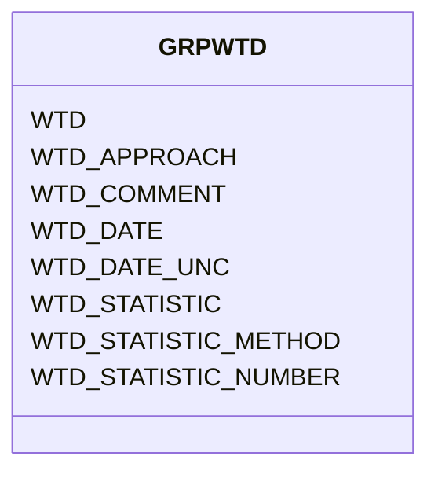

# Class: GRPWTD


URI: [TEMP:GRPWTD](https://example.org/TEMP/GRPWTD)





<!-- no inheritance hierarchy -->


## Slots

| Name | Cardinality and Range | Description | Inheritance |
| ---  | --- | --- | --- |
| [WTD](WTD.md) | 0..1 <br/> [xsd:float](xsd:float) | Water table depth (not continuous measurements) | direct |
| [WTD_STATISTIC](WTD_STATISTIC.md) | 0..1 <br/> [STATISTIC](STATISTIC.md) | Water table depth statistic | direct |
| [WTD_STATISTIC_METHOD](WTD_STATISTIC_METHOD.md) | 0..1 <br/> [STATISTICMETHOD](STATISTICMETHOD.md) | Water table depth statistic method | direct |
| [WTD_STATISTIC_NUMBER](WTD_STATISTIC_NUMBER.md) | 0..1 <br/> [xsd:integer](xsd:integer) | Number of observations used to determine water table depth statistic | direct |
| [WTD_APPROACH](WTD_APPROACH.md) | 0..1 <br/> [xsd:string](xsd:string) | Water table depth measurement approach | direct |
| [WTD_DATE](WTD_DATE.md) | 0..1 <br/> [xsd:float](xsd:float) | Water table depth measurement date | direct |
| [WTD_DATE_UNC](WTD_DATE_UNC.md) | 0..1 <br/> [xsd:float](xsd:float) | Uncertainty in the Water table depth measurement date | direct |
| [WTD_COMMENT](WTD_COMMENT.md) | 0..1 <br/> [xsd:string](xsd:string) | Water table depth comments | direct |


## Identifier and Mapping Information


### Schema Source


* from schema: TEMP


## Mappings

| Mapping Type | Mapped Value |
| ---  | ---  |
| self | TEMP:GRPWTD |
| native | TEMP:GRPWTD |


## LinkML Source

<!-- TODO: investigate https://stackoverflow.com/questions/37606292/how-to-create-tabbed-code-blocks-in-mkdocs-or-sphinx -->

### Direct

<details>
```yaml
name: GRP_WTD
from_schema: TEMP
rank: 1000
slots:
- WTD
- WTD_STATISTIC
- WTD_STATISTIC_METHOD
- WTD_STATISTIC_NUMBER
- WTD_APPROACH
- WTD_DATE
- WTD_DATE_UNC
- WTD_COMMENT
slot_usage:
  WTD:
    name: WTD
    description: Water table depth (not continuous measurements)
    comments:
    - Report continuous half-hourly or hourly measurements with flux/met data.
    multivalued: true
    identifier: true
    domain_of:
    - GRP_WTD
    - GRP_WTD
  WTD_APPROACH:
    name: WTD_APPROACH
    description: Water table depth measurement approach
    multivalued: true
    domain_of:
    - GRP_WTD
    - GRP_WTD
  WTD_COMMENT:
    name: WTD_COMMENT
    description: Water table depth comments
    multivalued: true
    domain_of:
    - GRP_WTD
    - GRP_WTD
  WTD_DATE:
    name: WTD_DATE
    description: Water table depth measurement date
    comments:
    - Please report the date at the precision known. Allowed reporting precisions
      are YYYY, YYYYMM, YYYYMMDD, and YYYYMMDDHHMM.
    multivalued: true
    domain_of:
    - GRP_WTD
    - GRP_WTD
    required: true
  WTD_DATE_UNC:
    name: WTD_DATE_UNC
    description: Uncertainty in the Water table depth measurement date
    multivalued: true
    domain_of:
    - GRP_WTD
    - GRP_WTD
  WTD_STATISTIC:
    name: WTD_STATISTIC
    description: Water table depth statistic
    comments:
    - The statistic for the measurement reported. Use predefined list (e.g., mean,
      min / max, standard deviation, etc).
    multivalued: true
    domain_of:
    - GRP_WTD
    - GRP_WTD
    required: true
  WTD_STATISTIC_METHOD:
    name: WTD_STATISTIC_METHOD
    description: Water table depth statistic method
    comments:
    - Method used to generate the reported statistic (e.g., aggregate of individuals,
      aggregate of sample aggregates) from observations representing the same time
      period. Use predefined list. The aggregation method is not meant to describe
      temporal aggregations for example in calculations of higher frequency observations
      (e.g., sub-minute) to lower frequency observations (e.g., hourly) at a single
      location.
    multivalued: true
    domain_of:
    - GRP_WTD
    - GRP_WTD
  WTD_STATISTIC_NUMBER:
    name: WTD_STATISTIC_NUMBER
    description: Number of observations used to determine water table depth statistic
    comments:
    - Number of observations (samples / replicates) used to calculate the STATISTIC
      for the reported measurement.
    multivalued: true
    domain_of:
    - GRP_WTD
    - GRP_WTD

```
</details>

### Induced

<details>
```yaml
name: GRP_WTD
from_schema: TEMP
rank: 1000
slot_usage:
  WTD:
    name: WTD
    description: Water table depth (not continuous measurements)
    comments:
    - Report continuous half-hourly or hourly measurements with flux/met data.
    multivalued: true
    identifier: true
    domain_of:
    - GRP_WTD
    - GRP_WTD
  WTD_APPROACH:
    name: WTD_APPROACH
    description: Water table depth measurement approach
    multivalued: true
    domain_of:
    - GRP_WTD
    - GRP_WTD
  WTD_COMMENT:
    name: WTD_COMMENT
    description: Water table depth comments
    multivalued: true
    domain_of:
    - GRP_WTD
    - GRP_WTD
  WTD_DATE:
    name: WTD_DATE
    description: Water table depth measurement date
    comments:
    - Please report the date at the precision known. Allowed reporting precisions
      are YYYY, YYYYMM, YYYYMMDD, and YYYYMMDDHHMM.
    multivalued: true
    domain_of:
    - GRP_WTD
    - GRP_WTD
    required: true
  WTD_DATE_UNC:
    name: WTD_DATE_UNC
    description: Uncertainty in the Water table depth measurement date
    multivalued: true
    domain_of:
    - GRP_WTD
    - GRP_WTD
  WTD_STATISTIC:
    name: WTD_STATISTIC
    description: Water table depth statistic
    comments:
    - The statistic for the measurement reported. Use predefined list (e.g., mean,
      min / max, standard deviation, etc).
    multivalued: true
    domain_of:
    - GRP_WTD
    - GRP_WTD
    required: true
  WTD_STATISTIC_METHOD:
    name: WTD_STATISTIC_METHOD
    description: Water table depth statistic method
    comments:
    - Method used to generate the reported statistic (e.g., aggregate of individuals,
      aggregate of sample aggregates) from observations representing the same time
      period. Use predefined list. The aggregation method is not meant to describe
      temporal aggregations for example in calculations of higher frequency observations
      (e.g., sub-minute) to lower frequency observations (e.g., hourly) at a single
      location.
    multivalued: true
    domain_of:
    - GRP_WTD
    - GRP_WTD
  WTD_STATISTIC_NUMBER:
    name: WTD_STATISTIC_NUMBER
    description: Number of observations used to determine water table depth statistic
    comments:
    - Number of observations (samples / replicates) used to calculate the STATISTIC
      for the reported measurement.
    multivalued: true
    domain_of:
    - GRP_WTD
    - GRP_WTD
attributes:
  WTD:
    name: WTD
    description: Water table depth (not continuous measurements)
    comments:
    - Report continuous half-hourly or hourly measurements with flux/met data.
    from_schema: TEMP
    rank: 1000
    multivalued: true
    identifier: true
    alias: WTD
    owner: GRP_WTD
    domain_of:
    - GRP_WTD
    - GRP_WTD
    range: float
    unit:
      symbol: m
  WTD_STATISTIC:
    name: WTD_STATISTIC
    description: Water table depth statistic
    comments:
    - The statistic for the measurement reported. Use predefined list (e.g., mean,
      min / max, standard deviation, etc).
    from_schema: TEMP
    rank: 1000
    multivalued: true
    alias: WTD_STATISTIC
    owner: GRP_WTD
    domain_of:
    - GRP_WTD
    - GRP_WTD
    range: STATISTIC
    required: true
  WTD_STATISTIC_METHOD:
    name: WTD_STATISTIC_METHOD
    description: Water table depth statistic method
    comments:
    - Method used to generate the reported statistic (e.g., aggregate of individuals,
      aggregate of sample aggregates) from observations representing the same time
      period. Use predefined list. The aggregation method is not meant to describe
      temporal aggregations for example in calculations of higher frequency observations
      (e.g., sub-minute) to lower frequency observations (e.g., hourly) at a single
      location.
    from_schema: TEMP
    rank: 1000
    multivalued: true
    alias: WTD_STATISTIC_METHOD
    owner: GRP_WTD
    domain_of:
    - GRP_WTD
    - GRP_WTD
    range: STATISTIC_METHOD
  WTD_STATISTIC_NUMBER:
    name: WTD_STATISTIC_NUMBER
    description: Number of observations used to determine water table depth statistic
    comments:
    - Number of observations (samples / replicates) used to calculate the STATISTIC
      for the reported measurement.
    from_schema: TEMP
    rank: 1000
    multivalued: true
    alias: WTD_STATISTIC_NUMBER
    owner: GRP_WTD
    domain_of:
    - GRP_WTD
    - GRP_WTD
    range: integer
  WTD_APPROACH:
    name: WTD_APPROACH
    description: Water table depth measurement approach
    from_schema: TEMP
    rank: 1000
    multivalued: true
    alias: WTD_APPROACH
    owner: GRP_WTD
    domain_of:
    - GRP_WTD
    - GRP_WTD
    range: string
  WTD_DATE:
    name: WTD_DATE
    description: Water table depth measurement date
    comments:
    - Please report the date at the precision known. Allowed reporting precisions
      are YYYY, YYYYMM, YYYYMMDD, and YYYYMMDDHHMM.
    from_schema: TEMP
    rank: 1000
    multivalued: true
    alias: WTD_DATE
    owner: GRP_WTD
    domain_of:
    - GRP_WTD
    - GRP_WTD
    range: float
    required: true
    unit:
      symbol: YYYYMMDDHHMM
  WTD_DATE_UNC:
    name: WTD_DATE_UNC
    description: Uncertainty in the Water table depth measurement date
    from_schema: TEMP
    rank: 1000
    multivalued: true
    alias: WTD_DATE_UNC
    owner: GRP_WTD
    domain_of:
    - GRP_WTD
    - GRP_WTD
    range: float
    unit:
      symbol: days
  WTD_COMMENT:
    name: WTD_COMMENT
    description: Water table depth comments
    from_schema: TEMP
    rank: 1000
    multivalued: true
    alias: WTD_COMMENT
    owner: GRP_WTD
    domain_of:
    - GRP_WTD
    - GRP_WTD
    range: string

```
</details>